# Engineering task ledger: UK literature-driven public-evidence upgrade

## Control

- **Mode:** EXECUTE
- **State:** IN_PROGRESS
- **Risk:** Critical
- **Approval:** Granted by the user on 2026-08-26 for the Critical scope, rollback boundaries,
  local validation, dissertation visual artifacts, and independent review defined in this ledger.
  Live public/API retrieval, OpenAI calls, deployment, commits, pushes, and held packets remain
  unauthorised.
- **Execution trigger:** `engineering EXECUTE .agents/runs/uk-literature-public-evidence-upgrade.md`
- **Baseline:** Clean `production` branch at
  `a9058aa5893ab8fb5432f6c1ac7ac90f8b3f5b83` (`origin/production`), containing this ledger and the
  initial prototype. Production files had not drifted when execution began.
- **Policy:** Additive and reversible changes only; preserve the current local-only, human-approved,
  evidence-first contracts. Schema, financial semantics, public-person data, and external-model
  boundaries make this Critical work.

## Goal, scope, constraints, and success

### Goal

Turn the current fictional P0 vertical slice into a UK-only dissertation-grade reporting system
that can ingest the supplied portfolio workbook, enrich and verify eligible facts through admitted
UK public sources, expose temporal/data-quality uncertainty, and produce change- and exception-led
reports through a bounded agent workflow.

### In scope

1. A versioned contract for the supplied matrix workbook and its paired narrative rows.
2. Reviewed Companies House identity resolution before any public collection.
3. Source capability manifests, immutable public snapshots, temporal eligibility, and executable
   quality contracts.
4. Companies House and UKRI/Gateway to Research connectors using public data only.
5. A typed event ledger for filings, grants, funding evidence, and company changes.
6. Deterministic document extraction with precise locators; optional OpenAI extraction for public
   or synthetic evidence only, with strict abstention and independent verification.
7. Descriptive within-portfolio distribution context, evidence coverage, missingness, changes,
   exceptions, and human review in the report/UI. An external UK comparator remains held until an
   admitted aggregate source and compatible cohort definition exist.
8. A UK-only evaluation pack that separates synthetic/open benchmark evidence, authorised
   supplied-data evaluation, and a sealed final out-of-sample set.

### Hard data constraint

Operational company evidence may come only from:

- the user-supplied portfolio dataset, retained locally as `restricted`; and
- sources admitted as genuinely public, with publisher, licence/terms, locator, retrieval time,
  availability/effective time, version, and SHA-256 recorded.

No proprietary, paywalled, login-only, “available on request”, inaccessible historical derived
panel, or commercial company universe may enter the operational or evaluation pipeline. A public
paper does not make its unavailable study data usable.

Released academic datasets may be used only as frozen development/evaluation benchmarks when their
licence and UK slice are recorded. They must never be silently merged into the supplied portfolio
or treated as current evidence about a portfolio company.

### Out of scope

- autonomous investment recommendations, success/failure scores, fraud labels, or causal claims;
- general web crawling, social scraping, and live Crowdcube/Seedrs reconstruction;
- Beauhurst, FAME, Orbis, PitchBook, Crunchbase, Eikon/TAB, glass.ai, or equivalent sources;
- production deployment, authentication, multi-tenancy, scheduling, or cloud storage;
- property-ownership investigation or HM Land Registry graph expansion;
- person-level director/PSC analytics until the separate privacy/ethics gate is approved;
- external-model processing of the supplied workbook or any internal/restricted evidence;
- empirical claims about participant utility before ethics approval and actual data collection.

### Success criteria

The upgrade is complete only when all of the following are proved on the final state:

1. A synthetic structural twin of the supplied workbook and an authorised local smoke test both
   import non-zero canonical observations, preserve paired narratives, ignore section/aggregate
   rows, and hold formulas rather than execute them.
2. Public collection cannot start for a company without an exact admitted registry identifier or
   a named human identity decision. Conflicting identifiers stop the run.
3. Every public response is stored as an immutable snapshot and every extracted fact identifies
   source, locator, checksum, connector/schema version, publisher, retrieval time, availability
   time, effective period, unit/currency, and extraction method.
4. Missingness distinguishes at least `blank`, `not_reported`, `not_yet_due`, `not_required`,
   `dormant`, `not_found_at_source`, `source_unavailable`, `stale`, `conflicted`, and `invalid`.
5. Staleness is evaluated for a claim/run from dates and availability rules, never stored as one
   global period-label boolean on an evidence record.
6. Companies House and UKRI/GtR connectors pass deterministic contract, retry, rate-limit,
   idempotence, provenance, and temporal tests without live network access in the core suite.
7. Reports distinguish supplied, public, and derived facts; surface coverage and unresolved
   issues; show changes only with comparable earlier evidence; and require named approval before
   export.
8. Any optional OpenAI run uses public/synthetic evidence only, `store=False`, `gpt-5.4-mini`
   followed by at most one `gpt-5.4` strict-validation escalation, exact evidence-span checks, and
   persisted attempts/tokens/errors. No model result can approve or publish.
9. Migration upgrade, downgrade, and re-upgrade preserve legacy P0 rows and foreign-key integrity.
10. Formatting, lint, strict type checks, unit/integration/e2e tests, coverage, source-admission
    audit, secret scan, and restricted-file exclusion all pass on the exact final working-tree
    state. Committing remains a separate user-authorised action.

## Discovery evidence

### Repository and current architecture

- Python 3.12, FastAPI/Jinja, SQLite/SQLAlchemy/Alembic, Pydantic, `httpx`, OpenAI, and
  `openpyxl` are already pinned in `pyproject.toml`.
- Current strengths worth preserving:
  - immutable SHA-256 submission snapshots and period-bound dataset IDs;
  - explicit typed missing states and no guessed currency conversion;
  - exact identity/no automatic fuzzy merge;
  - connector, extraction, verification, reporting, and approval boundaries;
  - fixed bounded workflow roles with persistent run records;
  - conservative support/contradiction states and claim provenance;
  - external LLM disabled by default and forbidden for internal/restricted content;
  - versioned reports and named approval before local export.
- P0 is still wired to one fictional connector and deterministic provider in `bootstrap.py`.
  There is no admitted live public connector.

### Supplied workbook profile (local inspection; values intentionally omitted)

- One sheet, used range `A1:P102`: 102 rows, 16 columns, 14 populated portfolio-company headers,
  and 472 non-empty cells.
- The structure is a transposed questionnaire: metric/question labels in column A, companies across
  row 1, section rows, paired explanation/narrative rows, and heterogeneous numeric/text cells.
- Only 1 of 14 company columns has a populated Companies House name/number cell; the join-period
  row is empty across all 14.
- The final counts-only smoke identified five populated formula cells across derived
  valuation-change/aggregate rows. Formulas are derived workbook logic, not source observations,
  and are held/re-derived from validated inputs rather than executed during ingestion.
- A restricted local dry run against the current code created 14 company rows but **0 canonical
  observations** because the workbook labels do not match the generic catalogue. This is the first
  implementation blocker.
- The workbook contains strongly populated operational/narrative sections while funding and
  financial-impact rows are largely empty. Public enrichment must not fill those blanks with model
  priors or unrelated public proxies.

### Material current gaps and bugs

| Finding | Evidence surface | Required correction |
|---|---|---|
| Real workbook imports zero observations | `catalogue.py`, `importers.py`; restricted dry run | Versioned workbook row contract, exact aliases, narrative pairing, and explicit row exclusions |
| Company IDs are absent for most columns | supplied workbook profile | Identity-review queue before collection; do not name-match live data autonomously |
| Generic `external_id` is not source-scoped or unique | `models.py`, `_resolve_company` | Identifier table with scheme/value uniqueness and time/provenance |
| `normalized_name` is globally unique | `models.py`, migration `0001` | Make it a search key, not identity; permit colliding normalisations under different registry IDs |
| Fixture identity accepts exact name even when IDs conflict | `connectors/fixtures.py` | If both IDs exist, equality is mandatory; name fallback is reviewed and explicit |
| Connector runs once per company/metric | `ConnectorQuery`, `_collect` | Collect a source snapshot once per company/source/cutoff, then extract multiple facts |
| Staleness is one global flag based on period-label equality | `_collect`, `EvidenceItemModel` | Claim/run-relative temporal eligibility using effective/available/retrieved dates |
| First eligible public extraction is selected without explicit ordering | `_verify` | Deterministic source precedence or explicit multi-source conflict/abstention |
| Extraction locator is only a string | `StrictExtraction`, `ExtractionModel` | Page/section/table/row/column/cell/bbox/raw-token/sign/scale/period locators as applicable |
| LLM attempts/tokens exist in schemas but are not populated by workflow | `openai_provider.py`, `_extract`, `AgentRunModel` | Persist per-call model, attempts, token usage, validation failure, and escalation reason |
| Runtime constructs only fixture/deterministic adapters | `bootstrap.py` | Explicit source/provider registry; public connectors opt-in and allowlisted |
| Current report is static and single-period | `_compose`, templates | Evidence coverage, temporal changes, event timeline, cohort context, and exception-led review |
| ORM metadata and migration `0001` drift | live `alembic check` | Align JSON nullability and unique constraint/index declarations before any new migration |
| Database startup uses `create_all` even though Alembic is documented | `db.py`, `bootstrap.py` | Keep tests convenient but make runtime migration state explicit and detect schema drift |

## Literature-to-feature disposition

The evidence basis is the local review and manifest in `research/literature/`. Page-specific claims
and complete references remain in `UK_EARLY_STAGE_AGENTIC_PORTFOLIO_LITERATURE_REVIEW.md`.

| Proposed feature | Decision | Literature basis | Rationale and guardrail |
|---|---|---|---|
| F1 Companies House temporal connector | **Core** | Galanakis/Savagar; Hardman/Ramírez Santos | Timely identity/status/filing events are highly relevant; incorporation is not economic activity |
| F2 Source capability/quality contracts | **Core** | Nikiforova; Krasikov et al. | “Public” is not equivalent to fit-for-use; rules must be use-case specific and executable |
| F3 Filing-lag missingness | **Core** | Hardman/Ramírez Santos | New/small companies structurally lack accounts; do not turn lawful lag into failure/zero |
| F4 Funding/corporate event ledger | **Core** | Wasti et al.; Thorne et al. | Funding/grants are lifecycles and histories, not one overwritten scalar |
| F5 Precision-first entity resolution | **Core** | Thorne et al.; Surak/Inkley | False links contaminate a portfolio; coverage and precision must be reported separately |
| F6 Exact financial extraction contract | **Core, phase 2** | Bradley et al. | Sign, scale, comparative year, and cell location can reverse meaning |
| F7 UKRI/GtR grant lifecycle | **Core** | Mondal/Mellor; Thorne et al. | Public funding is directly relevant, but association is not proof of causal impact |
| F8 Round/dilution intelligence | **Narrowed** | Estrin et al.; Wasti et al. | Store supplied/publicly evidenced events; do not scrape platforms or infer valuation/dilution |
| F9 Director/PSC ownership graph | **Conditional** | Surak/Inkley | Useful for identity/governance only after privacy approval; property graph is out of scope |
| F10 Context distribution | **Narrowed now; external comparator held** | Estrin et al.; Mondal/Mellor; Galanakis/Savagar | Current implementation describes only the imported portfolio with minimum N; sector/geography/age UK comparison requires admitted ONS evidence and must not imply ranking or causality |
| F11 Hierarchical retrieval/abstention | **Core for eligible documents** | Thorne et al. | Smallest sufficient context plus null/abstention reduces plausible fabricated fields |
| F12 OCR/table benchmark | **Evaluation first** | Bradley et al. | Use released synthetic benchmark; add runtime OCR only if real filing evidence proves need |
| F13 Change/exception narrative | **Core** | Cross-paper synthesis | Reviewer utility comes from material changes, gaps, conflicts, and evidence, not prose volume |
| F14 UK-only evaluation pack | **Core** | All accepted papers | Separate source reconstruction, extraction, identity, temporal, report, and HITL evidence |

## Admitted-source policy

| Source | Operational role | Classification | Permitted use | Explicitly prohibited use |
|---|---|---|---|---|
| Supplied portfolio workbook | Primary submission | Restricted | Company-reported metrics/narratives with cell provenance | External LLM, Git fixture, automatic public truth claim |
| Companies House public data products/API/filings | Public verification/enrichment | Public but untrusted input | Exact identity, status, incorporation/dissolution, filing/account dates, eligible filed facts, charges; PSC/directors only after gate | Treating incorporation as economic activity; inferring valuation or missing private funding |
| UKRI/Gateway to Research public records | Public verification/enrichment | Public but untrusted input | Opportunity/project/award/outcome lifecycle and exact source IDs | Claiming grant caused company performance |
| ONS open aggregate data | Optional descriptive context | Public aggregate | UK sector/region/period denominators when version/cutoff is frozen | Reconstructing company-level values or causal comparisons |
| UKIPO or another official register | Conditional connector | Public only after admission review | Exact patent/status facts if access/licence/schema are verified | Inventing an API, fuzzy company attribution, or implementation before feasibility proof |
| Estrin/Wasti released UK data | Evaluation/reference only | Public research data | Funding-event schema and frozen benchmark cases | Current portfolio evidence or generalisation beyond released sample |
| SynFinTabs | Evaluation only | Synthetic | Table/sign/scale/locator extraction benchmark | Company evidence or financial conclusion |
| GtR-Extended release | Evaluation/reconstruction reference | Public research data | Linkage/retrieval benchmark subject to licence | Substituting derived links for current official-source verification |
| Company sites, press, awards pages | Deferred supporting evidence | Public but non-authoritative | Only after per-source admission and frozen snapshots | General crawling, sole support for financial metrics, or instruction-following |

Every connector must fail closed if its source definition is absent, terms/licence are unrecorded,
the reporting cutoff is missing, the identifier is unresolved, or content classification is not
allowed for the requested downstream processor.

## Target architecture

```mermaid
flowchart LR
    W[Restricted supplied workbook] --> I[Immutable ingestion<br/>row + cell provenance]
    P[Admitted UK public sources] --> S[Immutable source snapshots<br/>licence + cutoff + SHA-256]
    I --> R[Reviewed identity registry<br/>exact identifiers + holds]
    S --> R
    R --> E[Typed facts and event ledger<br/>effective + available + observed time]
    E --> Q[Executable quality contracts<br/>missingness + conflicts + coverage]
    Q --> X[Deterministic extraction first<br/>smallest sufficient context]
    X -. public or synthetic only .-> L[Optional OpenAI<br/>5.4-mini then one 5.4 attempt]
    X --> V[Independent verifier<br/>claim-relative temporal eligibility]
    L --> V
    V --> C[Descriptive context<br/>within-portfolio distribution + minimum N]
    C --> REP[Change/exception report<br/>source class + uncertainty]
    REP --> H[Named human decision<br/>approval-gated export]
```



### Architectural decisions

1. **Submission observations and public facts remain separate.** They may corroborate or conflict,
   but a connector never overwrites the supplied workbook.
2. **Identity is a first-class reviewed object.** Add source-scoped identifiers; names generate
   candidates, not joins. Every transform and human decision is auditable.
3. **Collection is source-oriented, not metric-oriented.** A connector retrieves one immutable
   company/source/cutoff snapshot; deterministic extractors derive multiple typed facts.
4. **Time has separate meanings.** Store event/effective time, source publication/availability
   time, first-observed time, and retrieval time. Historical claims may use only evidence available
   by their frozen cutoff.
5. **Events are append-only.** Current summaries derive from immutable incorporation, filing,
   grant, funding, status, and related events; they are not mutable “latest” fields.
6. **Quality is a protocol, not one score.** Persist rule version, object, violation type, severity,
   evidence, and disposition. Expected missingness is not a source defect.
7. **Context is descriptive.** The current distribution contains only compatible observations in
   the imported portfolio and uses a minimum sample count. Any later external UK comparator
   requires admitted aggregate evidence with compatible sector, geography, age, period, and source
   coverage; otherwise report `not_comparable`.
8. **The agent is bounded.** The orchestrator may add explicit Quality and Contextualize stages,
   but retains a fixed acyclic state machine, budgets, stop states, and no publishing tool.
9. **The LLM is a parser of admitted evidence, not an investor.** It may extract/describe only
   public or synthetic evidence, must cite exact spans, and must abstain on absent/confused fields.
10. **Evaluation assets cannot leak into operational truth.** Namespace benchmark records and
    prevent their evidence IDs from being attached to a real portfolio run.

## Planned data model (additive transition)

The precise migration is reviewed during EXECUTE, but these contracts are fixed for planning:

- `company_identifiers`: `company_id`, closed `scheme`, canonical `value`, validity interval,
  source snapshot/evidence link, review status; unique `(scheme, value)`.
- `identity_candidates` and `identity_decisions`: candidate method, transformations, score only
  for review ordering, corroborating attributes, actor, rationale, decision time. A score never
  auto-merges.
- `source_definitions`: source key, publisher, access mode, public-data/licence references,
  capability fields, time semantics, rate/budget policy, classification, version, review date.
- `source_snapshots`: source definition/version, immutable locator/raw path/checksum, content type,
  publication/availability/effective/retrieval times, request fingerprint, status/error category.
- `evidence_facts`: snapshot, company, optional metric, typed raw/normalised value, unit/currency,
  applicable period, extraction method/schema, and exact structured locator.
- `company_events`: closed event type, event/effective time, optional amount/currency/terms, source
  fact links, and supersession/correction relationship. Event-type detail must be typed; do not
  create an unconstrained generic JSON dumping ground.
- `quality_contracts`, `quality_rules`, and `quality_violations`: use-case/source/schema versions,
  deterministic rule, expected-missingness rule, severity, object/fact, result, and disposition.
- Replace the simple `run_evidence` join with an association that records run cutoff, eligibility,
  eligibility reason, and evaluation time.
- Add extraction-span/location structure sufficient for page/section/table/row/column/cell/bbox,
  raw token, sign, scale, and accounting period, leaving inapplicable fields null.

`companies.external_id` remains temporarily readable while existing callers move to
`company_identifiers`; it is not removed in the same migration. Dropping the unique constraint on
`normalized_name` requires a reversible SQLite batch migration and collision tests.

## Work packets

All packets start `PENDING`. Execute sequentially unless a packet explicitly states it can be
omitted. After each packet: run the narrow proof, inspect `git diff`, update this ledger, and stop
on a failed Critical invariant.

### P00 — Repair the existing ORM/Alembic contract

- **Status:** COMPLETE (2026-08-26).

- **Files:** `src/portfolio_agent/models.py`, new
  `tests/integration/test_schema_equivalence.py`, this ledger.
- **Change:** make ORM declarations accurately describe the already-created `0001` schema: JSON
  fields that intentionally accept JSON null remain SQL-null compatible, and unique constraints
  plus ordinary lookup indexes are declared without asking metadata for different unique indexes.
  Do not weaken the database uniqueness invariants.
- **Acceptance:** `alembic check` reports no new upgrade operations against a fresh `0001` database;
  metadata-created and migration-created databases have equivalent nullability, constraints, and
  indexes; the current workflow still completes.
- **Proof:** fresh migration, `alembic check`, schema introspection comparison, focused workflow test.
- **Rollback:** restore the model declarations; database bytes are unchanged by this packet.

### P01 — Freeze supplied-workbook and source contracts

- **Status:** COMPLETE (2026-08-26).

- **Files:** new `src/portfolio_agent/cbit_contract.py`, `catalogue.py`, new
  `tests/unit/test_cbit_contract.py`, `docs/DATA_DICTIONARY.md`, `docs/REQUIREMENTS.md`, new
  `docs/adr/0006-uk-public-evidence-boundaries.md`.
- **Change:** encode every retained workbook row with canonical key, category, value shape,
  unit/period semantics, sourceability, paired narrative relationship, and whether it is input,
  section, explanation, or derived formula/aggregate. Encode the admitted-source policy.
- **Acceptance:** no ambiguous aliases; section/formula/aggregate rows are not canonical inputs;
  mixed constructs such as “number or %” are split or held, never coerced by guesswork.
- **Proof:** unit tests enumerate all retained/excluded row labels and assert no alias collisions.
- **Rollback:** remove the new contract/tests/docs; no persisted state yet.

### P02 — Make ingestion compatible with the supplied matrix

- **Status:** COMPLETE (2026-08-26).

- **Files:** `src/portfolio_agent/importers.py`, `schemas.py`, `catalogue.py`, new
  `tests/integration/test_cbit_importer.py`.
- **Change:** add an explicit workbook-profile detector, reporting-cutoff parameter, paired
  narrative provenance, formula hold state, row-level issue aggregation, and a synthetic structural
  twin built in tests. Do not encode company names or values in Git fixtures.
- **Acceptance:** synthetic twin imports all mapped fields; a local restricted smoke test reports
  14 company columns and non-zero observations without printing values; formula cells never become
  facts; unknown rows are summarised once per label rather than repeated per company.
- **Proof:** focused importer tests plus authorised local dry-run summary containing counts and issue
  codes only.
- **Rollback:** restore generic matrix path; raw snapshots remain immutable and can be deleted only
  under the separately approved retention policy.

### P03 — Add reviewed, source-scoped company identity

- **Status:** COMPLETE (2026-08-26).

- **Files:** `src/portfolio_agent/models.py`, `enums.py`, `schemas.py`, new `identity.py`,
  `importers.py`, new `alembic/versions/0002_uk_evidence_foundation.py`, new
  `tests/integration/test_identity_migration.py`.
- **Why this packet exceeds five files:** database, typed contract, resolver, importer, migration,
  and proof must move atomically to preserve identity integrity.
- **Change:** add identifier/candidate/decision tables; unique scheme/value; standard UK company
  number validation; migrate legacy IDs under an explicit legacy scheme; drop normalized-name
  uniqueness through reversible batch migration; require human resolution for name-only matches.
- **Acceptance:** two companies whose names normalise identically can coexist under different
  registry numbers; the same Companies House number cannot attach to two companies; conflicting
  IDs hold the run; no automatic fuzzy merge.
- **Proof:** 0001→0002→0001→0002 migration test with retained legacy rows; identity unit/integration
  cases for exact, collision, ambiguous, and reviewed-alias paths. A separate loss-boundary test
  proves that two valid companies whose names normalise identically cause the environment-level
  downgrade preflight to fail before any revision mutates schema or data.
- **Rollback:** downgrade to 0001 only when the legacy globally unique-name model can represent all
  current identities. Duplicate normalised names fail closed before the first downgrade step; they
  must be resolved by an explicit data-preserving forward change, never an invented automatic
  merge.

### P04 — Introduce source capability manifests and connector v2

- **Status:** COMPLETE OFFLINE (2026-08-26); live G2 remains open.

- **Files:** `connectors/base.py`, new `connectors/registry.py`, new `connectors/http_client.py`,
  `connectors/fixtures.py`, `config.py`, `bootstrap.py`, new
  `tests/integration/test_connector_contracts.py`.
- **Change:** keep a legacy adapter while introducing source-oriented requests keyed by company,
  identifier, source, and reporting cutoff. Add allowlisted source definitions, bounded timeouts,
  response-size/content-type limits, polite rate limits, retry/backoff for retryable statuses only,
  request fingerprints, immutable snapshots, and structured failures.
- **Acceptance:** one source collection can yield several facts; repeated collection is idempotent;
  non-admitted sources and missing cutoffs/IDs fail closed; tests run against local transports only.
- **Proof:** contract tests for success, 404/no record, 429/retry-after, 5xx bounded retry, timeout,
  oversized content, wrong content type, checksum drift, and replay.
- **Rollback:** select the legacy fixture adapter; additive snapshot tables remain unused.

### P05 — Implement temporal eligibility and executable quality contracts

- **Status:** COMPLETE (2026-08-26).

- **Files:** new `temporal.py`, new `quality.py`, `models.py`, `verification.py`, `workflow.py`,
  `reporting.py`, new `tests/unit/test_temporal_quality.py`, new
  `tests/integration/test_quality_workflow.py`.
- **Change:** replace global `is_stale` decisions with run-relative temporal eligibility; add
  filing-lag/dormancy/not-required/source-unavailable states; compile versioned quality contracts;
  persist violations and dispositions; make public-source precedence deterministic.
- **Acceptance:** future-published facts cannot support historical claims; filing not yet due is not
  a defect; conflicting current facts force contradiction/hold; ordering changes do not change the
  outcome; quality results are reproducible and source-linked.
- **Proof:** boundary-time/property-style tests, DST/timezone cases where relevant, expected-
  missingness matrix, and multi-source permutation tests.
- **Rollback:** retain new rows but disable v2 quality in runtime configuration; no source data is
  rewritten.

### P06 — Add the Companies House connector

- **Status:** COMPLETE FOR IMMUTABLE SYNTHETIC REPLAY (2026-08-26); live G2 held.

- **Files:** new `connectors/companies_house.py`, `connectors/registry.py`, `config.py`, new
  `fixtures/evidence/companies_house_synthetic.json`, new
  `tests/integration/test_companies_house_connector.py`.
- **Change:** support an immutable local public bulk snapshot and an optional read-only public API
  path with a process-environment credential where required. Collect exact identity, status,
  incorporation/dissolution, SIC/postcode, accounts/filing dates, eligible filed facts, and charges
  as typed public events/facts. Snapshot raw public responses below ignored local storage.
- **Acceptance:** only exact Companies House identifiers query; source timestamps and filing periods
  are preserved; dormant/late/not-yet-due distinctions are explicit; no company valuation or
  private-funding amount is inferred.
- **Proof:** synthetic replay and local snapshot tests; a separately authorised live smoke test
  records status/hash/locator only and is never required by CI.
- **Rollback:** disable connector source key and use stored snapshots for reproducibility.

### P07 — Add UKRI/GtR lifecycle and the event ledger

- **Status:** COMPLETE FOR IMMUTABLE SYNTHETIC REPLAY (2026-08-26); live G2 held.

- **Files:** new `connectors/ukri.py`, new `events.py`, `models.py`, `workflow.py`, new
  `fixtures/evidence/ukri_synthetic.json`, new `tests/integration/test_ukri_events.py`.
- **Change:** represent opportunity → application/decision → project/award → outcome with public
  IDs, dates, funder, organisation role, amount/currency where explicit, and conservative links.
  Convert user-supplied private funding only into restricted submission events; use CH public share
  events as evidence without inventing round valuation/dilution.
- **Acceptance:** exact IDs link automatically; fuzzy/name candidates require review; coverage and
  unmatched records are reported; grant association is never described as causal impact.
- **Proof:** lifecycle completeness, duplicate/correction, unmatched-link, missing amount, and
  historical-cutoff tests.
- **Rollback:** disable source key; append-only event rows remain attributable and can be excluded by
  source/version.

### P08 — Add precise public-document extraction and bounded LLM evaluation

- **Status:** COMPLETE FOR DETERMINISTIC/MOCKED BOUNDARIES (2026-08-26); G4 unexecuted.

- **Files:** new `document_extraction.py`, `schemas.py`, `models.py`,
  `llm/deterministic.py`, `llm/openai_provider.py`, `workflow.py`, new
  `tests/unit/test_document_extraction.py`, new `tests/integration/test_llm_boundary.py`.
- **Change:** deterministic structured/iXBRL or hierarchical-text extraction first; exact source
  spans and sign/scale/comparative-period rules; explicit null/abstain; validate returned locator,
  company, field, period, and value against evidence. Persist actual provider attempts/tokens/errors
  and escalation cause.
- **Acceptance:** parentheses negatives, dashes, currency, thousands/millions, comparative columns,
  maximum-vs-total funding, and absent fields pass adversarial tests. Restricted content is rejected
  before client invocation.
- **Proof:** deterministic tests and public/synthetic mocked provider tests. Optional real OpenAI
  evaluation requires Gate G4 and uses `gpt-5.4-mini`, then at most one `gpt-5.4` validation retry.
- **Rollback:** keep deterministic provider selected; optional provider remains disabled.

### P09 — Add descriptive context, change detection, and report logic

- **Status:** COMPLETE (2026-08-26).

- **Files:** new `context.py`, `reporting.py`, `workflow.py`, `schemas.py`, new
  `tests/integration/test_context_reporting.py`.
- **Change:** derive a within-import portfolio distribution from compatible fields; enforce minimum
  sample/source coverage; calculate medians, quantiles, and counts with explicit definitions;
  compare only compatible periods; compose change/exception/source-coverage/quality/event
  sections. The originally proposed external UK cohort is not implemented while G2 is open.
- **Acceptance:** no prior period yields `no_comparable_prior_period`; small/incompatible groups
  yield `not_comparable`; outliers cannot be hidden by mean-only output; every contextual statistic
  retains its within-portfolio definition, N, cutoff, and source versions; no score or
  recommendation appears and no external UK benchmark is claimed.
- **Proof:** deterministic cohort, low-N, missingness, period compatibility, outlier, and no-prior
  tests.
- **Rollback:** omit context sections while retaining verified claims/events.

### P10 — Add identity/source/evidence review UI

- **Status:** COMPLETE STATIC/ROUTE VALIDATION (2026-08-26); browser audit unrun.

- **Files:** `web.py`, `templates/index.html`, `templates/run.html`, `templates/report.html`,
  `static/styles.css`, `tests/integration/test_web.py`.
- **Change:** show identity holds, admitted-source status, temporal eligibility, quality violations,
  exact locators, evidence class, event timeline, and change exceptions. Add named approve/reject
  decisions for identity candidates; retain existing report approval gate.
- **Acceptance:** keyboard-accessible, text-labelled states; no raw restricted values in trace/log
  metadata; source evidence is viewable only within the local app; edits revoke report approval.
- **Proof:** server-rendered route/CSRF posture tests, HTML escaping, state transitions, static
  accessibility checks; browser accessibility audit only through an approved browser-capable run.
- **Rollback:** keep service/API capabilities and hide new routes; no report is auto-approved.

### P11 — Expand the UK-only evaluation harness

- **Status:** COMPLETE FOR D0 AND SEAL CONTROLS (2026-08-26); D1/D2 empirical gates open.

- **Files:** `evaluation.py`, `schemas.py`, new `evaluation_datasets.py`,
  `fixtures/evaluation_manifest.json`, `fixtures/evaluation_cases.json`,
  `tests/unit/test_evaluation.py`,
  `docs/EVALUATION_PROTOCOL.md`.
- **Change:** add separate identity, extraction, temporal, quality, contradiction, provenance,
  abstention, event-linkage, report, and reviewer-utility outcomes. Namespace D0 synthetic/open
  benchmarks, D1 authorised supplied-data pilot, and sealed D2 final OOS.
- **Acceptance:** company/period-aware partitioning; no benchmark record can join an operational
  run; precision and coverage reported separately; denominators/nulls explicit; final OOS cannot be
  accessed by tuning code; no human result until observed.
- **Proof:** leakage tests, frozen manifest/hash tests, repeat consistency, negative/null result
  preservation, and condition parity checks.
- **Rollback:** preserve the original v1 synthetic evaluation output while v2 is disabled.

### P12 — Final traceability, governance, and evidence freeze

- **Status:** IN PROGRESS — implementation/docs/visual manifest complete; final review remediation,
  exact-state gates, and independent re-reviews pending.

- **Files:** `README.md`, `docs/ARCHITECTURE.md`, `docs/AGENT_CONTRACTS.md`,
  `docs/SECURITY_AND_DATA_GOVERNANCE.md`, `docs/DISSERTATION_EVIDENCE_MAP.md`,
  `docs/WAYFINDER.md`, ADR index, this ledger.
- **Change:** reconcile implemented requirements/ADRs/data dictionary; record source licences,
  cutoffs, connector versions, migrations, model/prompt IDs, evaluation manifest, limitations, and
  unrun evidence. Mark protocol-only work accurately.
- **Acceptance:** docs agree with code/tests; no “implemented” claim lacks proof; dissertation claims
  cite the literature review and generated evidence without exposing restricted data.
- **Proof:** link/ID consistency script, final diff review, artifact hashes, and complete validation
  gate below.
- **Rollback:** documentation-only reversal; never erase immutable evidence needed to explain a
  completed experiment.

## Conditional packets and hard holds

### C01 — Director/PSC governance graph

- **State:** HELD pending Gate G3.
- **Entry:** documented purpose, lawful basis/ethics approval, data-minimisation fields, retention,
  access, export/redaction rules, and supervisor confirmation that this answers the dissertation
  question.
- **Scope if approved:** time-bounded company/director/PSC nodes and source-linked edges; protected,
  corporate-person, multiple-owner, and unknown states; exact identifier matches and reviewed name
  candidates only.
- **Never:** property graph, accusation/risk score, protected-attribute inference, or external LLM.

### C02 — Runtime OCR

- **State:** HELD until deterministic/iXBRL extraction is benchmarked on eligible real UK filings.
- **Entry:** documented error budget shows OCR is necessary, dependencies/licences are acceptable,
  and SynFinTabs plus a separately licensed frozen UK filing sample define the benchmark.
- **Never:** use synthetic financial values as company evidence or report synthetic performance as
  real-world accuracy.

### C03 — Additional public connectors

- **State:** HELD per source.
- **Entry:** a source-admission record proves public access, licence/terms, UK-company relevance,
  stable identifiers, time semantics, reproducible snapshotting, and a metric-specific use case.
- **Candidates:** official UKIPO patent data or ONS aggregate context. Do not plan against an API or
  dataset until its current authoritative interface is verified.

## Approval gates

| Gate | Required before | Evidence required | Status |
|---|---|---|---|
| G1 Critical implementation approval | P01 | Explicit user approval of this ledger and intended Critical scope | **GRANTED 2026-08-26** |
| G2 Source admission and identity authority | First live public retrieval | Source/licence/terms review, reporting cutoff, local storage path, reviewed company-number map | **OPEN** |
| G3 Public-person privacy/ethics | C01 or director/PSC collection | Purpose/lawful basis, minimisation, retention, access/export rules, supervisor/ethics approval | **OPEN** |
| G4 External OpenAI experiment | Any real API call | Public/synthetic-only dataset manifest, budget, prompt/schema freeze, API setting review | **OPEN** |
| G5 Authorised D1 pilot | Supplied-data scoring/user study | Data authority, gold-label protocol, ethics/consent where applicable, pseudonymous IDs | **OPEN** |
| G6 Final D2 evaluation | Holdout access | Frozen code/catalogue/prompts/rules, manifest hash, analysis plan, supervisor approval | **OPEN** |

## Validation plan

### Packet-level checks

- Run the narrow unit/integration tests named in each packet with bytecode/cache writes disabled
  where practical.
- Inspect migration SQL/state and database row counts before and after every schema packet.
- Use local `httpx` transports/fixtures for connector tests; core CI must not need network or keys.
- Run restricted-workbook smoke tests only against ignored temporary storage and emit counts, hashes,
  and issue codes—not values, names, narratives, or source content.
- Test deterministic repeatability with reordered connectors/facts and repeated runs.

### Final engineering gate

```bash
.venv/bin/ruff format --check src tests
.venv/bin/ruff check src tests
.venv/bin/mypy src
PYTHONDONTWRITEBYTECODE=1 .venv/bin/pytest -p no:cacheprovider \
  --cov=portfolio_agent --cov-report=term-missing
```

Migration proof must use a temporary database and cover:

1. empty database → `head`;
2. representative 0001 legacy data → 0002/head with row/invariant checks;
3. head → 0001 downgrade with documented loss boundaries;
4. 0001 → head re-upgrade; and
5. ORM metadata versus Alembic-head schema comparison.

The final security/data gate must additionally confirm:

- no `.env`, supplied workbook, dissertation source PDF/transcript, database, raw snapshot, export,
  or participant data is tracked;
- no secrets/private keys/tokens are present in tracked text or binary metadata;
- research-paper/dataset licences and redistribution decisions are documented;
- no external request occurs in default tests/runtime;
- restricted/internal classifications cannot instantiate or invoke the external provider;
- public evidence containing instruction-like text remains data and cannot control tools/workflow;
- exported artifacts contain provenance and reviewed claims, not raw restricted source content.

### Planning-state validation evidence

- `ruff format --check --no-cache src tests`: passed, 35 files already formatted.
- `ruff check --no-cache src tests`: passed.
- `mypy --cache-dir=/private/tmp/... src`: passed for 25 source files.
- `pytest -p no:cacheprovider --cov=portfolio_agent --cov-report=term-missing`: 30 passed,
  83.42% coverage; one third-party Starlette/httpx deprecation warning.
- Fresh `alembic upgrade head`: passed at revision `0001`; 17 application/Alembic tables and no
  foreign-key-check rows.
- Fresh `alembic check`: **failed on the planning baseline**. It detected ORM/migration differences
  for nullable JSON fields on observations/extractions/claims and unique-index declarations on
  company name, metric key, dataset ID, period label, and report run ID. P00 is the required repair;
  no implementation change was made in PLAN mode.

### Review plan

- **Architecture/data review:** inspect schema compatibility, source admission, identifier invariants,
  and time semantics after P03, P05, and P07.
- **Security/privacy review:** required before G3/G4 and at final state.
- **Research-method review:** validate D0/D1/D2 separation, leakage controls, metrics, and claim
  language before G5/G6.
- **Independent code review:** required for Critical implementation before final acceptance. It is
  omitted for this planning-only ledger because side-conversation policy prohibits subagents and no
  production implementation was changed.

## Rationale summary

The order is deliberate:

1. **Make the supplied data usable first.** The current zero-observation result means live
   connectors would enrich an empty or incorrectly typed core.
2. **Resolve identity before retrieval.** With only one populated registry identifier, name-based
   automation would create the highest-impact contamination risk.
3. **Establish source/time/quality contracts before adding sources.** Otherwise “public” evidence
   can be stale, legally unavailable, semantically incompatible, or impossible to reproduce.
4. **Add the two strongest public sources next.** Companies House and UKRI/GtR directly support UK
   company identity, filing, grant, and event evidence from the admitted literature.
5. **Keep deterministic facts ahead of language models.** The strongest paper evidence highlights
   field confusion, sign loss, and plausible hallucination; the verifier must check exact spans.
6. **Report changes and exceptions, not a black-box score.** This is both more useful to a reviewer
   and more defensible at MSc level because each conclusion has evidence, uncertainty, and a human
   decision point.
7. **Evaluate layers separately.** Identity, extraction, time correctness, source quality,
   grounding, report utility, cost, and human effects are different research claims and require
   different denominators and evidence.

## Execution log

- 2026-08-26: execution authorised from clean baseline
  `a9058aa5893ab8fb5432f6c1ac7ac90f8b3f5b83`. No live connector, external-model, deployment, or
  remote Git action was authorised. Baseline validation and P00 proof design started. Company-level
  values remain excluded from this ledger and Git.
- 2026-08-26 P00: aligned ORM nullability and unique/index declarations with migration `0001`.
  `tests/integration/test_schema_equivalence.py` and the focused workflow test passed; a fresh
  `alembic upgrade head` followed by `alembic check` reported no new upgrade operations.
- 2026-08-26 P01–P03: froze the 102-row CBIT structural contract, versioned its catalogue, imported
  a structural twin and the authorised restricted workbook counts-only smoke, preserved narratives
  and formula/mixed holds, and added exact source-scoped identity plus reversible legacy migration.
  The final restricted smoke recorded 14 company columns, 518 canonical observation rows, 78
  narrative rows, 40 mixed-field holds, five formula holds, and 14 identity holds. The one
  structurally valid public identifier remains held until named review; the issue codes were
  `formula_held`, `identity_review_required`, and `mixed_field_held`; no names, values,
  narratives, source bytes, or workbook path entered Git or the ledger.
- 2026-08-26 P04–P08: added source v2, bounded local HTTP contracts, immutable snapshots/facts,
  offline Companies House and UKRI lifecycles, time/quality rules, append-only events, exact
  document locators/abstention, and persisted deterministic/mocked model attempts. No network,
  credential, live source, or OpenAI call occurred.
- 2026-08-26 P09–P11: added compatible changes, minimum-N five-number context, exception/source/
  quality/event report tables, loopback/Host/CSRF/configured-reviewer/optimistic-lock controls,
  manifest-backed export finalization, namespaced D0, protocol-only D1, and pathless sealed D2.
- 2026-08-26 P12: generated 15 accessible deterministic SVG figures with textual alternatives,
  source/N/cutoff labels, CSV/JSON metadata, and SHA-256 hashes; reconciled requirements, data,
  architecture, security, source-admission, evaluation, ADR, evidence-map, and wayfinder documents.
- 2026-08-26 independent review round 1: the generic whole-change review and Critical data-integrity
  review identified run-relative time leakage, cross-company/unreviewed identifier admission,
  disconnected source-v2 collection, run/cutoff event leakage, manifest-response gaps, a UKRI
  identifier mismatch, quality-rule ordering, model abstention/grounding errors, unexecuted metric
  claims, misleading external-cohort language, duplicate cross-cutoff events, snapshot publication
  races, and duplicate-legacy-ID migration risk. Each finding received a code-level fix plus a
  regression test; no item was waived.
- 2026-08-26 exact-state validation before final review: formatting and lint passed for 69 files;
  mypy passed for 38 source files; 110 tests passed with 85.55% coverage. A fresh temporary database
  upgraded empty→`0005`, reported no Alembic drift, downgraded to `0001`, re-upgraded to `0005`,
  and had zero foreign-key-check rows. The synthetic demo stopped at `pending_review`; the
  three-repeat D0 evaluation preserved null outcomes for unexecuted layers. The restricted
  counts-only smoke matched 14 companies, 518 observations, 78 narratives, 40 mixed holds, five
  formula holds, and 14 identity holds with only the expected three issue codes. Candidate tracked
  and untracked files had no forbidden supplied/runtime path or secret-pattern hit; runtime
  databases, raw/sources, evaluations, and exports remained ignored. The regenerated 15-figure
  manifest retained SHA-256 `ce8a6d851ce63a447b5008312dfe03b66ea16fd3364a8f7c7481336207e07fc5`.
- 2026-08-26 independent review round 2: the whole-change review identified discarded programme
  period semantics, acceptance of truncated/non-finite numeric grounding, incomplete connector-fact
  provenance, silent expected/source-unavailable missing-state quality outcomes, and an
  absolute-path visual-manifest leak. No finding was waived. Revision `0007` now persists programme
  membership and metric period semantics, cumulative source facts must match programme start
  through cutoff, connector facts carry structured locator/method/schema provenance under
  `source-derivation-v2`, numeric/model/event paths reject non-finite or partial tokens, expected
  missing states remain visible as not-defect warnings, and visual manifests are byte-stable after
  checkout relocation. Focused regressions passed; final exact-state gates and independent
  re-reviews remain pending.
- 2026-08-26 post-remediation review candidate: 71 Python/migration files passed formatting, lint,
  and 38-source-file mypy checks; 143 tests passed with 85.90% coverage and nine documented
  third-party deprecation warnings. Empty→`0007`, `alembic check`, `0007`→`0001`→`0007`, direct
  `0006`→`0007`, and foreign-key checks passed. The fictional demo stopped at `pending_review`;
  D0 repeated three times with human/event layers still null. The restricted counts-only smoke
  retained 14 companies, 518 observations, 78 narratives, 40 mixed holds, five formula holds,
  14 identity holds, zero populated programme starts, and only the expected three issue codes. The
  15-figure pathless manifest is SHA-256
  `1e134851acc908d7f57c0de8db7ec00d40280e2a69adf84e319536c9e631e763`. Secret/path scans,
  ignored-runtime checks, and `git diff --check` passed. Independent re-reviews remain pending.
- 2026-08-26 independent review round 3: Critical and whole-change reviewers found seven additional
  material gaps: self-independent fact keys could be cross-bound to a wrong metric; cumulative
  change/context ignored programme origin; valid duplicate normalized names could partially fail a
  legacy downgrade; incomplete/non-GBP UKRI coverage could become a supported zero; index-based
  event locators broke later replay; the stated derivation-v1 serializer included a new field; and
  no-record/unavailable/failed source states were conflated. No finding was waived. Exact
  source-fact semantic contracts now reject cross-metric/method/schema/unit/currency output;
  programme-origin and duration compatibility govern changes/cohorts; Alembic preflights the
  lossful legacy boundary before mutation; UKRI emits a metric total only for complete finite GBP
  coverage; stable identifier locators replay longitudinally; v1 bytes are reproduced exactly;
  and quality v2 separates no-record warning, unavailable warning, and terminal-failure hold.
  Fifty-six focused tests and the 153-test full suite pass; exact final gates and both independent
  re-reviews remain pending.
- 2026-08-26 round-3 remediation candidate: the migration gate exposed one additional command-
  boundary regression before review: the loss-boundary preflight requested a destination revision
  from `alembic check`, which has none. The preflight now returns only for such non-migration
  commands, while the duplicate-identity downgrade test still proves pre-mutation rejection.
  Seventy-two Python/migration files pass formatting and lint; mypy passes 38 source files; all 153
  tests pass with 85.73% coverage and nine documented third-party deprecation warnings. Fresh
  empty→`0007`, `alembic check`, `0007`→`0001`→`0007`, direct `0006`→`0007`, and foreign-key
  checks pass. The fictional demo stops at `pending_review`; D0 repeats three times with human and
  event outcomes still null. The restricted counts-only smoke retains 14 companies, 518
  observations, 78 narratives, 40 mixed holds, five formula holds, 14 identity holds, zero
  populated programme starts, and only the expected three issue codes. The 15-figure pathless
  manifest remains SHA-256
  `1e134851acc908d7f57c0de8db7ec00d40280e2a69adf84e319536c9e631e763`. Supplied-path,
  secret-pattern, ignored-runtime, and diff-whitespace checks pass. Both independent final
  re-reviews remain pending.
- 2026-08-26 final review remediation: all thirteen reported findings were fixed without waiving a
  contract. Lossy downgrade preflight now covers symbolic and relative targets; restricted
  portfolio names are replaced by public-provenance aliases at the model boundary; currency
  support, aggregation, model grounding, and public conflicts fail closed on absent/incompatible
  currency or unit semantics; streamed HTTP transport failures use the bounded retry policy;
  Companies House required JSON scalars exercise the production document extractor; duplicate
  latest prior periods are reported as conflicted; deprecated `--cases` resolves only through its
  sibling manifest; visual alternatives are data-derived; dataset/visual schema versions are
  closed literals; and the ordered model pair is enforced before client creation. Formatting and
  lint pass for 72 Python/migration files; strict mypy passes for the same 72-file scope; all 173
  tests pass with 86.19% branch coverage and 19 documented third-party deprecation warnings. A
  fresh database passed empty→`0007`, `alembic check`, `0007`→`0001`→`0007`, and foreign-key
  checks; duplicate-identity tests rejected `0001`, `base`, and `-6` before mutation. Both the
  manifest and deprecated-cases evaluation CLI paths completed with the same admitted D0 data.
  The regenerated pathless 15-figure manifest is SHA-256
  `17bc91ee1a20e580db879b917415b81434eac674268d150dbf182aeb72a83a4e`.
  Secret-pattern, forbidden-path/runtime, and diff-whitespace scans passed. No network, live
  source, real OpenAI, restricted-workbook, participant, or D2 action was performed; G2–G6 remain
  open under their existing approval boundaries.
