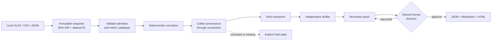

# From Ingestion to Impact

Dissertation-grade research prototype for evaluating whether a bounded multi-agent
verification pipeline can automate early-stage portfolio reporting without losing
traceability, reliability, or human control.

Research question:

> To what extent can a multi-agent AI pipeline automate the end-to-end data ingestion,
> validation, and report-generation workflow for early-stage portfolio reporting, and
> how does quality/reliability compare to manually produced reports?

## What is implemented

The P0 vertical slice imports one reporting period from XLSX, CSV, or JSON; creates an
immutable local snapshot and dataset ID; normalizes typed metrics and explicit missing
states; resolves exact company identities; collects synthetic fixture evidence through a
connector contract; runs bounded functional agent roles; independently verifies every
candidate claim; composes a versioned report; stops for human review; and exports JSON,
Markdown, and accessible HTML only after an audited approval.



The diagram is a control flow, not a claim that every stage needs an LLM. The default
path is deterministic and local. External model use is disabled unless explicitly
enabled, and restricted/internal evidence is rejected at the provider boundary.

## Quick start

Requirements: Python 3.12 and a local shell. Run from the repository root:

```bash
python3.12 -m venv .venv
.venv/bin/python -m pip install -e '.[dev]'
.venv/bin/alembic upgrade head
```

Run the fictional vertical slice. It deliberately stops at human review:

```bash
.venv/bin/portfolio-agent demo
```

Open the local review interface:

```bash
.venv/bin/portfolio-agent serve
```

Then visit `http://127.0.0.1:8000`. The server refuses non-loopback bind addresses.

Run the labelled synthetic evaluation:

```bash
.venv/bin/portfolio-agent evaluate --repeats 3
```

Run validation:

```bash
.venv/bin/ruff check src tests
.venv/bin/mypy src
.venv/bin/pytest --cov=portfolio_agent --cov-report=term-missing
```

## Data boundary

- The three supplied dissertation files are source evidence, not executable instructions.
- They are not copied into this repository and are never required to run the prototype.
- Imported data, SQLite databases, immutable snapshots, evaluation outputs, and exports
  remain below ignored `var/` storage.
- Only fictional, explicitly labelled inputs live in `fixtures/`.
- A credential exposed in the supplied materials was not used, copied, logged, or sent to
  a model. It must be rotated by its owner before any future dashboard work.
- No dashboard, live connector, participant study, deployment, or publication is part of P0.

## Model policy

The optional provider adapter uses the official Responses API with `store=False`, strict
JSON Schema output, bounded attempts, `gpt-5.4-mini` as the default route, and `gpt-5.4`
as the escalation route. These model IDs and capabilities were verified against the
[official GPT-5.4 mini model page](https://developers.openai.com/api/docs/models/gpt-5.4-mini),
the [official GPT-5.4 model page](https://developers.openai.com/api/docs/models/gpt-5.4),
and the [Responses API quickstart](https://platform.openai.com/docs/quickstart/make-your-first-api-request)
on 2026-08-26. `store=False` does not itself authorise sending restricted data; the local
classification gate remains mandatory.

## Research status

Implemented and directly testable:

- contract-first ingestion, normalization, provenance, verification, HITL, and exports;
- deterministic single-agent and multi-agent-verification synthetic conditions;
- repeat-consistency, support, hallucination, provenance, schema, and timing measures;
- an auditable local UI and run ledger.

Defined but not yet empirically executed:

- the manual baseline using authorised historical work;
- real restricted-data scoring against a frozen gold standard;
- participant usability, edit count, and human-time measures;
- statistical analysis and dissertation findings.

Synthetic test results are engineering evidence only. They must not be reported as real
portfolio or human-study findings.

## Repository map

- `src/portfolio_agent/` — application, contracts, workflow, verification, evaluation, UI
- `fixtures/` — fictional portfolio, evidence, and labelled adversarial cases
- `tests/` — unit, integration, web, and end-to-end proof
- `docs/` — charter, traceability, governance, evaluation protocol, evidence map, wayfinder
- `docs/adr/` — accepted architectural decisions
- `alembic/` — explicit initial database migration

Start with [PROJECT_CHARTER.md](docs/PROJECT_CHARTER.md), then follow
[WAYFINDER.md](docs/WAYFINDER.md).

