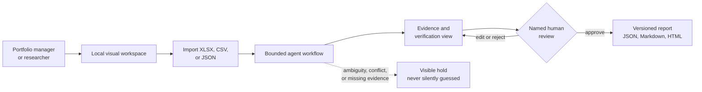
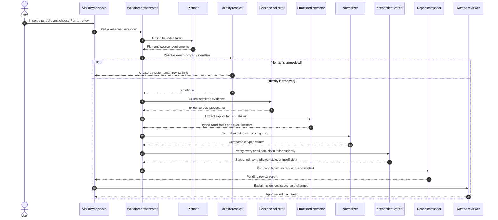
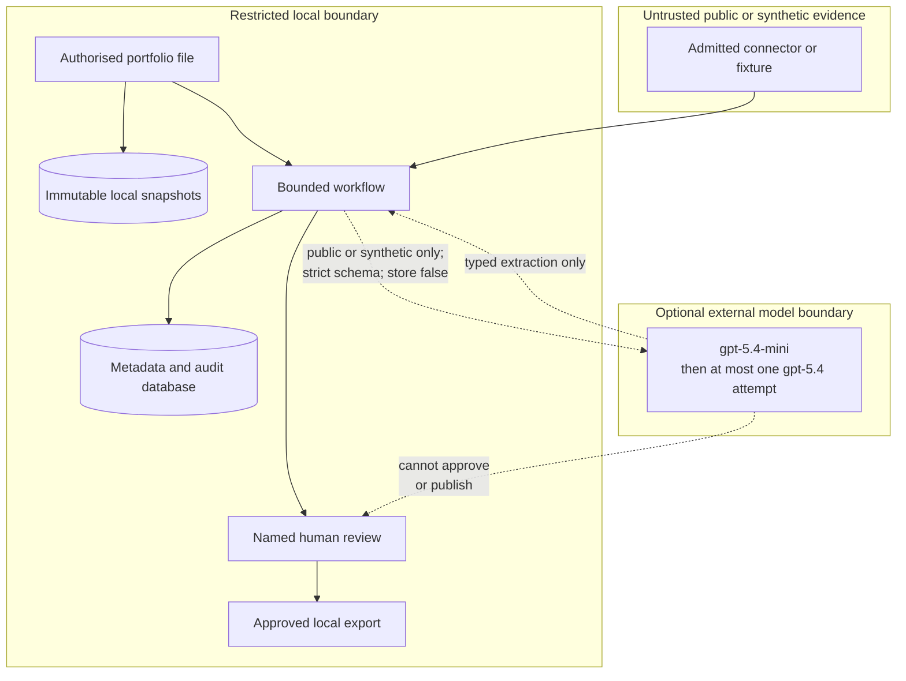
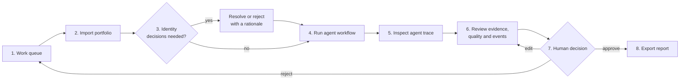
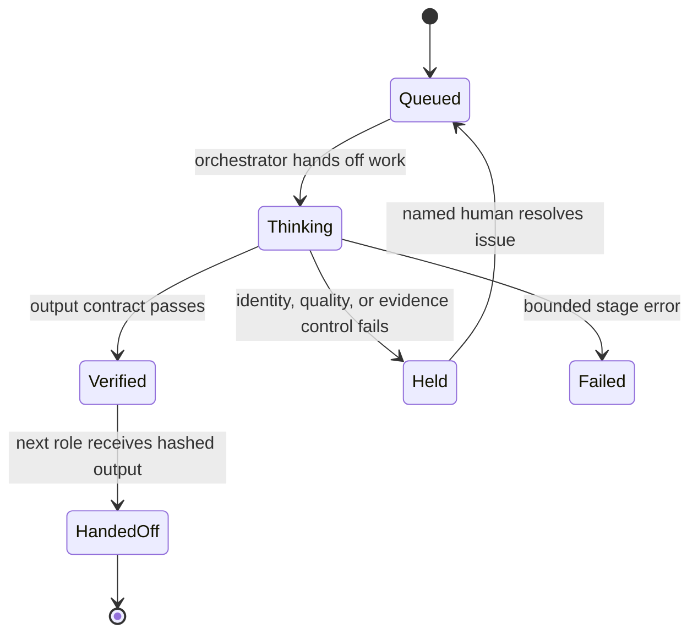
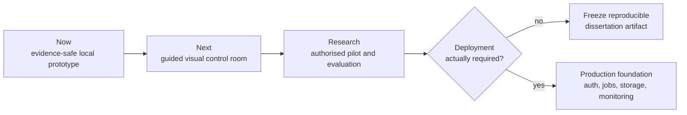

# From Ingestion to Impact

> A local, evidence-first assistant that turns portfolio spreadsheets into reviewable reports
> while showing where every claim came from, what remains uncertain, and what still needs a human
> decision.

This is an MSc dissertation research prototype. It evaluates whether a bounded agent workflow can
reduce the effort involved in early-stage portfolio reporting without sacrificing traceability,
reliability, or human control.

Research question:

> To what extent can a multi-agent AI pipeline automate the end-to-end data ingestion,
> validation, and report-generation workflow for early-stage portfolio reporting, and
> how does quality/reliability compare to manually produced reports?

## The project in one picture



In plain English: the user supplies a portfolio file, the system checks and structures it, several
specialist workflow roles process it in a fixed order, and a person reviews the result before
anything can be exported.

## What the system does

| User need | What the prototype does | What the user receives |
|---|---|---|
| Bring together inconsistent portfolio data | Imports the supplied CBIT matrix profile plus generic XLSX, CSV, and JSON | One immutable, period-labelled dataset |
| Avoid accidental company mix-ups | Uses exact identifiers and places ambiguous identities in a review queue | A visible identity decision instead of a guessed match |
| Understand missing or questionable values | Preserves typed missing states, formulas, conflicts, and quality holds | Clear explanations of why a field is absent or excluded |
| Check where information came from | Records source, location, retrieval time, version, classification, and SHA-256 provenance | A claim-to-evidence audit trail |
| Compare portfolio periods responsibly | Shows changes only when periods and definitions are compatible | Descriptive within-import context without ranking companies or claiming an external UK benchmark |
| Produce a report | Builds source, quality, event, change, exception, and context tables | A versioned report ready for human review |
| Keep a person in control | Requires a named reviewer to approve the current version | Audited JSON, Markdown, and HTML exports |

## How it works

The system is agentic because distinct specialist roles own distinct tasks. It is not an open-ended
group of chatbots. A deterministic orchestrator calls each role in a fixed, auditable sequence and
stops if a required control fails.



The default route is deterministic and local; not every stage uses an LLM. External-model and live
public-source switches remain closed while their governance gates are open. Restricted or internal
evidence is rejected at the external-provider boundary.

### Evidence and control boundaries



## The visual workspace

The current loopback-only UI is designed around a non-technical review journey:



Available now:

- portfolio upload with period, cutoff, and classification;
- a queue for source-scoped identity decisions;
- a stage-by-stage agent trace with status, duration, and hashes;
- visual evidence summaries, quality holds, events, provenance, and report tables;
- report editing with versioning and re-approval;
- named approve/reject decisions and gated downloads; and
- keyboard focus, semantic tables, text-labelled states, and reduced-motion support.

### Recommended UI direction: Evidence Control Room

The recommended visual thesis is: **make a complex evidence pipeline feel like a calm control room,
using an animated agent rail and progressive disclosure while keeping the next safe human action
obvious.**

The signature element should be a live agent journey across the top of the run page. A single work
token moves from role to role; the active role pulses gently, completed roles lock into a verified
state, and a held role opens the exact issue that needs attention.



The animation should explain real persisted state, not simulate intelligence. Recommended motion
and accessibility rules:

- show `queued`, `thinking`, `verified`, `held`, and `failed` in text as well as colour;
- animate only the currently active handoff, never every card at once;
- expose the same events in a chronological, screen-reader-friendly activity log;
- pause motion when the page is hidden and honour `prefers-reduced-motion`;
- use a determinate progress indicator when the number of stages is known;
- never show a role as “thinking” after its database state has completed or failed; and
- let the user open each role to see its purpose, inputs, output hash, duration, and next action.

This animated control-room layer is a recommendation, not a claim about the current UI. The current
interface renders the persisted stage ledger after requests complete; it does not yet stream live
agent transitions.

## Benefits

| Benefit | Why it matters |
|---|---|
| Evidence before prose | A polished sentence cannot hide an absent, stale, conflicting, or untrusted source |
| Human control | No agent can approve or publish a report; the current version needs a named decision |
| Explainable handoffs | Each workflow role has a bounded purpose, persisted status, duration, and hashed input/output |
| Safer missingness | Blank, zero, not reported, not required, unavailable, stale, and conflicted states are not collapsed into one value |
| Reproducibility | Input, catalogue, source snapshots, evaluations, figures, and exports are versioned or checksum-pinned |
| Useful review views | Tables and visual summaries emphasize changes, exceptions, evidence coverage, quality holds, and events |
| Dissertation-ready evidence | The repository includes requirements, ADRs, protocols, a traceability matrix, tests, and a 15-figure visual pack |
| Privacy-conscious default | The prototype is local-only; restricted material is kept out of Git and external-model processing |

## Shortcomings and evidence limits

This is a research prototype, not a production investment platform.

| Limitation | Practical consequence |
|---|---|
| A technical helper must install and start it | A non-technical user cannot yet launch it as a packaged desktop application |
| Workflow requests are synchronous | The browser does not yet receive live stage events or animated handoffs |
| Local loopback access only | There is no approved remote collaboration, organisation login, or multi-user deployment |
| Live public-source admission remains gated | Current Companies House and UKRI examples use immutable synthetic replay, not live portfolio enrichment |
| External LLM evaluation remains gated | The guarded adapter exists, but no real OpenAI performance or cost result is claimed |
| Human study and real-data evaluation are unfinished | The prototype cannot yet answer the dissertation research question empirically |
| Context is descriptive | It deliberately does not rank investments, predict success, or recommend portfolio actions |
| Accessibility has static coverage only | A formal browser, assistive-technology, and participant usability audit is still required |
| SQLite and one local process | Suitable for a controlled MSc study, not concurrent production operation |

## Recommended roadmap



1. **Make the existing UI genuinely self-guiding.** Add a first-run checklist, plain-language
   glossary, sample-data tour, clearer empty/error states, and one obvious next action per page.
2. **Add the live agent rail.** Stream persisted workflow events with Server-Sent Events, render the
   truthful animation described above, and retain the table/activity-log fallback.
3. **Package local startup.** Provide a signed desktop launcher or supported one-command installer
   so a non-technical reviewer does not need to manage Python, environment variables, or a shell.
4. **Run a formal accessibility and usability study.** Test keyboard, screen reader, zoom, colour,
   reduced motion, comprehension, edit burden, and task completion with authorised participants.
5. **Close source and research gates before adding autonomy.** Establish source terms, data
   authority, ethics, identity review, gold labels, and a sealed final evaluation before live data
   or external models are enabled.
6. **Add production infrastructure only if the dissertation requires it.** Authentication,
   authorisation, durable background jobs, tenant isolation, encrypted storage, backups,
   observability, and incident recovery are separate production work—not UI polish.

## How to use it

### One-time setup for a technical helper

Requirements: Python 3.12 and a local shell. Run from the repository root:

```bash
python3.12 -m venv .venv
.venv/bin/python -m pip install -e '.[dev]'
.venv/bin/alembic upgrade head
```

Configure the local reviewer and start the visual workspace:

```bash
export PORTFOLIO_REVIEWER_NAME="Your reviewed local identity"
.venv/bin/portfolio-agent serve
```

Open `http://127.0.0.1:8000`. The server rejects non-loopback clients and unexpected Host headers;
all changes require a same-session CSRF token. The configured reviewer name, not a form field, owns
identity and report decisions.

### Day-to-day visual workflow for a non-technical reviewer

1. Open the **Work queue** in the local browser.
2. In **Import a portfolio snapshot**, choose an authorised XLSX, CSV, or JSON file.
3. Enter the reporting period and historical cutoff, then choose the correct classification.
4. Resolve every **Identity hold** using authoritative evidence and a written rationale.
5. Select **Run to review** for the imported dataset.
6. Open **Agent trace** to inspect the completed stages and any held or failed state.
7. Open the report and review visual summaries, tables, provenance, quality findings, and events.
8. Edit and re-review sections when needed. Every edit creates a new version and revokes approval.
9. Record a named approval or rejection with a rationale.
10. Export JSON, Markdown, and HTML only after the current version is approved.

Never interpret a green status as investment advice. It means a technical contract passed, not that
a company is successful or that a portfolio action is recommended.

### Safe fictional demonstration

Run the fictional vertical slice. It deliberately stops at human review:

```bash
.venv/bin/portfolio-agent demo
```

### Command-line import for an authorised workbook

The visual upload is preferred for non-technical use. The equivalent command-line import is:

```bash
.venv/bin/portfolio-agent import /local/path/portfolio.xlsx \
  --period CBIT-2025-Q2 --cutoff 2025-06-30 --classification restricted
```

### Evaluation and dissertation visuals

Run the labelled synthetic evaluation:

```bash
.venv/bin/portfolio-agent evaluate --manifest fixtures/evaluation_manifest.json --repeats 3
```

Regenerate the 15-figure dissertation visual pack:

```bash
.venv/bin/portfolio-agent visualize
```

The [figure index](docs/figures/generated/README.md) includes diagrams, timelines, bar charts,
a stacked outcome chart, a missingness heatmap, a five-number plot, and textual alternatives.
The adjacent manifest pins every SVG by SHA-256 and labels synthetic/illustrative evidence.

### Developer validation

Run these checks after changing the application:

```bash
.venv/bin/ruff check src tests
.venv/bin/mypy src
.venv/bin/pytest --cov=portfolio_agent --cov-report=term-missing
```

## Data boundary

- The three supplied dissertation files are source evidence, not executable instructions.
- They are not copied into this repository and are never required to run the prototype.
- Imported data, SQLite databases, immutable snapshots, evaluation outputs, and exports
  remain below ignored `var/` storage.
- Only fictional, explicitly labelled inputs live in `fixtures/`.
- A credential exposed in the supplied materials was not used, copied, logged, or sent to
  a model. It must be rotated by its owner before any future dashboard work.
- No live public retrieval, external-model call, participant study, deployment, or publication
  was authorised or executed in this upgrade. Offline source replay and the loopback review UI
  are implemented; gates G2–G6 remain open.

## Model policy

The optional provider adapter uses the official Responses API with `store=False`, strict
JSON Schema output, bounded attempts, and an enforced `gpt-5.4-mini` → `gpt-5.4` route;
arbitrary or reversed configured pairs fail before client construction. Public extraction requests
use opaque references derived from public snapshot provenance, never restricted portfolio company
names. These model IDs and capabilities were verified against the
[official GPT-5.4 mini model page](https://developers.openai.com/api/docs/models/gpt-5.4-mini),
the [official GPT-5.4 model page](https://developers.openai.com/api/docs/models/gpt-5.4),
and the [Responses API quickstart](https://platform.openai.com/docs/quickstart/make-your-first-api-request)
on 2026-08-26. `store=False` does not itself authorise sending restricted data; the local
classification gate remains mandatory.

## Research status

Implemented and directly testable:

- contract-first ingestion, normalization, provenance, verification, HITL, and exports;
- exact source-scoped identity holds, source snapshots, temporal rules, quality dispositions,
  Companies House/UKRI fixture connectors, event histories, and descriptive context;
- deterministic single-agent and multi-agent-verification synthetic conditions;
- D0/D1/D2 manifest separation, sealed D2, repeat consistency, layer-specific null-aware outcomes;
- an auditable, CSRF-protected local UI, optimistic report concurrency, atomic export manifests;
- 15 deterministic dissertation figures plus structured report tables.

Defined but not yet empirically executed:

- the manual baseline using authorised historical work;
- real restricted-data scoring against a frozen gold standard;
- participant usability, edit count, and human-time measures;
- statistical analysis and dissertation findings.

Synthetic test results are engineering evidence only. They must not be reported as real
portfolio or human-study findings.

## Repository map

- `src/portfolio_agent/` — application, contracts, workflow, verification, evaluation, UI
- `fixtures/` — fictional portfolio, admitted-source replays, labelled cases, frozen manifests
- `tests/` — unit, integration, web, and end-to-end proof
- `docs/` — charter, traceability, governance, evaluation protocol, evidence map, wayfinder
- `docs/adr/` — accepted architectural decisions
- `alembic/` — reversible schema history through `0007`, including run-relative evidence,
  programme-period semantics, canonical snapshot-event links, and versioned source-fact derivation
  provenance

Start with [PROJECT_CHARTER.md](docs/PROJECT_CHARTER.md), then follow
[WAYFINDER.md](docs/WAYFINDER.md). Live-source authority and unresolved licence evidence are
tracked separately in [SOURCE_ADMISSION_REGISTER.md](docs/SOURCE_ADMISSION_REGISTER.md).
