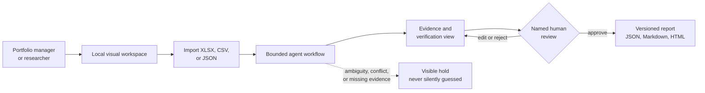
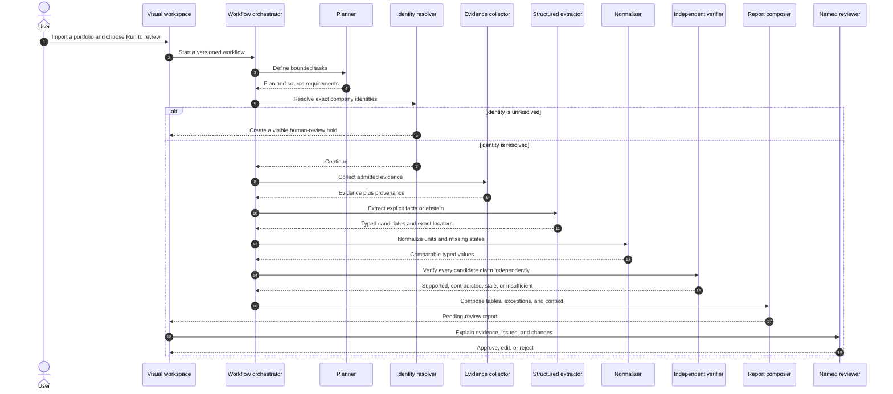
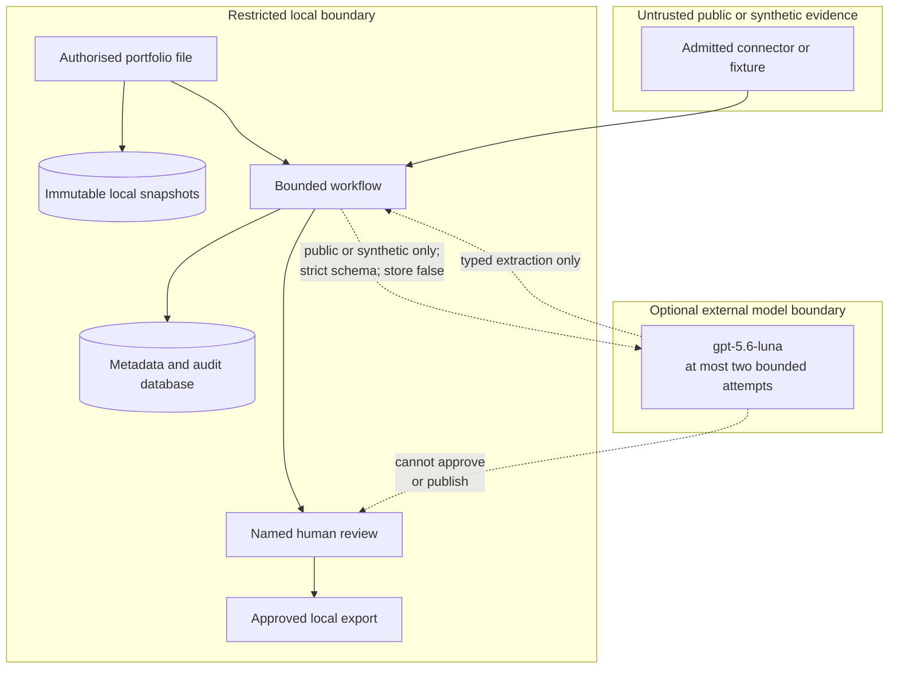
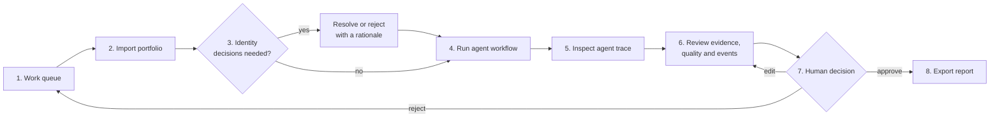
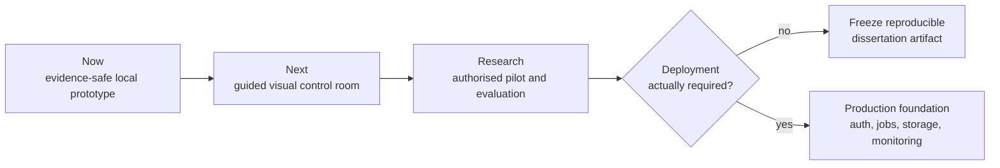

# From Ingestion to Impact

> A local, evidence-first assistant that turns portfolio spreadsheets into reviewable reports
> while showing where every claim came from, what remains uncertain, and what still needs a human
> decision.

This is an MSc dissertation research prototype. It evaluates whether a bounded agent workflow can
reduce the effort involved in early-stage portfolio reporting without sacrificing traceability,
reliability, or human control.

Research question:

> To what extent can a multi-agent AI pipeline automate the end-to-end data ingestion,
> validation, and report-generation workflow for early-stage portfolio reporting, and
> how does quality/reliability compare to manually produced reports?

## The project in one picture



In plain English: the user supplies a portfolio file, the system checks and structures it, several
specialist workflow roles process it in a fixed order, and a person reviews the result before
anything can be exported.

## What the system does

| User need | What the prototype does | What the user receives |
|---|---|---|
| Bring together inconsistent portfolio data | Imports the supplied CBIT matrix profile plus generic XLSX, CSV, and JSON | One immutable, period-labelled dataset |
| Avoid accidental company mix-ups | Uses exact identifiers and places ambiguous identities in a review queue | A visible identity decision instead of a guessed match |
| Understand missing or questionable values | Preserves typed missing states, formulas, conflicts, and quality holds | Clear explanations of why a field is absent or excluded |
| Check where information came from | Records source, location, retrieval time, version, classification, and SHA-256 provenance | A claim-to-evidence audit trail |
| Compare portfolio periods responsibly | Shows changes only when periods and definitions are compatible | Descriptive within-import context without ranking companies or claiming an external UK benchmark |
| Produce a report | Builds source, quality, event, change, exception, and context tables | A versioned report ready for human review |
| Keep a person in control | Requires a named reviewer to approve the current version | Audited JSON, Markdown, and HTML exports |

## How it works

The system is agentic because distinct specialist roles own distinct tasks. It is not an open-ended
group of chatbots. A deterministic orchestrator calls each role in a fixed, auditable sequence and
stops if a required control fails.



The default route is deterministic and local; not every stage uses an LLM. External-model and live
public-source switches remain closed while their governance gates are open. Restricted or internal
evidence is rejected at the external-provider boundary.

### Evidence and control boundaries



## The visual workspace

The current loopback-only UI is designed around a non-technical review journey:



Available now:

- portfolio upload with period, cutoff, and classification;
- a queue for source-scoped identity decisions;
- a stage-by-stage agent trace with status, duration, and hashes;
- visual evidence summaries, quality holds, events, provenance, and report tables;
- report editing with versioning and re-approval;
- named approve/reject decisions and gated downloads; and
- keyboard focus, semantic tables, text-labelled states, and reduced-motion support.

### The agent control room

There are two surfaces over the same persisted records.

| Surface | What it is | When to use it |
|---|---|---|
| Jinja workspace (`http://127.0.0.1:8000`) | The original server-rendered review UI. No Node required. | Import and report review; any environment without Node |
| Control room (`dashboard/`, `http://localhost:3000`) | A Next.js operator surface for the company-research workflow | Watching a research run execute, inspecting evidence, approving a profile |

The control room's thesis is: **make the bounded agent workflow the interface.** Its centrepiece is
an execution graph built from the persisted task and source rows, not from a hard-coded diagram.

```text
  Identity ──▶ Source planner ──▶ Safe public fetcher ──▶ Claim extractor ──▶ Composer ──▶ Reviewer
   (human)         (model)          (deterministic)      (model + validator)  (deterministic)  (human)
                                          │
                                          ├── lane: official register        captured · 5 claims
                                          ├── lane: verified first party     captured · 6 claims
                                          ├── lane: secondary public         blocked by robots
                                          └── lane: secondary public         unsupported media
```

What the animation means, and only what it means:

| Motion | Persisted state it reports |
|---|---|
| Node ring pulses | That stage currently holds an exclusive claim on the run |
| Packet travels an edge | Work is flowing into the stage at the far end right now |
| Lane changes colour | That source's acquisition outcome changed in the database |
| Edge stops short in coral | The downstream stage recorded a failure |
| Slow amber breath | The run is waiting on a person, not on a machine |
| Nothing moves | Nothing is executing |

Selecting any stage opens its bounded contract — what it owns, what it must not do, its inputs and
outputs — alongside its attempt log, input and output hashes, duration and model telemetry.
Selecting a source lane shows its HTTP status, byte size, snapshot checksum, redaction count and
the claims it admitted, and dims every claim that came from elsewhere.

The approved HTML deck is an evidence-led diligence dossier rather than a raw schema dump. It opens
with source and claim coverage, then groups admitted exact spans into decision-oriented sections.
The CBIT appendix keeps four states visually and textually distinct: direct public evidence,
related public signals that do not complete a metric, company documentation required, and no
qualifying evidence found in the bounded run. This prevents useful funding, customer, partnership,
technology, certification, and adverse evidence from being hidden merely because it does not satisfy
an exact metric denominator or reporting period.

Honest limits: execution is still synchronous and one stage runs per instruction. The control room
chains those instructions and polls while a stage is in flight; it is not a durable background
worker, and it never shows a state the database does not hold. `prefers-reduced-motion` removes all
motion without removing information, and every state is written in text as well as colour.

## Benefits

| Benefit | Why it matters |
|---|---|
| Evidence before prose | A polished sentence cannot hide an absent, stale, conflicting, or untrusted source |
| Human control | No agent can approve or publish a report; the current version needs a named decision |
| Explainable handoffs | Each workflow role has a bounded purpose, persisted status, duration, and hashed input/output |
| Safer missingness | Blank, zero, not reported, not required, unavailable, stale, and conflicted states are not collapsed into one value |
| Reproducibility | Input, catalogue, source snapshots, evaluations, figures, and exports are versioned or checksum-pinned |
| Useful review views | Tables and visual summaries emphasize changes, exceptions, evidence coverage, quality holds, and events |
| Dissertation-ready evidence | The repository includes requirements, ADRs, protocols, a traceability matrix, tests, and a 15-figure visual pack |
| Privacy-conscious default | The prototype is local-only; restricted material is kept out of Git and external-model processing |

## Shortcomings and evidence limits

This is a research prototype, not a production investment platform.

| Limitation | Practical consequence |
|---|---|
| A technical helper must install and start it | A non-technical user cannot yet launch it as a packaged desktop application |
| Workflow requests are synchronous | The browser does not yet receive live stage events or animated handoffs |
| Local loopback access only | There is no approved remote collaboration, organisation login, or multi-user deployment |
| Live public-source admission remains gated | Current Companies House and UKRI examples use immutable synthetic replay, not live portfolio enrichment |
| External LLM evaluation remains gated | The guarded adapter exists, but no real OpenAI performance or cost result is claimed |
| Human study and real-data evaluation are unfinished | The prototype cannot yet answer the dissertation research question empirically |
| Context is descriptive | It deliberately does not rank investments, predict success, or recommend portfolio actions |
| Accessibility has static coverage only | A formal browser, assistive-technology, and participant usability audit is still required |
| SQLite and one local process | Suitable for a controlled MSc study, not concurrent production operation |

## Recommended roadmap



1. **Make the existing UI genuinely self-guiding.** Add a first-run checklist, plain-language
   glossary, sample-data tour, clearer empty/error states, and one obvious next action per page.
2. **Add the live agent rail.** Stream persisted workflow events with Server-Sent Events, render the
   truthful animation described above, and retain the table/activity-log fallback.
3. **Package local startup.** Provide a signed desktop launcher or supported one-command installer
   so a non-technical reviewer does not need to manage Python, environment variables, or a shell.
4. **Run a formal accessibility and usability study.** Test keyboard, screen reader, zoom, colour,
   reduced motion, comprehension, edit burden, and task completion with authorised participants.
5. **Close source and research gates before adding autonomy.** Establish source terms, data
   authority, ethics, identity review, gold labels, and a sealed final evaluation before live data
   or external models are enabled.
6. **Add production infrastructure only if the dissertation requires it.** Authentication,
   authorisation, durable background jobs, tenant isolation, encrypted storage, backups,
   observability, and incident recovery are separate production work—not UI polish.

## How to use it

### Docker Compose: consistent local environment

Docker is the recommended path when you want the app, migrations, digest-pinned Python 3.12 base,
and fully resolved Python dependency locks to run in one reproducible environment. Docker Desktop
(or Docker Engine with Compose) is the only host prerequisite.

Create a private `.env` once from `.env.example`, setting `OPENAI_API_KEY` and the accountable
`PORTFOLIO_REVIEWER_NAME`. Docker Compose reads only the explicitly mapped values; the API key is
injected into the running local container and is not copied into the image. Keep the file private:

```bash
chmod 600 .env
```

Then the complete local dashboard, migrations, persistent state, and approved live company
research boundary start with one command:

```bash
docker compose up --build --wait
```

Open `http://127.0.0.1:8000`. Compose publishes the service only on host loopback. The app's
explicit Docker-local mode accepts the private Docker gateway inside the container but continues
to reject public clients and unexpected Host headers. Database migrations run automatically before
the service becomes healthy.

If port 8000 is already occupied, select another host-loopback port without changing the container:

```bash
export PORTFOLIO_PORT=8001
docker compose up --build --wait
```

Then open `http://127.0.0.1:8001`.

Runtime databases, snapshots, uploads, evaluations, and exports persist in the
`portfolio-state` Docker volume. Routine shutdown preserves them:

```bash
docker compose down
```

Useful containerised commands:

```bash
docker compose logs --follow app
docker compose exec app portfolio-agent demo
docker compose exec app portfolio-agent evaluate --manifest fixtures/evaluation_manifest.json --repeats 3
docker compose exec app portfolio-agent visualize --output /app/var/figures
docker compose --profile test run --rm test
```

`docker compose down --volumes` permanently deletes the Docker-managed database and all other
runtime artifacts. Use it only when you deliberately want a clean local state. Loading the API key
enables the approved capability but does not itself make an external request: only explicitly
advancing a discovery or extraction stage in Company 360 calls OpenAI.

### One-time setup for a technical helper

For a native installation instead, requirements are Python 3.12 and a local shell. Run from the
repository root:

```bash
python3.12 -m venv .venv
.venv/bin/python -m pip install -e '.[dev]'
.venv/bin/alembic upgrade head
```

Configure the local reviewer and start the visual workspace:

```bash
export PORTFOLIO_REVIEWER_NAME="Your reviewed local identity"
.venv/bin/portfolio-agent serve
```

Open `http://127.0.0.1:8000`. The server rejects non-loopback clients and unexpected Host headers;
all changes require a same-session CSRF token. The configured reviewer name, not a form field, owns
identity and report decisions.

### Day-to-day visual workflow for a non-technical reviewer

1. Open the **Work queue** in the local browser.
2. In **Import a portfolio snapshot**, choose an authorised XLSX, CSV, or JSON file.
3. Enter the reporting period and historical cutoff, then choose the correct classification.
4. Resolve every **Identity hold** using authoritative evidence and a written rationale.
5. Select **Run to review** for the imported dataset.
6. Open **Agent trace** to inspect the completed stages and any held or failed state.
7. Open the report and review visual summaries, tables, provenance, quality findings, and events.
8. Edit and re-review sections when needed. Every edit creates a new version and revokes approval.
9. Record a named approval or rejection with a rationale.
10. Export JSON, Markdown, and HTML only after the current version is approved.

Never interpret a green status as investment advice. It means a technical contract passed, not that
a company is successful or that a portfolio action is recommended.

### Safe fictional demonstration

Run the fictional vertical slice. It deliberately stops at human review:

```bash
.venv/bin/portfolio-agent demo
```

### Run the agent control room

The control room is a separate Next.js application in `dashboard/`. It talks to the research service
through a server-side proxy, so the browser never holds the CSRF token and the service keeps its
loopback-only boundary.

Start the research service with the offline fixture corpus. No external model call and no outbound
request is made, and every run produced this way is synthetic:

```bash
PORTFOLIO_REVIEWER_NAME="Your name" .venv/bin/portfolio-agent serve --fixture-research
```

In a second terminal, install and start the control room once:

```bash
cd dashboard && npm install && npm run dev
```

Open `http://localhost:3000` and follow the workflow: enter a Companies House number, accept the
identity with a written rationale, start a run, then either advance one stage at a time or run to
review. The masthead states which mode the service is in — `Fixture research · synthetic`,
`Public research open`, or `Research gates closed`.

If port 3000 or 8000 is already taken on your machine, move either side and tell the control room
where the service is:

```bash
PORTFOLIO_API_ORIGIN=http://127.0.0.1:8010 npm run dev -- -p 3100
```

The Docker Compose service also exposes the JSON API. Rebuild the image after pulling these changes
so the container serves `/api`:

```bash
docker compose build app && docker compose up -d app
```

For a real research run, start the service without `--fixture-research` and open both gates as
described in [Explicit live company research](#explicit-live-company-research). Live runs spend
OpenAI credits and make outbound requests to public sources.

### Bounded live OpenAI smoke test

The default runtime remains deterministic. A separately acknowledged command can exercise one
real Responses API extraction inside the same eight-stage synthetic workflow. It sends only the
checksum-pinned `ev_syn_aster_products_narrative` fixture; all other extraction work remains local.

The command accepts `OPENAI_API_KEY` from the current process environment. For local development,
it also reads only that exact key from the ignored `.env`; it does not source or execute the file.
Make the file private once, then run the explicitly acknowledged command:

```bash
chmod 600 .env
.venv/bin/portfolio-agent openai-smoke --acknowledge-synthetic-only
```

The smoke command forces synthetic-only guards and uses a new private runtime directory below
ignored `var/experiments/runtimes/`, so it cannot collide with `var/portfolio.db`. Supplying
`OPENAI_API_KEY` in the process environment still takes precedence over `.env`.

After the command passes, copy the emitted `serve_command` to open that exact persisted run/report
in the deterministic control room. It has this shape:

```bash
PORTFOLIO_DATABASE_URL='sqlite:////…/portfolio.db' \
PORTFOLIO_RAW_DATA_DIR='/…/raw' \
PORTFOLIO_SOURCE_SNAPSHOT_DIR='/…/sources' \
.venv/bin/portfolio-agent serve
```

The command permits at most one strict extraction target, with at most one validation escalation.
Each response is capped at 512 output tokens and uses `store=False`. It writes a content-free audit
manifest below ignored `var/experiments/` with model, token counts, timings, hashes, and fixture
checksums. A passing smoke test proves connectivity and the strict extraction contract only; it
does not close G4 or support performance, quality, retention, or cost claims.

G4 is the P0 artifact/quality gate for admitting external-model runs as empirical evidence. Closing
it requires an approved evaluation protocol, budget/data authority, frozen prompts and schemas,
and evidence suitable for model-quality or cost claims. This narrow connectivity check deliberately
stays on the safe side of that gate.

### Explicit live company research

The Company 360 workspace can run the approved public-only research path. It uses OpenAI Responses
web search for URL discovery, independently captures permitted public pages, validates model claims
as contact-redacted immutable derivatives, retains only substantive verbatim captured spans, and
builds a named-review deck with potential contradictions and coverage gaps. Search snippets and
unrestricted model prose never become evidence.

OpenAI account setup:

1. use a dedicated API project with active billing or available API credits;
2. create a project API key and keep it out of the repository;
3. ensure the project permits the configured model and Web Search hosted tool if your organisation
   uses model/tool allowlists;
4. configure a project spend limit or alert appropriate for local research; and
5. optionally configure an approved data-retention control. `store=False` is used, but it is not a
   claim that the project has Zero Data Retention.

There is no separate search-provider key. The recommended Docker path uses the private `.env` and
starts with `docker compose up --build --wait`. For a native local server instead, use explicit
process configuration (the normal `serve` command does not source `.env`):

```bash
export OPENAI_API_KEY='replace-with-project-key'
export PORTFOLIO_REVIEWER_NAME='Your accountable reviewer name'
export PORTFOLIO_ALLOW_EXTERNAL_LLM=true
export PORTFOLIO_ALLOW_LIVE_PUBLIC_RETRIEVAL=true
.venv/bin/portfolio-agent serve
```

In **Companies**, create a `public` case from the Companies House number, record the named identity
decision, create a research run, and advance its four persisted stages. Run creation and page views
do not call external services. Discovery and extraction are the two model stages; capture performs
connection-pinned bounded publisher requests. If a process stops with a task marked running, use the
named recovery control before continuing. Review sources, verbatim spans, contradiction candidates,
coverage gaps, and limitations before approving. Approved profiles download as hash-verified
evidence JSON and printable HTML; native PPTX/PDF remains a later rendering track.

### Command-line import for an authorised workbook

The visual upload is preferred for non-technical use. The equivalent command-line import is:

```bash
.venv/bin/portfolio-agent import /local/path/portfolio.xlsx \
  --period CBIT-2025-Q2 --cutoff 2025-06-30 --classification restricted
```

### Evaluation and dissertation visuals

Run the labelled synthetic evaluation:

```bash
.venv/bin/portfolio-agent evaluate --manifest fixtures/evaluation_manifest.json --repeats 3
```

Regenerate the 15-figure dissertation visual pack:

```bash
.venv/bin/portfolio-agent visualize
```

The [figure index](docs/figures/generated/README.md) includes diagrams, timelines, bar charts,
a stacked outcome chart, a missingness heatmap, a five-number plot, and textual alternatives.
The adjacent manifest pins every SVG by SHA-256 and labels synthetic/illustrative evidence.

### Developer validation

Run these checks after changing the application:

```bash
.venv/bin/ruff check src tests
.venv/bin/mypy src
.venv/bin/pytest --cov=portfolio_agent --cov-report=term-missing
```

After changing the control room, run its gates from `dashboard/`:

```bash
npm run typecheck && npm run lint && npm run build
```

## Data boundary

- The three supplied dissertation files are source evidence, not executable instructions.
- They are not copied into this repository and are never required to run the prototype.
- Imported data, SQLite databases, immutable snapshots, evaluation outputs, and exports
  remain below ignored `var/` storage.
- Only fictional, explicitly labelled inputs live in `fixtures/`.
- A credential exposed in the supplied materials was not used, copied, logged, or sent to
  a model. It must be rotated by its owner before any future dashboard work.
- Live public retrieval is disabled by default. The approved public-company path requires both
  explicit runtime opt-ins, a reviewed Companies House identity, and named review; no live company
  run has been executed as implementation proof. Participant study, deployment, and publication
  remain disabled, and gates G2–G6 remain governed by the evidence ledger.

## Model policy

The optional provider adapter uses the official Responses API with `store=False`, strict
JSON Schema output and bounded attempts. Any configured model outside the pinned route fails before
client construction. Every route uses GPT-5.6 Luna and is fixed in code, never chosen by a model:

| Route | Stage | Model | Effort |
|---|---|---|---|
| Portfolio extraction | one field from one evidence item, plus at most one schema-repair attempt | `gpt-5.6-luna` | `none` |
| Company research — broad discovery | diverse public-source planning from one exact identifier | `gpt-5.6-luna` | `PORTFOLIO_OPENAI_REASONING_EFFORT`, default `medium` |
| Company research — evidence selection | exact-span claims selected from the captured corpus | `gpt-5.6-luna` | `low` |
| Company research — repair | any repeat attempt after rejected output | `gpt-5.6-luna` | `low` |

Discovery uses configured reasoning effort to assemble a diverse source bucket across official
registers, first-party pages, local and trade reporting, public notices, and attributable
engineering sources. Low-effort Luna calls then select exact-span claims from captured text;
deterministic code still decides which claims enter the ledger. The briefs state the validation contract verbatim because anything
the validator enforces but the brief omits becomes silently missing evidence. The model that
actually ran is recorded on every attempt and shown per stage in the control room. See
[ADR 0011](docs/adr/0011-gpt-5-6-luna-routing.md). Public extraction requests
use opaque references derived from public snapshot provenance, never restricted portfolio company
names. The model ID and capabilities were verified against the
[official GPT-5.6 Luna model page](https://developers.openai.com/api/docs/models/gpt-5.6-luna),
and the [Responses API quickstart](https://platform.openai.com/docs/quickstart/make-your-first-api-request)
on 2026-08-28. `store=False` does not itself authorise sending restricted data; the local
classification gate remains mandatory.

## Research status

Implemented and directly testable:

- contract-first ingestion, normalization, provenance, verification, HITL, and exports;
- exact source-scoped identity holds, source snapshots, temporal rules, quality dispositions,
  Companies House/UKRI fixture connectors, event histories, and descriptive context;
- deterministic single-agent and multi-agent-verification synthetic conditions;
- D0/D1/D2 manifest separation, sealed D2, repeat consistency, layer-specific null-aware outcomes;
- an auditable, CSRF-protected local UI, optimistic report concurrency, atomic export manifests;
- 15 deterministic dissertation figures plus structured report tables.

Defined but not yet empirically executed:

- the manual baseline using authorised historical work;
- real restricted-data scoring against a frozen gold standard;
- participant usability, edit count, and human-time measures;
- statistical analysis and dissertation findings.

Synthetic test results are engineering evidence only. They must not be reported as real
portfolio or human-study findings.

## Repository map

- `src/portfolio_agent/` — application, contracts, workflow, verification, evaluation, UI
- `dashboard/` — Next.js agent control room over the read-only `/api` projection
- `fixtures/` — fictional portfolio, admitted-source replays, labelled cases, frozen manifests
- `tests/` — unit, integration, web, and end-to-end proof
- `docs/` — charter, traceability, governance, evaluation protocol, evidence map, wayfinder
- `docs/adr/` — accepted architectural decisions
- `alembic/` — schema history through `0009`, including run-relative evidence, company-intelligence
  cases, persisted public-research tasks/sources/claims, and fail-closed downgrade preflights

Start with [PROJECT_CHARTER.md](docs/PROJECT_CHARTER.md), then follow
[WAYFINDER.md](docs/WAYFINDER.md). Live-source authority and unresolved licence evidence are
tracked separately in [SOURCE_ADMISSION_REGISTER.md](docs/SOURCE_ADMISSION_REGISTER.md).
