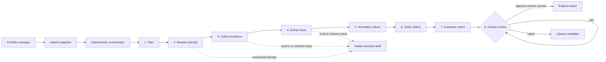
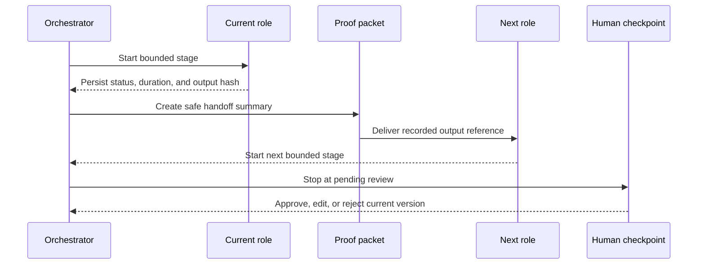

# Agentic Evidence Control Room

## Dashboard build brief

> **Document status:** implementation instructions for a future dashboard refinement. This file
> defines a target experience; it does not claim that live animation, background execution, or
> streaming already exists.

The dashboard should make a bounded multi-agent reporting workflow understandable, trustworthy,
and useful in a real quarterly portfolio-review scenario. It should borrow the legibility of an
n8n-style directed process without becoming a free-form workflow editor or a piece of decorative
“AI theatre.”

Build on the current [architecture](ARCHITECTURE.md), [agent contracts](AGENT_CONTRACTS.md),
[security boundary](SECURITY_AND_DATA_GOVERNANCE.md), and [research wayfinder](WAYFINDER.md).
Those documents control behaviour; this brief controls presentation and interaction.

---

## 1. Outcome, scope, and success

### Intended outcome

Create a calm evidence control room where a portfolio manager or researcher can:

1. import an authorised reporting-period snapshot;
2. see which bounded role is doing what and why;
3. follow truthful handoffs between roles;
4. identify holds, contradictions, stale evidence, and missing information quickly;
5. inspect the provenance behind any claim;
6. complete the next safe human action; and
7. approve and export only the current reviewed report version.

### Primary user and job

- **Primary user:** a portfolio manager or researcher preparing a periodic portfolio report.
- **Secondary user:** a named reviewer or dissertation evaluator auditing how the result was
  produced.
- **Primary job:** move one dataset from import to an evidence-backed, reviewable report without
  losing provenance or human control.
- **Primary decision:** “What needs my attention before this report can be approved?”

### Product constraints that the design must preserve

- The workflow is a fixed orchestrated sequence, not an autonomous swarm.
- A role may be deterministic; “agent” does not imply an LLM call.
- The orchestrator chooses the next stage. Agents do not freely delegate or publish.
- Restricted values, prompts, and source text must not appear in trace metadata.
- Ambiguity, unavailable evidence, and control failures are visible; they are never guessed away.
- Independent verification remains separate from extraction and composition.
- A named human owns approval. Editing a report creates a new version and invalidates prior
  approval.
- The current P0 runtime is synchronous, loopback-only, and non-production.
- The exposed credential described in project evidence must never be used for this work.

### Minimum success criteria

The implementation is successful only when:

- the current stage, material blocker, and next safe action are clear without opening a log;
- every animated state can be traced to persisted run data;
- a completed stage is never shown as still working, and a failed stage never silently advances;
- claim support, stage completion, and report approval are visually and verbally distinct;
- all actions remain available with keyboard, zoom, high contrast, and reduced motion;
- the interface recomposes at 390, 820, 1280, and 1440 pixels without hiding critical controls;
- no report can be exported before the existing named-review approval invariant passes; and
- screenshots, demos, and tests use synthetic data unless separate authority exists.

---

## 2. Product truth before visual metaphor

The dashboard must represent the implemented lifecycle accurately:



### Truthful language

Use language that describes observable work:

- Prefer **Waiting**, **Working**, **Complete**, **Held**, **Failed**, and **Needs review**.
- Do not use “thinking,” “reasoning,” “confident,” or “intelligent” unless the product exposes a
  precise, evidence-backed meaning for that term.
- Use **Complete** for a stage contract that passed. Reserve **Supported** for verified claims.
- Use **Approved** only for a named human decision on the current report version.
- Describe a transition as “The orchestrator handed the planner output to identity resolution.”
  Do not claim that one role directly called another when the orchestrator performed the dispatch.

### UI state mapping

Do not create a second source of truth in the browser. Derive display states from persisted domain
state.

| Persisted source | Display label | Visual treatment | Important rule |
|---|---|---|---|
| No `AgentRun` yet for a future stage | Waiting | Quiet outline and dashed incoming edge | Never animate |
| `RunStatus.PENDING` | Queued | Quiet outline plus queue position | Text must say queued |
| `RunStatus.RUNNING` | Working | Strong border, one restrained activity cue | Stop immediately when state changes |
| `RunStatus.SUCCEEDED` | Complete | Solid connector and output-hash seal | Does not mean claims are supported |
| `RunStatus.FAILED` | Failed | Broken connector, error summary, recovery action | Do not advance the token |
| `RunStatus.SKIPPED` | Skipped | Muted node with explicit reason | Do not style as complete |
| Pending identity candidate or `QualityDisposition.HOLD` | Held | Amber interruption marker and decision count | Only use when a real hold exists |
| `ReportStatus.PENDING_REVIEW` | Needs human review | Distinct human-shaped checkpoint | This is the normal P0 endpoint |
| `ReportStatus.APPROVED` | Approved | Reviewer name, version, rationale, timestamp | Editing invalidates this state |
| `ReportStatus.EXPORTED` | Exported | Immutable artifact links and manifest state | Never imply external publication |

If a display state cannot be derived unambiguously, show **Status unavailable** and the last known
timestamp. Do not infer optimism.

---

## 3. Creative directions considered

### Direction A — Evidence Control Room (recommended)

**Concept:** a warm, editorial operations surface crossed by a precise evidence circuit.

- **Impression:** authoritative, calm, technical, and human-controlled.
- **Palette:** warm paper, deep ink, evidence teal, human-gate amber, restrained semantic red and
  violet.
- **Typography:** highly legible grotesk UI type with monospace reserved for hashes, IDs, timings,
  and event sequence numbers.
- **Composition:** a full-width run context and handoff rail above a dense evidence-and-exception
  workspace; no generic permanent sidebar.
- **Graphic language:** thin circuit paths, proof stamps, direct labels, ruled ledgers, and sparse
  depth.
- **Motion:** one evidence packet moves only during a real or replayed handoff.
- **Trade-off:** more bespoke stage and connector work than a normal table, but it makes the
  agentic lifecycle memorable without weakening review usability.

### Direction B — Audit Ledger

**Concept:** a near-monochrome reporting ledger where every stage is a signed row in a chronological
record.

- **Impression:** rigorous, conservative, and research-oriented.
- **Palette:** paper, black-green ink, rules, and sparse semantic status colours.
- **Typography:** editorial serif headings with compact sans-serif tables.
- **Composition:** vertical ledger, split evidence panes, and marginal annotations.
- **Graphic language:** stamps, ruled tables, version marks, and audit annotations.
- **Motion:** subtle row insertion and status-change emphasis only.
- **Trade-off:** excellent auditability but does not communicate multi-agent collaboration as
  strongly.

### Direction C — Orchestration Canvas

**Concept:** an n8n-inspired spatial graph with inspectable nodes, branches, and animated edges.

- **Impression:** expressive, technical, and overtly agentic.
- **Palette:** muted workshop canvas with category-coded nodes rather than a cyberpunk neon field.
- **Typography:** compact technical sans-serif with dense node metadata.
- **Composition:** pan-and-zoom graph plus a persistent inspector.
- **Graphic language:** ports, edges, nested subflows, and execution tokens.
- **Motion:** routed handoffs and parallel branch activity.
- **Trade-off:** the most visually agentic direction, but excessive for the current fixed linear
  workflow, harder on mobile, and likely to compete with exception review.

### Selection

Build **Direction A: Evidence Control Room**. Borrow the directed-node clarity of Direction C for
the handoff rail, and the audit discipline of Direction B for the activity log. Do not build a
free-form graph editor until the workflow genuinely supports user-authored topology.

---

## 4. Visual thesis and signature idea

> The interface should feel precise, evidence-led, and quietly agentic by combining a warm
> editorial canvas, compact operational typography, and proof-carrying handoffs, while keeping the
> next human decision immediately clear.

### Signature idea: the proof-carrying handoff

A small labelled **evidence packet** travels along the connector after a stage completes. The packet
does not contain raw source values. It carries only safe metadata such as:

- artifact type, for example `evidence set` or `verification ledger`;
- item count when the count is safe;
- truncated input or output hash;
- source stage and destination stage; and
- recorded handoff time.

When the packet reaches the destination, the prior stage receives a compact hash seal and the next
stage becomes active. At the human checkpoint, the packet stops and unfolds into the exact review
summary: supported claims, exceptions, quality holds, report version, and the required decision.



This is both the memorable visual treatment and the core explainability device. Do not distribute
glows, animated grids, particles, or moving decorations elsewhere.

---

## 5. Information architecture

Keep the existing server-rendered route model and give each page one clear job.

| Existing route | Page role | Primary action |
|---|---|---|
| `/` | Work queue and import | Import a snapshot or start an eligible run |
| `/runs/{run_id}` | Evidence control room | Understand progress, inspect a role, or follow the next action |
| `/reports/{report_id}` | Human review desk | Resolve exceptions, inspect provenance, and decide the current version |
| Existing identity-decision action | Identity resolution | Record a named accept/reject decision with rationale |

Use a compact top masthead and breadcrumb. Avoid a permanent left sidebar while the product has
only these three destinations; it would consume space without improving orientation.

### Run control room — desktop composition

```text
┌──────────────────────────────────────────────────────────────────────────────┐
│ Portfolio evidence review      Local only · Model path · Reviewer           │
├──────────────────────────────────────────────────────────────────────────────┤
│ Breadcrumb / Run ID      Q2 period · cutoff · class · run status · duration │
│ NEXT SAFE ACTION: Review {n} held items / Open pending report / None         │
├──────────────────────────────────────────────────────────────────────────────┤
│  PLAN → RESOLVE → COLLECT → EXTRACT → NORMALIZE → VERIFY → COMPOSE → HUMAN  │
│              one truthful proof packet moves along this rail                │
├───────────────────────────────────────────────┬──────────────────────────────┤
│ Activity and evidence health                  │ Selected-stage inspector     │
│ - chronological activity log                  │ - purpose and mechanism      │
│ - verification distribution                   │ - status and duration        │
│ - evidence coverage and source states         │ - safe input/output summary  │
│ - quality dispositions                        │ - hashes, attempts, error    │
├───────────────────────────────────────────────┴──────────────────────────────┤
│ Exceptions ledger: identity · quality · contradiction · stale · unavailable │
└──────────────────────────────────────────────────────────────────────────────┘
```

### Hierarchy rules

1. Put the **next safe action** above the animated rail. Usability outranks spectacle.
2. Make the active or selected stage the visual focal point, not every stage at once.
3. Show exceptions before aggregate success metrics.
4. Keep provenance one interaction away from every claim and event.
5. Keep report approval visually separated from report content and agent controls.
6. Do not turn every count into a card. Prefer labelled rows, grouped bars, and one exceptions
   ledger.

---

## 6. Screen-by-screen build instructions

### A. Work queue

The first screen should answer: “What can I safely do next?”

Build it in this order:

1. **Boundary strip:** local-only state, external-model state, configured reviewer, and a plain
   explanation that export needs human approval.
2. **Import step:** file, period, reporting cutoff, and classification in one coherent form.
3. **Imported datasets ledger:** period and classification first; truncate the dataset hash
   visually while preserving an accessible full value.
4. **Identity holds:** move these above run history when any are pending. State why collection
   cannot continue and require rationale with the decision.
5. **Recent work:** one shared chronological list for runs and reports, with a clear next-action
   label instead of two equal card grids.

Recommended action copy:

- `Import reporting snapshot`
- `Run evidence workflow`
- `Resolve {count} identities`
- `Continue to report review`
- `View completed trace`

Do not label a run action `Ask agents`, `Generate with AI`, or `Magic report`.

### B. Run control room

This is the signature dashboard.

#### Run context header

Show:

- human-readable period label;
- reporting cutoff;
- data classification;
- run ID and dataset ID, visually shortened but fully available;
- current run status and stage;
- start time and measured duration;
- evidence and quality contract versions; and
- model/provider only when recorded, otherwise `Not recorded`.

Do not show token or cost cards when no model ran. Do not show zeros for unavailable metadata.

#### Next-safe-action banner

Derive exactly one primary next action from state. Examples use placeholders, not fixture claims:

- `Resolve {identity_hold_count} company identities before collection can begin.`
- `Inspect {exception_count} verification exceptions before reviewing the report.`
- `The current report version is ready for named human review.`
- `This run failed during {stage}. Open the recorded error and recovery guidance.`
- `No action required. This trace is complete and its report was exported.`

If more than one issue exists, choose the earliest blocking contract and show the rest as secondary
counts. Never present two competing primary buttons.

#### Agent handoff rail

Render the fixed stages as a semantic ordered list. Each node contains:

- step number and plain-language role name;
- one-line purpose;
- text status;
- elapsed duration when complete;
- safe output count or short hash when available; and
- a button to open the stage inspector.

Use these user-facing labels:

| Stage | Label | Purpose shown in the node or inspector |
|---|---|---|
| `plan` | Plan work | Define bounded tasks and source requirements |
| `resolve` | Resolve identity | Confirm exact company identity or create a decision hold |
| `collect` | Gather evidence | Retrieve admitted evidence with provenance and cutoff rules |
| `extract` | Extract facts | Return explicit structured facts or abstain |
| `normalize` | Normalize values | Apply typed units, currencies, and missing-state rules |
| `verify` | Verify claims | Independently classify every candidate claim |
| `compose` | Compose report | Build versioned tables, exceptions, and context |
| `human_review` | Human review | Stop for a named decision; never simulate approval |

Visually distinguish the human checkpoint with a different shape and amber rule rather than
pretending it is another automated agent.

#### Stage inspector

Selecting a node opens a stable adjacent panel on desktop and an inline disclosure on mobile.
Include:

- role purpose and boundaries;
- persisted status, start, finish, and duration;
- attempts;
- model, token, and cost metadata only when present;
- input hash and output hash;
- safe summary counts from `metadata_json`;
- error type and safe error text when failed;
- prior and next stage; and
- the relevant recovery or review action.

Never render raw restricted values, source text, prompts, hidden reasoning, or credentials. Label
missing fields as `Not recorded`, not `0` or `None`.

#### Evidence health

Use direct-labelled horizontal rows, not decorative gauges or a donut chart. Separate:

- verification: supported, contradicted, insufficient evidence, stale, rejected untrusted;
- quality: pass, warn, hold, exclude;
- collection: succeeded, no record, source unavailable, failed; and
- evidence source/classification counts.

Every row needs the exact count, denominator, period/cutoff context, and a link or filter into the
relevant ledger. Colour supplements the label; it never replaces it.

#### Activity log

Render a chronological text log beside or below the visual rail. Each item should answer:

`When · Which role · What persisted transition · What safe output · What happened next`

The log is the accessible and audit-friendly equivalent of the animation. It must remain complete
when CSS, JavaScript, or motion is unavailable.

#### Exceptions ledger

Prioritise actionable exceptions in one table or responsive list:

- identity decisions;
- quality holds and exclusions;
- contradicted claims;
- stale or insufficient evidence;
- source unavailability;
- untrusted evidence rejection; and
- stage failure.

Columns should be `Severity`, `Stage`, `Company/metric when safe`, `Reason`, `Evidence state`, and
`Next action`. Provide deterministic filters and a meaningful empty state: `No recorded exceptions
for this run.`

### C. Human review desk

The report page should feel like a review desk, not another workflow dashboard.

1. Keep the report title, version, content hash, cutoff, and approval state together.
2. Place an evidence summary and unresolved-exception count before report prose.
3. Use a readable document column with a persistent review outline on wide screens.
4. Keep claim provenance and quality findings directly reachable from report sections.
5. Put approval, rejection, and export in a clearly bounded decision dock.
6. Require the existing rationale and expected lock version for mutations.
7. After an edit, explain that approval was invalidated because the content version changed.
8. Never make the approve button the largest element until unresolved evidence has been reviewed.

Approval copy must clarify that approval records review of the current report version; it does not
turn held or contradicted claims into supported claims.

---

## 7. Collaboration visualization and animation

### Visual model

Use a directed rail, not autonomous avatars. Each role is a bounded work cell; the proof packet is
the shared artifact moving through the system.

Connector states:

- **Waiting:** dashed neutral line.
- **Active handoff:** one directional packet crossing the line.
- **Completed handoff:** solid evidence-teal line with timestamp available in the inspector.
- **Held:** amber interruption marker before the blocked destination.
- **Failed:** red break with no downstream continuation.
- **Skipped:** muted dotted connector with a written reason.

### Motion choreography

Use a small shared timing system:

| Motion | Duration | Purpose |
|---|---:|---|
| Hover/focus feedback | 120–160 ms | Confirm interaction |
| Inspector open/close | 180–240 ms | Preserve spatial orientation |
| Status transition | 180–240 ms | Show a persisted state change |
| Proof-packet handoff | 420–520 ms | Explain stage relationship |
| Recorded-trace step gap | 240–400 ms | Make replay legible without mimicking real duration |

Use ease-out for arrivals and ease-in-out for spatial movement. Do not animate height from `auto`
in large evidence sections; use disclosure without layout thrash.

The sequence for one transition is:

1. a stage receives a persisted `running` state and its border becomes active;
2. a small working cue appears inside that node only;
3. on persisted success, the cue stops and the duration/output seal appears;
4. the proof packet moves across the outgoing connector once;
5. the next node becomes active only when its own state is persisted; and
6. if no next stage starts, the packet waits at the connector terminus without looping.

### Never fake activity

- Do not run decorative loops on completed nodes.
- Do not generate random “agent messages,” typing dots, token counts, or progress percentages.
- Do not infer substeps from elapsed time.
- Do not show parallel work unless the backend records actual parallel executions and parent/child
  relationships.
- Do not animate a direct agent-to-agent call when the orchestrator made the handoff.
- Do not replay a completed trace under a `Live` label.

### Recorded replay versus live mode

The current request/response workflow is synchronous. Treat these as separate product modes:

#### Recorded trace — minimum honest implementation

- Render the final state directly from `WorkflowRunModel` and ordered `AgentRunModel` rows.
- Label the view `Recorded trace`.
- Provide a user-initiated `Replay trace` control.
- Reconstruct only stage start, finish, status, hashes, and duration already stored.
- If timing is compressed, label it `Compressed replay` and keep real duration in the inspector.
- The static ordered list and activity log remain the default content.

#### Live trace — later implementation requiring backend work

- Return a run identifier before long-running execution begins.
- Execute the workflow outside the initiating page request.
- expose a sanitised, ordered state stream using Server-Sent Events or a documented polling
  fallback;
- stream persisted stage transitions, never provider chain-of-thought or raw source content;
- support reconnection from the last acknowledged sequence and an authoritative snapshot refresh;
- stop animation while the document is hidden and reconcile immediately on return; and
- show `Disconnected — displaying last persisted state` if updates cannot be resumed.

Do not present an in-process background task as production-grade job infrastructure. If the system
ever moves beyond the local research prototype, durable jobs, authentication, authorisation,
tenant isolation, and observability are separate prerequisites.

### Future fan-out rule

If genuine parent/child agent runs are added later, draw a branch only when a persisted contract
contains a parent execution ID, child execution ID, ordered event sequence, and explicit join
state. Collapse more than four children into a grouped node with counts and an expandable ledger.
Until that contract exists, keep the eight-stage rail linear.

---

## 8. Visual system

Extend the current warm-paper palette instead of replacing it with a generic dark AI dashboard.

### Colour tokens

| Semantic role | Recommended token | Use |
|---|---|---|
| Canvas | `#F3F1EB` | Main application background |
| Primary surface | `#FFFDF7` | Review and workflow content |
| Primary ink | `#17211F` | Headings and body text |
| Muted ink | `#56615E` | Supporting metadata only |
| Rule/border | `#C7CEC9` | Structure and inactive connectors |
| Evidence action | `#005F56` | Primary action and completed evidence path |
| Evidence action strong | `#003D38` | Hover/pressed and strong labels |
| Human checkpoint | `#E7A83E` | Review gate and human-required interruption |
| Danger | `#982F2F` | Failure, rejection, and destructive action |
| Focus | `#0068D9` | Keyboard focus independent of status |
| Insufficient/informational | `#544C7F` | Non-error evidence insufficiency |

Derive soft status backgrounds from these colours only after checking contrast with actual text.
Do not use colour as the only distinction. Avoid gradients, glassmorphism, blurred surfaces, neon
glows, and rainbow colouring by agent.

### Typography

- Preferred UI family: self-hosted **IBM Plex Sans** with a system sans-serif fallback.
- Technical family: self-hosted **IBM Plex Mono** for hashes, IDs, timestamps, units, and code.
- If font assets are not added and licensed explicitly, preserve the system font stack; do not load
  fonts from a third-party CDN.
- Use tabular numerals for durations and counts.
- Keep body copy around 16 px with a 1.5–1.6 line height.
- Use compact 12–13 px metadata only where contrast and zoom remain sufficient.
- Keep explanatory prose to roughly 65–75 characters per line.
- Use sentence case for controls and headings. Reserve uppercase for very short eyebrows.

### Spacing and density

Use a compact scale based on `4, 8, 12, 16, 24, 32, 48` pixels.

- Main content maximum: approximately 90 rem for the control room and 76 rem for report prose.
- Desktop page gutter: 24–32 px; mobile gutter: 16 px.
- Control height: at least 44 px for primary interactive targets.
- Stage nodes: compact enough to show the lifecycle, but never below a readable 124 px width on
  wide screens.
- Dense tables may use 12 px vertical cell padding; decision forms need more breathing room.

### Shape and depth

- Use mostly rectangular surfaces with a small 4–6 px radius.
- Give the proof packet a clipped or notched edge so it reads as an artifact, not a chat bubble.
- Use 1 px rules for grouping and 2 px borders for selected/active states.
- Reserve shadow for the stage inspector or a sticky decision dock. Do not shadow every panel.
- Use a square or shield-like human checkpoint, distinct from automated stage nodes.

### Icons and diagrams

- Use simple inline SVG line icons with text labels; do not add an icon dependency solely for this
  dashboard.
- Do not use emoji as production icons.
- Provide an accessible name where an icon is the control; otherwise mark decorative SVG as hidden.
- Keep connectors behind HTML controls so SVG never becomes the sole interaction surface.

---

## 9. Component contracts

| Component | Purpose | Required states | Accessibility and behaviour |
|---|---|---|---|
| `RunContextBar` | Establish period, class, boundary, model path, and reviewer | normal, missing metadata | Definition list; long IDs wrap or copy safely |
| `NextActionBanner` | Present exactly one safe next step | action, informational, blocked, complete | Heading plus descriptive action; never colour-only |
| `AgentRail` | Explain ordered collaboration | static, recorded replay, live, disconnected | Semantic `<ol>`; remains readable without CSS/JS |
| `AgentNode` | Summarise one bounded role | waiting, queued, working, complete, held, failed, skipped, selected | Use a real button for inspection; visible focus; text status |
| `HandoffEdge` | Show relationship between roles | waiting, active, complete, held, failed, skipped | Decorative only; equivalent event exists in text log |
| `ProofPacket` | Explain a persisted handoff | absent, moving, arrived | `aria-hidden`; never contains raw evidence |
| `StageInspector` | Reveal stage contract and trace metadata | closed, open, error, incomplete metadata | Stable heading/focus; Escape closes only if implemented as modal |
| `ActivityLog` | Provide chronological audit equivalent | empty, populated, updating, disconnected | `role="log"`; announce state events, not animation frames |
| `EvidenceHealth` | Compare verification and quality outcomes | populated, empty, partial | Direct labels, counts, denominators, text alternative |
| `ExceptionsLedger` | Drive review and recovery | empty, filtered, populated, loading, error | Semantic table or mobile list; filters have labels |
| `HumanReviewGate` | Separate human authority from automation | disabled, pending review, approved, rejected, exported, stale approval | Named reviewer, rationale, version, focus/error management |

Avoid building a generic card component for every surface. These components need different
containment and density because they have different jobs.

---

## 10. Responsive recomposition

### 1440 px and wider

- Show the complete horizontal handoff rail.
- Use an 8/4 content split for activity/evidence and the selected-stage inspector.
- Keep the exceptions ledger full width.
- Keep the decision dock visible without obscuring report content.

### 1280 px

- Preserve the horizontal rail with compact node copy and full labels in the inspector.
- Allow evidence summaries to use two columns.
- Do not shrink type below the defined metadata floor to make the graph fit.

### 820 px

- Recompose the rail into a vertical stepped timeline.
- Move the selected-stage inspector directly below the selected node.
- Place evidence health before the full activity log.
- Convert the report outline to a horizontal jump menu or disclosure.

### 390 px

- Show the next safe action immediately after the run title.
- Render stages as a vertical ordered accordion with status, duration, and one-line purpose.
- Hide decorative connectors, but keep explicit `Handed off to …` text in the activity log.
- Convert wide ledgers to labelled records; do not simply hide important columns.
- Stack approve/reject actions, preserve rationale fields, and account for safe-area insets.
- Keep every interactive target at least 44 by 44 px.

Test long company names, long metric labels, full hashes, translated-like 30–50% text expansion,
short viewports, and 200% text scaling.

---

## 11. Accessibility and motion safety

Target WCAG 2.2 AA.

- Use semantic HTML before ARIA.
- Render the lifecycle as an ordered list of buttons and regions, not an interactive SVG graph.
- Use `aria-current="step"` for the active stage where appropriate.
- Announce only meaningful asynchronous state changes through a polite live region.
- Keep focus order aligned with visual order.
- Return focus to the selected stage button when an inspector closes.
- Make errors identify the problem, affected stage, and recovery action.
- Preserve the existing visible focus treatment or improve it; never remove outlines.
- Add a user-visible `Pause animation` control for live or replay mode.
- Under `prefers-reduced-motion: reduce`, remove packet travel and pulses. Replace them with an
  immediate state change and a brief static emphasis.
- Pause nonessential motion when the page is hidden.
- In forced-colour mode, rely on borders, text, and native controls rather than filled status
  colours.
- Give charts and connector diagrams complete textual equivalents.
- Never announce every progress poll or animation frame to a screen reader.

---

## 12. Implementation strategy for this repository

Preserve FastAPI, Jinja, server rendering, and the current design-system direction. Do not add a
SPA framework for this dashboard.

### Phase 1 — static control room and recorded trace

Make the smallest coherent visual change:

1. Create a presentation/view-model function that converts current run, stage, report, evidence,
   and quality records into a safe dashboard structure.
2. Recompose `run.html` around `RunContextBar`, `NextActionBanner`, the semantic agent rail, stage
   details, activity log, evidence health, and exceptions ledger.
3. Refine `index.html` into the work queue described above.
4. Refine `report.html` into the review desk while preserving every existing form contract.
5. Extend semantic CSS tokens and responsive rules in `styles.css`.
6. Keep all core content and actions functional with JavaScript disabled.

### Phase 2 — progressive recorded replay

If replay materially improves the dissertation demonstration:

1. Add one small local ES module for user-initiated trace replay and node selection.
2. Derive replay steps only from persisted agent timestamps and statuses.
3. Add `script-src 'self'` explicitly to the current Content Security Policy; do not permit inline
   scripts or third-party origins.
4. Add JavaScript assets to package data so installed builds behave like the checkout.
5. Preserve the static rail and log as the no-script fallback.

### Phase 3 — truthful live trace

Only after agreeing the execution contract:

1. Separate run creation from long-running execution so the UI receives a run ID immediately.
2. Define a versioned, sanitised run snapshot containing stage, role, status, attempts, safe
   summary counts, hashes, timestamps, and error category.
3. Publish only committed state through an ordered SSE stream, with reconnect and snapshot
   reconciliation; polling may be the fallback.
4. Keep raw evidence, prompts, provider text, restricted values, and hidden reasoning out of the
   transport.
5. Treat the database as authoritative after reconnect or conflict.
6. Add explicit disconnected, stale, failed, and complete stream states.

### Expected file surfaces when implementation is authorised

- `src/portfolio_agent/templates/base.html`
- `src/portfolio_agent/templates/index.html`
- `src/portfolio_agent/templates/run.html`
- `src/portfolio_agent/templates/report.html`
- `src/portfolio_agent/static/styles.css`
- optional new local script under `src/portfolio_agent/static/`
- `src/portfolio_agent/web.py` for safe view data and any future state transport
- `pyproject.toml` only if new static assets must be packaged
- focused unit/integration tests plus browser-level visual and accessibility tests

Do not change workflow contracts, approval authority, source admission, or data semantics merely to
make the visualization easier.

---

## 13. Real-world reference scenario

Use this scenario to test the full experience with synthetic data:

1. A portfolio manager imports a fictional quarterly XLSX snapshot, confirms the reporting cutoff,
   and marks it synthetic.
2. The work queue reports `{identity_hold_count}` unresolved identities and blocks collection.
3. The named reviewer opens each candidate, inspects the exact identifier context, and records a
   rationale.
4. The user starts a verified workflow.
5. The control room shows the orchestrator progressing through the eight bounded roles. The user
   can inspect inputs, safe summary counts, hashes, durations, and any abstentions.
6. Verification completes with a mixed distribution. Exceptions are shown before success totals;
   nothing is silently promoted.
7. The report composer creates a versioned report and the proof packet stops at **Human review**.
8. The reviewer opens contradicted, stale, and insufficient-evidence items, then reads the report.
9. If the reviewer edits a section, the dashboard shows a new version and removes the prior
   approval state.
10. The named reviewer records an approve or reject rationale for the current version.
11. Only an approved version exposes the explicit export action and verified downloads.

The primary task is not “watch agents animate.” It is “reach a defensible human decision faster
while understanding how the evidence moved through the system.”

---

## 14. Validation plan

### Focused automated checks

- View-model tests for every persisted-to-display state mapping.
- Integration tests for work queue, run trace, report states, and next-action derivation.
- Existing CSRF, host restriction, reviewer identity, optimistic version, and export-gate tests.
- CSP and package-data tests if a local JavaScript module or font is added.
- Tests proving trace summaries omit raw restricted values and provider/source text.
- Reconnect, event ordering, duplicate-event, and authoritative-snapshot tests if SSE is added.
- Deterministic recorded-replay tests using fixed timestamps.

### Rendered validation

Use only synthetic data. At minimum inspect:

- 390 × 844;
- 820 × 1180;
- 1280 × 800; and
- 1440 × 900.

Exercise:

- empty work queue;
- imported dataset ready to run;
- identity hold;
- waiting, working, complete, skipped, failed, and disconnected stages;
- mixed verification and quality outcomes;
- pending review, edited/new version, approved, rejected, and exported report states;
- keyboard-only node inspection and decision forms;
- 200% zoom and text scaling;
- reduced motion and forced colours;
- long content and table overflow; and
- no-script fallback.

Inspect browser console errors, layout shift, focus order, accessible names, live-region noise, and
whether the animation ever disagrees with the textual ledger. Render, review critically, fix, and
render again before calling the dashboard complete.

### Usability acceptance tasks

In an authorised study, test whether a participant can:

1. identify the current stage and next safe action;
2. explain why a run is held;
3. locate the evidence and verification state behind a claim;
4. distinguish stage completion from claim support;
5. understand why editing invalidated approval; and
6. complete a named review decision without accidental export.

Do not convert synthetic demo success into a claim about real user performance. Retain task time,
errors, comprehension, accessibility findings, and participant feedback only under the approved
evaluation protocol.

---

## 15. Anti-patterns to reject

- A dark navy dashboard with violet/cyan glows because it “looks AI.”
- Animated avatars pretending to discuss or think.
- A free-form workflow editor for a fixed workflow.
- Random progress percentages or token counters.
- Seven equal metric cards above the actual exceptions.
- A separate colour for every agent.
- Glass cards, gradient blobs, animated background grids, or particles.
- A chat box as the primary control surface.
- Auto-scrolling that steals the user’s position during review.
- Colour-only support and failure states.
- Approval hidden inside an agent node or presented as an autonomous stage.
- Any ranking, investment recommendation, or “portfolio health score.”
- Raw restricted data, prompts, credentials, or source text in trace events.
- A `Live` badge on a reconstructed or compressed replay.

---

## 16. Definition of done

The dashboard is ready for handoff when:

- the Evidence Control Room thesis is recognisable without the product name;
- the proof-carrying handoff explains the real lifecycle without inventing autonomy;
- one primary next action is clear in every material state;
- work queue, run control room, and human review desk form one coherent journey;
- all state mappings, empty/error/loading cases, and approval boundaries are implemented;
- the static experience remains complete without JavaScript;
- animation is event-driven or explicitly labelled recorded replay;
- reduced-motion, keyboard, screen-reader, zoom, and responsive behaviour are verified;
- security, classification, provenance, and no-export-before-approval invariants still pass;
- browser screenshots have been reviewed at the representative widths and material issues fixed;
  and
- limitations are stated plainly: local prototype, no production auth, no production job system,
  and no empirical usability claim until an authorised study is completed.
