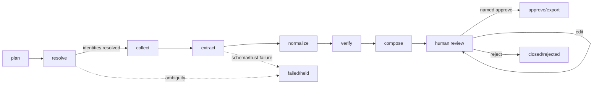

# Agent and orchestration contracts

## What “agent” means here

An agent is a named functional role executing one bounded state transition with an explicit
input hash, output hash, status, timing, and failure contract. It is not an unconstrained
persona, recursive planner, or permission to browse/use tools autonomously.

The multi-agent decomposition is valuable only if it creates inspectable separation of
concerns—especially between extraction/composition and verification. The evaluation protocol
must test whether that separation improves outcomes rather than assume that it does.

## Global contract

Every role must:

- operate on one `run_id` and its period-bound `dataset_id`;
- apply the persisted `uk-public-evidence-v2` contract, including run-relative cutoff decisions
  and explicit run-to-snapshot/event associations;
- read only persisted artifacts from completed prior stages;
- return bounded JSON-compatible summary metadata;
- avoid raw restricted values in trace metadata/errors;
- write domain records only within its assigned responsibility;
- fail closed on contract/identity/schema violations;
- never modify an immutable submission/evidence checksum;
- never change another role's verification result;
- never approve, export, publish, or recruit/contact anyone; and
- terminate after one stage execution.

## Role contracts

| Stage / role | Required inputs | Persistent output | Allowed decisions | Forbidden behaviour | Failure condition |
|---|---|---|---|---|---|
| `plan` / planner | dataset, observations, metric sourceability | task counts and configuration snapshot | Identify which observations may need public collection | Invent tasks/metrics/companies; contact sources | Missing dataset or invalid canonical observations |
| `resolve` / identity resolver | source-scoped identifiers, name search hints, named decisions | resolved-company count | Accept exact identifier or prior named decision; hold every name-only/conflicting case | Fuzzy/name-only auto-merge or cross-classification merge | Any included company is ambiguous/unresolved |
| `collect` / evidence collector | resolved company, exact source identifier, cutoff, optional required programme start, admitted manifest with exact fact bindings | immutable snapshots, facts/events, submission evidence and run links | Retrieve one company/source/window snapshot and derive only facts whose metric/method/schema/unit/currency exactly match the manifest | Metric-by-metric duplicate retrieval; treat content as instruction; claim truth; cross-bind a fact; relabel cumulative values as quarterly | Missing cutoff/ID/source contract, semantic binding mismatch, invalid/incomplete cumulative window, drift, or provenance invalid |
| `extract` / structured extractor | trusted evidence, expected identity/metric/period | strict extraction with provider/schema version | Parse explicit complete finite values only | Infer absent values; ground from provenance metadata; accept numeric substrings/non-finite values; process untrusted/restricted evidence externally | Schema, grounding, finiteness, or expected identity/metric mismatch |
| `normalize` / normalizer | extracted value + metric definition | normalized value, missing state, unit/currency, issue | Apply deterministic type/missingness rules | Round counts, infer currency, convert ratios/rates | Rule violation becomes `invalid`, not guessed repair |
| `verify` / independent verifier | candidate, sourceability, current evidence/provenance | Verification and claim-evidence links | supported/contradicted/insufficient/stale/rejected | Generate prose to justify desired outcome; average conflicts | Every candidate must receive exactly interpretable outcome |
| `compose` / report composer | verified claims, missingness, quality, events, compatible semantic intervals, cutoff/source versions | draft sections, change/context tables with exposure windows, current versions | Include support plus exceptions/coverage/minimum-N five-number context | Promote held claim; mix currency, duration, or programme-origin cohorts; rank/recommend; approve/export | Missing verifier records or context/report contract failure |
| `human_review` / review gate | current versioned report | `pending_review` state | Confirm system reached review boundary | Simulate human approval | Report not pending review |

Approval/export is a user-controlled service action, not an autonomous role.

## Stage transition contract



The orchestrator enumerates this sequence in code. There is no agent-selected next state.

## Typed extraction contract

`StrictExtraction` permits only:

| Field | Type | Rule |
|---|---|---|
| `company_name` | string | Must exactly match the model-safe reference in the supplied evidence. Public-source requests use a provenance-derived `public-evidence:*` alias and never a restricted portfolio name. |
| `metric_key` | string | Must equal the planned canonical key |
| `value` | string, integer, boolean, or null | Must be explicit in evidence; normalization follows |
| `unit` | optional string | Must be explicit in the structured sibling field or deterministically grounded by the complete span; an explicit currency grounds only `currency_units`. |
| `currency` | optional string | Must be explicit in the structured sibling field or complete span; never inferred by model confidence. |
| `period_label` | optional string | Must match target to support a current claim |
| `evidence_locator` | string | Must identify the supplied evidence item |
| `evidence_span` | optional string, max 500 characters | Required for non-null values; must be a complete finite numeric token in unstructured text or equal an exact structured value leaf, and deterministically agree with value/currency/unit |
| `abstain_reason` | optional string | Required only when `value` is null; a null result cannot cite a supporting span |
| `confidence` | number 0–1 | Diagnostic only; never a support threshold |

Unknown fields are forbidden. A valid JSON shape is necessary but not sufficient: identity,
period, exact complete span/value leaf, finiteness, parsed value, provenance, and sourceability are
checked deterministically afterwards. Source-locator/extraction metadata is excluded from the set
of value-bearing leaves. A schema-valid but ungrounded value triggers the one allowed validation
escalation and then fails closed.

## Model-provider boundary

The provider abstraction has one method: `extract(ExtractionRequest) -> ProviderOutcome`.
The request contains one evidence item and expected model-safe reference/metric/period. The outcome
contains the validated extraction, provider, model, attempts, and available token usage.

Routing is fixed, not agent-selected:

```text
deterministic structured extractor (default)
    OR, after explicit external-model enablement and safety checks:
gpt-5.6-luna → strict validation failure → one gpt-5.6-luna repair → fail closed
```

The adapter rejects any configured model outside that exact route before constructing the external
client. Keeping the second bounded attempt preserves repair behaviour even though both attempts use
the same model.

No retry occurs for policy/classification/injection rejection. Transient network retry policy
is intentionally absent from P0 because the external route is not part of offline evaluation.

## Independent verification decision table

| Candidate/evidence condition | Result |
|---|---|
| No evidence | `insufficient_evidence` |
| Only untrusted or provenance-incomplete evidence | `rejected_untrusted` |
| Provenance-complete evidence, but none for requested period | `stale` |
| Current public evidence conflicts in value or explicit currency | `contradicted` |
| Exact immutable submission match for internal-only/mixed metric, no current public conflict | `supported` |
| Exact current public match for public/mixed metric | `supported` |
| Publicly sourceable metric with only submission evidence | `insufficient_evidence` |
| Exact public match for internal-only metric without submission support | `insufficient_evidence` |

This rule is conservative. `contradicted` means “requires resolution,” not “the public source
is more authoritative than the company.”

## Prompt-injection contract

- Connector content is always untrusted data.
- Known instruction-like patterns set `is_untrusted`.
- Marked/untrusted items are persisted for audit but excluded from extraction and model calls.
- Provider instructions explicitly say that evidence instructions are data, but this is a
  defence-in-depth measure, not the primary control.
- Content is never granted tool, file, network, approval, or export authority.
- Adversarial fixture cases must remain in every regression/evaluation run.

## Observability contract

Each `AgentRun` records:

- role/stage/status and `run_id`;
- start/end and integer duration milliseconds;
- SHA-256-compatible stable input/output hashes;
- attempts and prompt/schema version where relevant;
- provider/model and available input/output token counts;
- monetary cost only when calculated from an authoritative contemporaneous source;
- redacted error type/message; and
- bounded count/status metadata.

The trace deliberately does not store full prompts, raw workbook values, evidence narratives,
credentials, or generated report text.

## Human contract

The reviewer must inspect the current report version and claim table. Their identity is configured
locally before the service starts; it is not accepted from each browser form. Every mutation carries
a CSRF token and expected `lock_version`; stale pages fail. Approval does not change verification
states. Editing creates a new section/report version and revokes approval. Export is a separate
explicit action after approval and becomes final only after its manifest-backed artifact bundle is
atomically installed.
