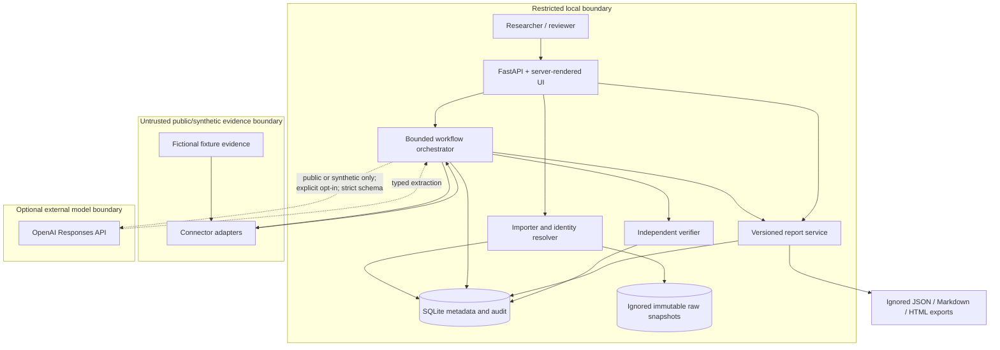
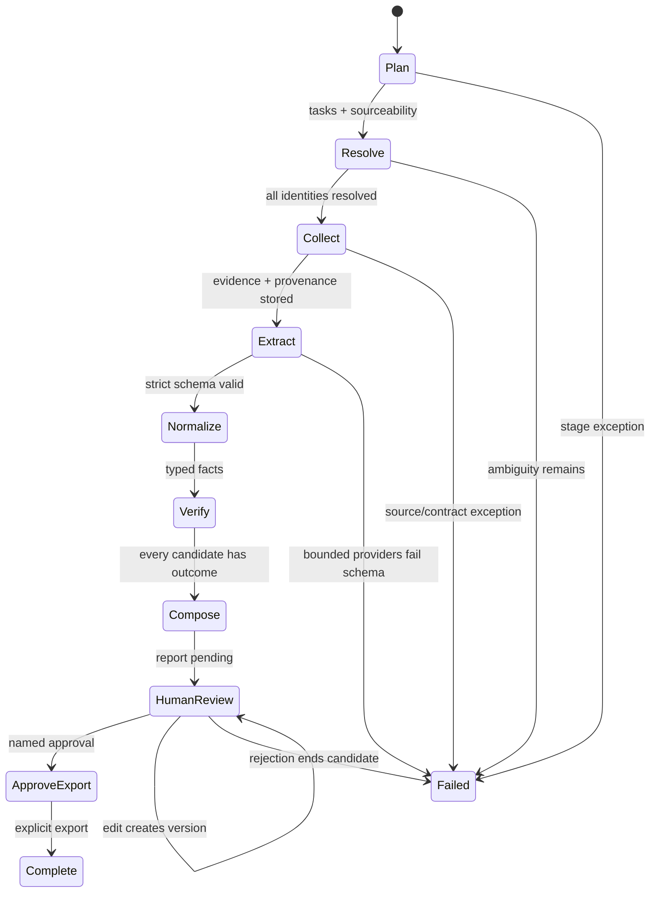
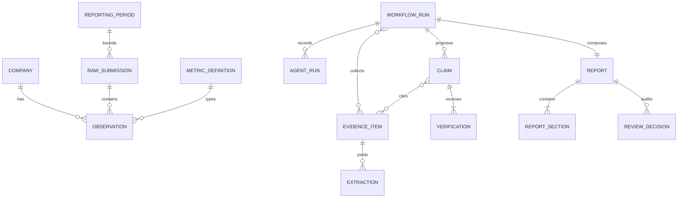

# Architecture

## Architectural objective

Make the smallest local system that can test the research hypothesis without hiding
uncertainty behind a conversational agent. Deterministic contracts own data semantics;
agents own bounded workflow roles; the verifier owns claim eligibility; and the human owns
the final publication decision.

## System context and trust boundaries

The dashed model path is implemented as an adapter but is not used by default or by the
test/evaluation harness. Restricted/internal evidence cannot cross that boundary.

## Runtime deployment

- One Python 3.12 process.
- FastAPI and Jinja templates bound to `127.0.0.1`/`localhost`/`::1` only.
- SQLite with foreign keys enabled; Alembic controls schema creation.
- Imported bytes and generated exports live below ignored `var/` storage with local file
  permissions.
- No queue, scheduler, cloud store, background crawler, authentication provider, or API key
  is required for P0.

This is suitable for controlled dissertation experimentation, not concurrent production use.

## Component responsibilities

| Component | Owns | Does not own |
|---|---|---|
| `config.py` / bootstrap | Local settings, dependency construction, external-model off switch | Secrets or remote provisioning |
| `importers.py` | Format parsing, immutable snapshots, period creation, exact identity resolution, observation persistence | Semantic guessing, fuzzy entity resolution, model calls |
| `catalogue.py` | Canonical metric definitions and aliases | Real-world institutional approval of definitions |
| `normalization.py` | Missing-state and type normalization | Claim support, currency conversion, aggregation |
| `connectors/` | Query and provenance contract; fictional evidence adapter | Claim composition or verification |
| `llm/` | Typed extraction provider abstraction and guarded optional OpenAI adapter | Workflow control, restricted data permission, report approval |
| `workflow.py` | Fixed stage order, stage audit, evidence/extraction/claim/report coordination | Open-ended planning or autonomous publication |
| `verification.py` | Pure conservative support/contradiction/stale/trust decision | Source collection, text generation, human judgement |
| `reporting.py` | Section versions, decisions, approval gate, deterministic multi-format export | Changing verification status |
| `evaluation.py` | Labelled synthetic comparisons, metrics, repeat consistency, protocol-only holds | Real manual/HITL findings |
| `web.py` | Accessible local interaction and download routes | Production auth, tenant isolation, remote exposure |

## End-to-end state machine

There is no transition from collection, extraction, verification, or composition directly to
export. `HumanReview` is a terminal P0 pipeline outcome until a separate user action occurs.

## Data flow and invariants

1. **Import:** bytes are read once, hashed, and stored create-once. The dataset ID includes
   period label and bytes. A duplicate hash+period reuses the existing dataset.
2. **Canonicalization:** company identity and metric definition become foreign keys. Unknown
   labels and identity conflicts become issues; they are not repaired by a model.
3. **Collection:** every valid observation produces local submission evidence. Only metrics
   marked public/mixed generate connector queries. Evidence is associated with the run.
4. **Extraction:** internal submission evidence is already structured. Other trusted evidence
   passes through a provider and strict `StrictExtraction` contract. Untrusted evidence stops.
5. **Normalization:** extraction values pass through the same metric rules as submissions.
6. **Verification:** a distinct pure rule set compares value, currency, period, provenance,
   trust, and sourceability. A current public conflict yields `contradicted`.
7. **Composition:** deterministic prose includes supported claims; all other states become
   verification exceptions. No missing value is generated.
8. **Review/export:** a named reviewer can edit, approve, or reject. Editing creates a version
   and invalidates approval. Export writes the current approved version atomically.

## Persistence model

All table names and constraints are defined in `models.py` and reproduced in Alembic
revision `0001`. Application bootstrapping currently calls `create_all` defensively for local
tests; dissertation/reproducible setup uses `alembic upgrade head` as the authoritative path.

## Deterministic-first and model routing

The optional OpenAI adapter exists for genuinely unstructured public/synthetic evidence.
Its route is:

1. classification must be `public` or `synthetic`;
2. injection detector/trust state must pass;
3. `gpt-5.4-mini` receives only the minimum evidence and expected identity/metric/period;
4. output must validate against strict JSON Schema;
5. one escalation to `gpt-5.4` is allowed only after validation/parsing failure;
6. failure after the bounded route stops extraction; and
7. downstream deterministic normalization and independent verification remain mandatory.

Model fluency, confidence, or tier never establishes claim support. The provider reports model,
attempts, and tokens; cost remains null unless calculated from a contemporaneous authoritative
price source during an authorised run.

## Failure and recovery behaviour

| Failure | Behaviour | Recovery |
|---|---|---|
| Malformed input | Reject import; no partial observations | Correct input, create new import |
| Unknown metric | Preserve raw snapshot; issue warning; skip canonical observation | Domain-map label and re-import as a new dataset/version |
| Ambiguous identity | Hold affected company; resolve stage refuses pipeline | Human supplies authoritative identity, then new import |
| Connector unavailable | No public evidence; claim remains missing/insufficient | Retry connector in a new run; never infer |
| Prompt injection | Store item as untrusted; no extraction/model call | Review source; do not “clean” it into support automatically |
| Strict schema/model failure | Stage fails after bounded attempts | Fix schema/provider or use deterministic extraction; new run |
| Conflicting evidence | Claim becomes contradicted | Human investigates; verification status remains auditable |
| Report edit | New section/report version; approval revoked | Re-review current version |
| Export write error | Report is not marked exported until all writes succeed | Correct local storage and retry approved export |

## Scalability and production gaps

SQLite and synchronous stages are intentional for a small controlled study. Production would
require authentication/authorisation, tenant isolation, encrypted managed storage, migration
operations, async/durable jobs, connector quotas, observability redaction, backup/restore,
concurrency controls, threat testing, DPIA/legal review, and an accessible production design.
Those gaps are not hidden as backlog “polish”; they define why P0 must remain loopback-only.

