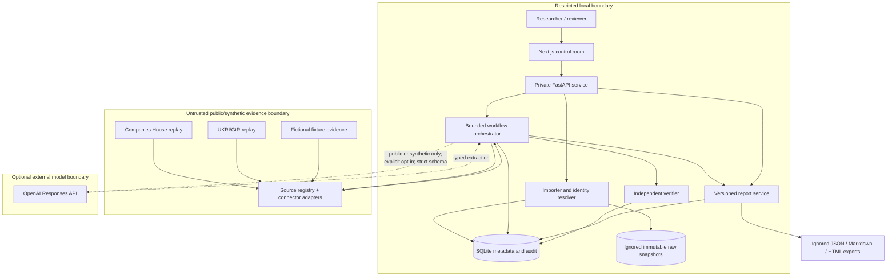
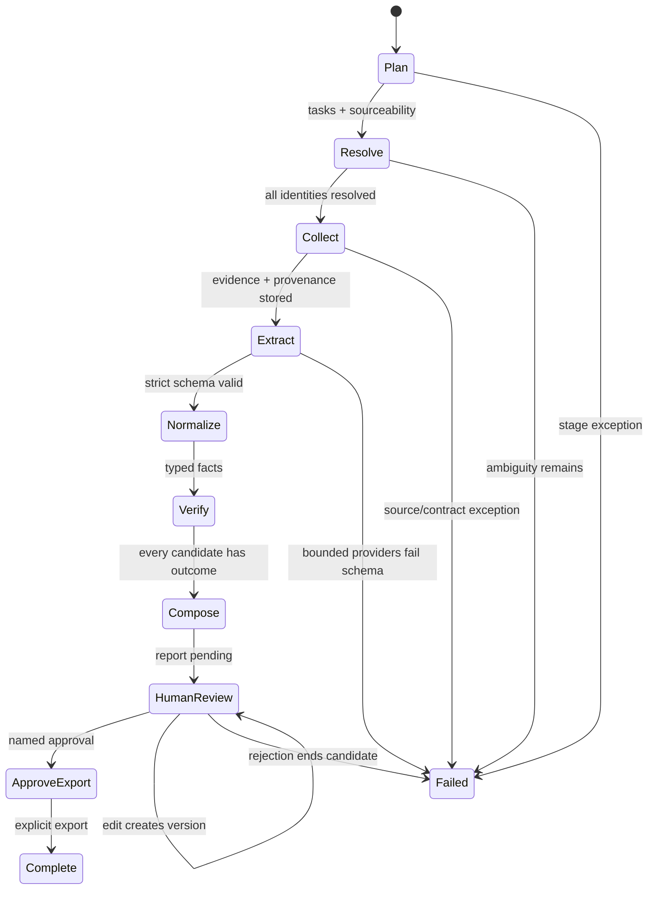
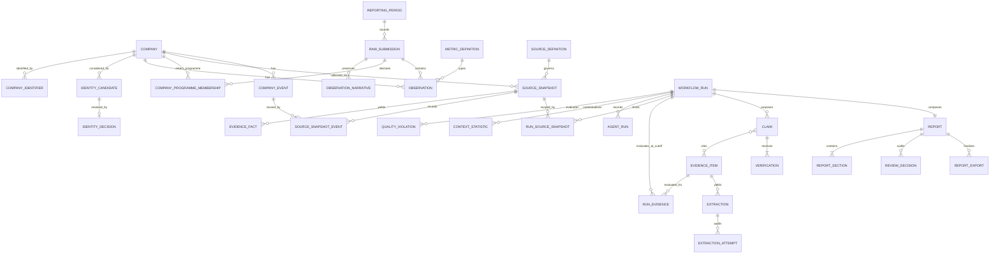

# Architecture

## Architectural objective

Make the smallest local system that can test the research hypothesis without hiding
uncertainty behind a conversational agent. Deterministic contracts own data semantics;
agents own bounded workflow roles; the verifier owns claim eligibility; and the human owns
the final publication decision.

## System context and trust boundaries

The dashed model path is implemented as an adapter but is not used by default or by the
test/evaluation harness. Restricted/internal evidence cannot cross that boundary.

## Runtime deployment

- One Next.js dashboard process and one private Python 3.12 API process under Docker Compose.
- Compose publishes only Next.js on host loopback; FastAPI accepts only loopback or the exact
  private Compose client/Host boundary.
- SQLite with foreign keys enabled; Alembic controls schema creation.
- Imported bytes and generated exports live below ignored `var/` storage with local file
  permissions.
- No queue, scheduler, cloud store, background crawler, authentication provider, or API key
  is required for P0.
- The Next.js server-side proxy is the only dashboard path. The browser never receives the FastAPI
  CSRF token or connects to FastAPI directly. Native development may run the same two processes
  separately; the Python process is not a fallback dashboard.

This is suitable for controlled dissertation experimentation, not concurrent production use.

## Component responsibilities

| Component | Owns | Does not own |
|---|---|---|
| `config.py` / bootstrap | Local settings, dependency construction, external-model off switch | Secrets or remote provisioning |
| `cbit_contract.py` / `importers.py` | Exact workbook-row contract, programme-start membership, formula/aggregate holds, paired narratives, immutable snapshots, reviewed identity candidates | Semantic guessing, formula execution, fuzzy entity resolution, model calls |
| `catalogue.py` | Versioned canonical metric definitions, explicit period semantics, aliases, and drift hash | Real-world institutional approval of definitions |
| `normalization.py` | Missing-state and type normalization | Claim support, currency conversion, aggregation |
| `connectors/` | Admitted source manifests with exact fact semantic bindings, bounded HTTP policy, immutable replay, stable event locators, Companies House and UKRI facts/events | Name-only joins, claim composition, causal inference, incomplete monetary totals, or live access without G2 |
| `temporal.py` / `quality.py` | Claim-relative time eligibility and executable, versioned missing/no-record/unavailable/failure dispositions | Global stale flags, conflated terminal states, or opaque quality scores |
| `context.py` / `visualizations.py` | Period-semantics/exposure-aware change, segmented minimum-N five-number context, accessible dissertation SVGs | Rankings, incompatible programme/duration cohorts, causal labels, or hidden small samples |
| `llm/` | Typed extraction provider abstraction and guarded optional OpenAI adapter | Workflow control, restricted data permission, report approval |
| `company_research.py` | Explicit OpenAI web discovery, guarded page capture, serial persisted research stages, exact-span company claims, deterministic deck composition | Identity approval, arbitrary browsing, person profiling, investment recommendations, native presentation rendering |
| `workflow.py` | Fixed stage order, stage audit, evidence/extraction/claim/report coordination | Open-ended planning or autonomous publication |
| `verification.py` | Pure conservative support/contradiction/stale/trust decision | Source collection, text generation, human judgement |
| `reporting.py` | Optimistic versions, decisions, approval gate, staged manifest-backed export | Changing verification status or publishing autonomously |
| `evaluation.py` / `evaluation_datasets.py` | Namespaced D0 execution, D1 protocol, sealed D2, null-aware layer outcomes | Real manual/HITL findings or holdout access |
| `web.py` | Private FastAPI assembly, health/deck routes, Host/client enforcement, and security headers | Dashboard rendering, production authentication, tenant isolation, remote exposure |
| `api.py` | JSON projection of persisted runs, tasks, sources, claims, and profiles; CSRF-checked mutations delegated to domain services | Dashboard rendering, business logic, derived values, or any state the database does not hold |
| `company_research_fixtures.py` | Recorded source map and recorded candidate sentences for the offline rehearsal mode | Weakening any acquisition, validation, contradiction, or approval control |
| `dashboard/` (Next.js) | Default operator dashboard: execution graph rendered from persisted rows, state-bound motion, evidence inspector, review gate, and server-side API proxy | Reaching the research service directly from the browser, holding the CSRF token, or displaying unpersisted state |

## End-to-end state machine

There is no transition from collection, extraction, verification, or composition directly to
export. `HumanReview` is a terminal P0 pipeline outcome until a separate user action occurs.

## Data flow and invariants

1. **Import:** bytes are read once, hashed, and stored create-once. The dataset ID includes
   period label and bytes. A duplicate hash+period reuses the existing dataset.
2. **Canonicalization:** company identity, programme start, and metric definition become explicit
   records. Unknown labels, invalid/future programme dates, and identity conflicts become issues;
   they are not repaired by a model.
3. **Collection:** every valid observation produces local submission evidence. The executable
   source-v2 registry retrieves one exact, reviewed-ID company/source/cutoff snapshot that can
   yield several facts/events, then binds that snapshot to the initiating run. For cumulative
   metrics the request and facts must cover the persisted programme start through cutoff exactly.
   Every fact key is bound by the manifest to exact allowed metric(s), extraction method/schema,
   unit, and currency. Every fact carries a structured locator, and those fields enter the
   versioned derivation hash. Mapped source facts become evidence through the same
   extraction/verification route. The legacy metric fixture remains an offline compatibility
   adapter for D0 regression cases.
4. **Extraction:** internal submission evidence is already structured. Other trusted evidence
   passes through a provider and strict `StrictExtraction` contract. Untrusted evidence stops.
5. **Normalization:** extraction values pass through the same metric rules as submissions.
6. **Verification:** a distinct pure rule set compares value, currency, period, provenance,
   trust, and sourceability. A current public conflict yields `contradicted`.
7. **Composition:** supported claims, semantically compatible changes, exceptions, coverage,
   quality, event timelines, and exposure-segmented minimum-N five-number context become structured
   tables. Reporting-period comparisons require equal complete durations; cumulative comparisons
   and cohorts require the same programme origin. No missing value, score, recommendation, or
   causal explanation is generated.
8. **Review/export:** reviewer identity is configuration-controlled. CSRF-protected actions use
   optimistic `lock_version`; edits revoke approval. Export commits a pending manifest, writes a
   staging directory, atomically renames it, and only then marks the report/export final.

## Persistence model

All table names and constraints are defined in `models.py` and reproduced by Alembic revisions
`0001`–`0007`. Revision `0005` makes evidence eligibility explicitly run-relative, binds source
snapshots to runs, and permits one canonical event to be associated with multiple cutoff-specific
snapshots. Revision `0006` adds a canonical derivation hash over terminal source metadata, facts,
events, locators, and temporal fields so same-byte parser drift and concurrent disagreement fail
closed. Revision `0007` persists programme membership and metric period semantics, records the
programme window and derivation-contract version on snapshots, and adds structured locator plus
extraction-method/schema provenance to facts. Application bootstrapping executes `alembic upgrade
head` on its supplied
connection; metadata creation is not a runtime shortcut. Schema-equivalence and `alembic check`
tests detect ORM/migration drift.

## Deterministic-first and model routing

The optional OpenAI adapter exists for genuinely unstructured public/synthetic evidence.
Its route is:

1. classification must be `public` or `synthetic`;
2. injection detector/trust state must pass;
3. `gpt-5.6-luna` receives only the minimum evidence and a public-provenance-derived opaque
   reference/metric/period; a restricted portfolio company name is never copied into that request;
4. output must validate against strict JSON Schema and cite a complete finite numeric token or an
   exact structured value leaf; provenance-envelope fields cannot ground a value;
5. one low-effort repair attempt on `gpt-5.6-luna` is allowed only after validation/parsing failure;
6. failure after the bounded route stops extraction; and
7. downstream deterministic normalization and independent verification remain mandatory.

The repeated `gpt-5.6-luna` route is an enforced allowlist, not a freely configurable model
selector. Companies House replay/API JSON also routes its required scalar identity/status
fields through the production document-extraction boundary and checks the extracted pointer value
against the validated connector record.

Model fluency, confidence, or tier never establishes claim support. The provider reports model,
attempts, and tokens; cost remains null unless calculated from a contemporaneous authoritative
price source during an authorised run.

## Failure and recovery behaviour

| Failure | Behaviour | Recovery |
|---|---|---|
| Malformed input | Reject import; no partial observations | Correct input, create new import |
| Unknown metric | Preserve raw snapshot; issue warning; skip canonical observation | Domain-map label and re-import as a new dataset/version |
| Ambiguous identity | Hold affected company; resolve stage refuses pipeline | Human supplies authoritative identity, then new import |
| Connector unavailable | No public evidence; claim remains missing/insufficient | Retry connector in a new run; never infer |
| Exact-ID lookup returns no record | Persist `not_found_publicly` warning separately from transport failure | Review identity/source coverage; never convert absence to zero |
| Connector contract/policy/media failure | Persist a distinct error/hold finding | Correct admission, credentials, media, or parser contract before a new run |
| Cumulative metric lacks a valid programme start or exact fact interval | No cumulative claim is composed; the condition remains visible in coverage/quality evidence | Correct the source programme boundary and create a new immutable import/run |
| UKRI award amount is missing or non-GBP | Keep explicit subtotals/diagnostics nonmetric and record missingness; no complete grant claim | Obtain complete same-currency evidence or retain abstention; never infer zero or convert currency |
| Snapshot metadata transaction fails after file publication | Checksum-addressed artifact is retained; no concurrent writer's artifact is deleted | A later valid metadata transaction verifies and reuses the same immutable bytes |
| Same bytes produce different parsed facts/events | Canonical source-derivation hash comparison fails the refresh or concurrent loser | Version connector/parser semantics and collect again under a new source version |
| Repeated public event at a later cutoff | Reuse canonical event identity and add a snapshot association; a corrected record version creates a new event | Query through the run/snapshot associations; never query a company-wide event pool |
| Requested downgrade cannot satisfy 0001 name uniqueness | Alembic preflight rejects before any revision runs | Resolve/archive duplicate canonical identities or retain the newer schema; no partial downgrade |
| Prompt injection | Store item as untrusted; no extraction/model call | Review source; do not “clean” it into support automatically |
| Strict schema/model failure | Stage fails after bounded attempts | Fix schema/provider or use deterministic extraction; new run |
| Conflicting evidence | Claim becomes contradicted | Human investigates; verification status remains auditable |
| Report edit | New section/report version; approval revoked | Re-review current version |
| Export write error | Report is not marked exported until all writes succeed | Correct local storage and retry approved export |
| Process termination after export rename but before database finalization | Pending manifest and `exporting` report remain held; no overwrite, edit, or automatic deletion occurs | Preserve the directory, verify every manifest/file hash, and perform an explicitly reviewed recovery; the prototype has no automatic crash-recovery mutation |

## Scalability and production gaps

SQLite and synchronous stages are intentional for a small controlled study. Optimistic report
concurrency prevents stale reviewer writes but does not make SQLite a multi-user production store.
Production would still require authentication/authorisation, tenant isolation, encrypted managed
storage, durable jobs, connector quotas, operational observability, backup/restore, stronger
concurrency, threat testing, DPIA/legal review, and an accessible production design.
Those gaps are not hidden as backlog “polish”; they define why P0 must remain loopback-only.
