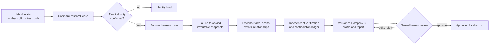
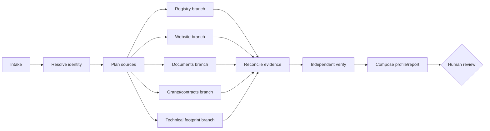

# Company Intelligence and Research Dashboard Upgrade Plan

> **Status:** proposed upgrade plan; no runtime behaviour is implemented by this document.
> **Prepared:** 2026-08-27 from a read-only Safari review of the CBIT admin dashboard,
> current repository evidence, and authoritative public-source documentation.
> **Repository provenance:** branch `production`, commit
> `32783b0303778086788cd00e0ee94b88291cec91`. The checkout was already dirty when analysed;
> this plan does not treat uncommitted files as an immutable baseline.

## 1. Outcome, boundary, and definition of success

### Intended outcome

Evolve the current evidence-first portfolio-reporting prototype into a company-intelligence
workspace where a user can start with any of the following:

- a Companies House number alone;
- a company website or verified public profile;
- one or more uploaded documents;
- a company name plus jurisdiction, held for identity review until an exact entity is confirmed;
- a bulk CSV/XLSX portfolio; or
- any combination of the above.

The system should then run a bounded, multi-layer research workflow that collects permitted public
evidence, ingests authorised documents, extracts and reconciles facts, exposes contradictions and
missing evidence, produces a cited company profile, and stops at a named human review checkpoint.

### Scope

This plan covers:

1. dashboard information architecture and company-level UX;
2. hybrid public-web and document intake;
3. bounded multi-agent orchestration and parallel source collection;
4. source admission, provenance, time, privacy, and trust contracts;
5. data-model, API, job, and migration changes;
6. phased implementation and validation; and
7. an extensible public-source landscape.

It does **not** authorise live source access, scraping, credential creation, production deployment,
contact with companies, automatic report publication, or use of restricted data with an external
model. Each live source must pass the repository's G2 admission gate before it is enabled.

### Minimum sufficient success

The first production-shaped release is successful when:

- a reviewed Companies House number can create a company research case without another required
  identifier;
- the same case can accept uploaded files and a verified company website;
- at least Companies House and first-party website collection can run through immutable,
  versioned source adapters after source admission;
- every displayed fact links to an exact evidence span, API pointer, XBRL concept, or document
  location and records publisher, retrieval time, effective/publication time, and checksum;
- conflicting current sources create a visible contradiction, never a silently selected value;
- identity resolution, source collection, extraction, verification, synthesis, and human approval
  remain separate auditable stages;
- a run can be replayed from its snapshots without network access and reproduce the same derived
  facts and report hash;
- public, internal, restricted, and synthetic evidence remain separated at storage, model, and
  export boundaries; and
- the dashboard makes the current blocker, source coverage, evidence freshness, agent state, and
  next safe human action clear at desktop and mobile widths.

---

## 2. What was observed in the reference dashboard

### Evidence boundary

The reference product was inspected in Safari on 2026-08-27 at the routes listed below. No company
was created, no research run was started, and no form was submitted. The labels and structures are
observations of the visible interface; they do not prove its backend implementation.

### Information architecture and workflows

| Route / surface | Observed purpose | Reusable design pattern | Limitation for our target |
|---|---|---|---|
| `/admindashboard` | Portfolio overview with active companies, periods, pending review, completed work, current period, recent activity, and admin shortcuts | Clear operational landing page and status cards | Counts are reporting-centric; no research coverage, freshness, contradiction, or source-health view |
| `/admincompanies` | Portfolio company table with programme, sector, stage, location, status, assigned users, and company dashboard action | Effective list-to-detail navigation and compact tags | Company data appears predominantly administrative and manually curated |
| Add Company wizard | Registered/ideation classification, then labelled `Deep research`, then `Validate & save`; registered path asks for company name, website, Companies House number, optional contact, and programme | Strong progressive disclosure and a useful registered-versus-idea branch | Website and company number are both required; the deep-research stage was not executed, so its provenance and verification behaviour are unknown |
| Company dashboard | Company classification chips; submission totals; completed/in-progress/review counts; historical trends; historical table; submissions | Good company-level shell and empty states | Historical reporting dominates; no identity record, source ledger, claim/evidence graph, company timeline, or research trace |
| `/adminperiods` | Period name, status, year, quarter, dates, deadline, company assignment, and metric selection | Explicit period/cutoff configuration and bulk assignment | Periodic questionnaire workflow is the primary unit, not an on-demand research case |
| `/adminmetrics` and `/AdminMetricTemplates` | Metric catalogue and reusable bundles | Useful configurable ontology/template pattern | Metrics do not visibly expose sourceability, evidence contracts, or verification rules |
| `/AdminOnboarding` | Template name/status/description, custom questions, and selectable metrics | Reusable onboarding template model | No observed source, document, or research-plan template |
| Programmes / Impact Agendas | Portfolio grouping and strategic themes | Helpful segmentation and cohort context | Grouping must not become evidence or imply causal impact |

### Reference dashboard strengths to preserve

- predictable left-navigation and list/detail hierarchy;
- one obvious primary action on each management page;
- progressive company intake rather than one oversized form;
- clear empty states;
- visible lifecycle labels such as draft, active, review, completed, and locked; and
- reusable metric and onboarding templates.

### Redesign thesis

The reference dashboard is a useful **portfolio operations shell**. Our system should keep that
clarity but change its centre of gravity from quarterly form administration to **proof-carrying
company intelligence**. A company row should answer not only “what programme and stage is this?”
but also “which legal entity is this, what was researched, from which sources, as of when, what is
supported, what conflicts, and what requires a human decision?”

---

## 3. Current repository baseline to extend

This is an extension plan, not a replacement architecture.

### Existing capabilities that should remain authoritative

| Existing capability | Repository evidence | Upgrade use |
|---|---|---|
| Local FastAPI/Jinja UI, loopback/Host enforcement, CSP, CSRF, no-store headers | `src/portfolio_agent/web.py:529-576` | Preserve for the local research release; introduce production auth only as a separate deployment track |
| Immutable source and submission snapshots with SHA-256 provenance | `docs/ARCHITECTURE.md:115-130`; `src/portfolio_agent/connectors/registry.py:98-190` | Generalise from known connectors/files to every admitted URL, API response, and uploaded artifact |
| Exact identifier review and name-only holds | `src/portfolio_agent/identity.py:45-65`; `src/portfolio_agent/identity.py:148-195` | Make the identity kernel the mandatory root of every company research case |
| Source capability manifests with identifier, fact, media, retrieval, licence, and live-admission fields | `src/portfolio_agent/connectors/base.py:30-57` | Extend with robots policy, attribution, retention, rate budget, credential class, and source-specific time semantics |
| Companies House and UKRI source adapters | `src/portfolio_agent/bootstrap.py:60-80`; `docs/SOURCE_ADMISSION_REGISTER.md:7-14` | Admit and enable deliberately; expand Companies House coverage before adding many secondary sources |
| Deterministic JSON, iXBRL/XML/HTML, and hierarchical-text extraction | `src/portfolio_agent/document_extraction.py:331-348` | Reuse for Companies House filings and uploaded public/company documents; add PDF/DOCX/OCR adapters behind the same result contract |
| Fixed stages with recorded input/output hashes and separate verifier | `docs/AGENT_CONTRACTS.md:1-28`; `docs/ARCHITECTURE.md:90-113` | Evolve into a bounded DAG with parallel collector tasks; preserve independent verification and orchestrator ownership |
| Claim, evidence, verification, quality, event, context, report, decision, and export records | `docs/ARCHITECTURE.md:145-193` | Build the Company 360 view from these durable records rather than from generated prose |
| Versioned report and named approval/export gate | `src/portfolio_agent/workflow.py:1335-1363`; `src/portfolio_agent/workflow.py:1650-1668` | Keep research synthesis pending until a named reviewer resolves material holds |
| Evidence Control Room presentation model | `docs/AGENTIC_DASHBOARD_BUILD_BRIEF.md:20-67`; `src/portfolio_agent/dashboard.py` | Retain proof-carrying handoffs and next-safe-action design; add portfolio and company intelligence screens |

### Current constraints that materially shape the upgrade

- The runtime is synchronous, single-process, SQLite, and intentionally non-production
  (`docs/ARCHITECTURE.md:60-70`).
- Live public retrieval is rejected while G2 is open (`src/portfolio_agent/bootstrap.py:42-47`).
- The current web intake is file-first and accepts restricted/internal/synthetic files, not public
  live research cases (`src/portfolio_agent/web.py:697-729`).
- The current run route executes the full workflow synchronously inside one request
  (`src/portfolio_agent/web.py:731-739`).
- Source connectors are admitted by exact source key and reviewed identifier, which is the correct
  security boundary to preserve (`src/portfolio_agent/connectors/registry.py:68-107`).
- No queue, scheduler, crawler, vector store, production authentication, or tenant model exists.

---

## 4. Target product model

### Primary objects



### Company research case

A case is the durable workspace for one legal entity or explicitly unincorporated idea. It owns:

- canonical legal identity and reviewed aliases;
- identifiers and identifier provenance;
- verified first-party domains and public profiles;
- intake artifacts and their classifications;
- research objectives, cutoff, scope, and source policy version;
- one or more immutable research runs;
- current approved profile/report version; and
- open identity, evidence, quality, or review decisions.

### Input modes

| Mode | Minimum input | Identity behaviour | Automatic research eligibility |
|---|---|---|---|
| Companies House number | Structurally valid number | Create candidate, retrieve exact profile only after source admission, then require named confirmation if name conflicts | Yes after review |
| Company website | HTTPS URL | Treat domain as a claim, not legal identity; look for legal-name/number statements and hold until corroborated | Website branch only until legal identity is reviewed |
| Uploaded document | File plus classification and declared company | Extract identity candidates and evidence; never infer a merge from a document name | Document branch only until identity is reviewed |
| Name + jurisdiction | Legal/trading name and country/jurisdiction | Search creates ranked candidates for human selection; no fuzzy auto-merge | No |
| Unincorporated idea | Name, optional description/site/files | Explicit `unincorporated` entity type; no Companies House assumption | First-party/document research only |
| Bulk portfolio | CSV/XLSX with per-row identifiers/URLs | Resolve each row independently; partial runs allowed only for resolved companies | Per resolved company |

The registered-company path must allow **Companies House number only**. Name and website become
derived or optional confirmation fields, not blockers.

---

## 5. Target information architecture

### Global navigation

1. **Overview** — portfolio research health, review queue, source health, freshness, and recent runs.
2. **Companies** — searchable company ledger and bulk intake.
3. **Research runs** — cross-company execution queue and Evidence Control Room traces.
4. **Documents** — uploaded artifacts, processing state, classification, and unresolved ownership.
5. **Sources** — admitted sources, credentials state, quotas, failures, and policy versions.
6. **Reports & review** — pending decisions, approved versions, and exports.
7. **Templates** — research objectives, source bundles, metric/claim definitions, and report sections.
8. **Governance** — source-admission register, retention, model boundary, audit, and evaluation.

The existing three-route local UI can introduce this progressively. A production sidebar should be
added only once these destinations exist; the current compact masthead remains appropriate during
the first implementation slices.

### Overview dashboard

Replace generic metric-card proliferation with an operational summary:

```text
┌──────────────────────────────────────────────────────────────────────────────┐
│ Company intelligence      Cutoff · source-policy version · reviewer          │
├──────────────────────────────────────────────────────────────────────────────┤
│ NEXT SAFE ACTION: Resolve 3 identities · Review 2 contradictions             │
├──────────────────────┬───────────────────────┬───────────────────────────────┤
│ Companies            │ Research runs         │ Evidence health               │
│ 42 verified identity │ 3 working · 4 held    │ 81% current · 7 stale         │
│ 5 identity holds     │ 12 pending review     │ 2 source failures             │
├──────────────────────┴───────────────────────┴───────────────────────────────┤
│ Attention queue: identity · contradiction · source failure · stale · review  │
├───────────────────────────────────────────────┬──────────────────────────────┤
│ Portfolio company ledger                      │ Source status and quotas      │
└───────────────────────────────────────────────┴──────────────────────────────┘
```

All counts must link to the exact filtered ledger. Unknown denominators must display `Not
available`, not `0`.

### Companies ledger

Required columns:

- canonical name and primary identifier;
- entity status/jurisdiction;
- verified domain;
- programme/cohort;
- last successful research cutoff;
- source coverage and freshness;
- supported / contradicted / insufficient claim counts;
- open decision count;
- current profile version and approval state; and
- next safe action.

Filters should include identity state, entity type, programme, sector, research status, source
coverage, evidence freshness, contradiction state, and review state.

### Company 360 workspace

| Tab | Purpose |
|---|---|
| Snapshot | Human-readable overview made only from current supported claims; visible `as of` date and profile version |
| Identity | Legal name, number, jurisdiction, aliases, verified domains, identifiers, and every merge/selection decision |
| Evidence | Claim-to-source ledger with exact spans/pointers, freshness, trust, temporal eligibility, and download/open-source actions |
| Financial & filings | Accounts periods, filed documents, extracted facts, typed missing states, and comparability warnings |
| Ownership & people | Public corporate ownership/control and officer roles only where necessary; privacy-minimised and never used for sensitive profiling |
| Grants & contracts | UKRI projects, public contract notices/awards, currencies, periods, and non-causal association labels |
| IP & innovation | Patent/trade-mark candidates and explicit identity-linkage state |
| Technology footprint | Reviewed GitHub organisation, public repositories/releases, and package metadata; no inferred engineering quality score |
| Website & market signals | First-party pages, product/sector claims, news/press items, and page-change history with self-claim labels |
| Documents | Uploaded and retrieved documents, classification, extraction state, page/span coverage, and unresolved items |
| Timeline | Incorporation, filings, funding, procurement, grants, releases, and other source events, each with provenance |
| Research trace | Parallel task graph, attempts, hashes, source calls, holds, duration, and safe summaries |
| Review | Contradictions, insufficient evidence, edits, approval, report version, and export gate |

### Research run control room

Retain the existing proof-carrying handoff rail, but permit bounded parallel collection branches:



Each node must expose its input contract, source/policy version, status, attempts, safe counts,
duration, output hash, and exact failure/hold reason. The graph is rendered from persisted tasks;
it is not a free-form agent editor.

---

## 6. Multi-layer agent architecture

### Architectural rule

Agents do not browse freely, mutate other agents' output, or call one another directly. The
orchestrator creates typed tasks. Fetchers acquire permitted bytes. Agents read persisted snapshots
and return bounded structured results. The independent verifier owns support status, and a human
owns approval.

### Layers and bounded roles

| Layer | Role | Owns | Must not do |
|---|---|---|---|
| Control | Research orchestrator | DAG state, task budgets, retries, dependencies, cancellation, and final hold | Interpret evidence or approve output |
| Identity | Legal-entity resolver | Exact identifiers, candidate set, reviewed aliases/domains, merge holds | Name-only auto-merge |
| Planning | Source planner | Select admitted source capabilities needed for the case objective and cutoff | Invent sources, identifiers, or facts |
| Acquisition | Registry collector | API/bulk/stream requests through admitted adapters | Parse unadmitted fields into claims |
| Acquisition | Web collector | robots/sitemap-aware bounded first-party retrieval | Crawl the open web indiscriminately or execute site instructions |
| Acquisition | Document collector | Store authorised uploads/retrieved filings and derive safe metadata | Send restricted bytes externally |
| Specialist extraction | Filing/financial analyst | Deterministic XBRL/iXBRL/structured document facts and typed missingness | Calculate unsupported totals or mix periods/currencies |
| Specialist extraction | Web/company analyst | Product, sector, location, team-role, and first-party claims with exact spans | Present self-claims as independently verified facts |
| Specialist extraction | Grants/procurement analyst | UKRI and OCDS facts/events with exact identifiers and time windows | Claim causality or complete totals from incomplete records |
| Specialist extraction | Technical-footprint analyst | Reviewed GitHub/package facts, repository events, languages/topics/releases | Infer product quality, security, staff performance, or company ownership from a name match |
| Reconciliation | Evidence reconciler | Canonical fact keys, unit/period mapping, duplicates, source precedence candidates, contradiction candidates | Choose a winner silently |
| Assurance | Independent verifier | Support/contradiction/insufficient/stale/untrusted decision per claim | Collect sources or generate narrative |
| Assurance | Quality/privacy auditor | Source policy, PII minimisation, injection, freshness, completeness, and export holds | Waive governance gates |
| Synthesis | Company-profile composer | Structured summary and report sections from verified records only | Add unstated facts or recommendations |
| Human | Named reviewer | Resolve identity/conflicts, edit, approve/reject, and explicitly export | Retroactively alter immutable evidence |

### Execution semantics

- A `ResearchRun` owns one company, one cutoff, one source-policy version, one research-template
  version, and one data-classification envelope.
- A `ResearchTask` is idempotent by `(run, capability, normalized request, policy version)`.
- Independent source tasks may run concurrently, but one task attempt writes only its own staging
  output. The orchestrator atomically accepts one valid result.
- Retries are source-specific, bounded, jittered, and visible; contract or trust failures are not
  retried automatically.
- Every task has timeout, byte, request, redirect, and model-token budgets.
- A partial run may reach review only when failed/unavailable branches are represented explicitly
  and no mandatory source/identity/privacy hold remains.
- Re-running with a new cutoff creates a new run and preserves prior facts/events; it does not
  mutate the historical run.

### Model use

1. Deterministic parsing, JSON pointers, XBRL concepts, metadata, and rules run first.
2. A model is considered only for admitted unstructured text/image extraction or constrained
   synthesis.
3. External models receive public/synthetic evidence only unless a separate approved deployment
   provides a compatible restricted-data boundary.
4. The model receives a source-safe opaque company reference, expected schema, claim key, period,
   and bounded text fragment—not open browser or database tools.
5. Every non-null extraction requires an exact evidence span that is validated deterministically.
6. Model output never determines identity, source admission, verification, approval, or publication.

### Retrieval and document intelligence

- Start with exact-citation storage and SQLite FTS5/lexical retrieval over permitted extracted text.
- Do not add embeddings or a vector database until a frozen evaluation shows material recall gains
  beyond deterministic/lexical retrieval.
- If embeddings are later admitted, fit/index only the authorised corpus, version model and chunking
  policy, retain source/span mappings, enforce per-company/classification filters, and evaluate
  retrieval separately from generation.
- Chunking must respect document structure (headings, table rows, XBRL facts, page boundaries) and
  never sever the evidence locator from its text.

---

## 7. Public-source strategy

### Source hierarchy

Source precedence is **claim-specific**, not a single global trust score:

1. official registry/regulator data for legal status, filings, regulatory status, grants, and
   procurement notices;
2. filed documents for period-bounded financial facts;
3. verified first-party company pages for products, positioning, locations, and announced events,
   labelled as self-claims;
4. public engineering/package platforms for technical activity, after explicit account/entity
   linkage;
5. secondary aggregators for discovery/cross-jurisdiction reconciliation, always retaining their
   underlying provenance and licence; and
6. press/news/search results for discovery and event candidates, not as unqualified company truth.

An authoritative publisher does not guarantee that a record is current, complete, or semantically
suitable for the claim. Publication, effective, correction, availability, and retrieval times must
remain distinct.

### Candidate source matrix

Every row below is a **candidate** until a named reviewer completes the repository's G2 checklist.

| Priority | Source | Candidate facts/events | Exact linkage | Access and current evidence | Key constraint |
|---|---|---|---|---|---|
| P0 | Companies House Public Data API | Legal profile, status, incorporation, SIC, addresses, filing links, officers, PSC, charges, insolvency, filing metadata | Companies House number | REST API uses authenticated GET requests; profile resources link to filing/officer/PSC surfaces. Default limit documented as 600 requests per five minutes. [API start](https://developer.company-information.service.gov.uk/get-started), [profile resource](https://developer-specs.company-information.service.gov.uk/companies-house-public-data-api/resources/companyprofile?v=latest), [guidelines](https://developer.company-information.service.gov.uk/developer-guidelines/) | Public personal data still requires purpose limitation, minimisation, correction handling, and legal review |
| P0 | Companies House accounts/company/PSC bulk products | Monthly company snapshot, PSC snapshot, daily/monthly electronically filed XBRL/iXBRL accounts | Companies House number inside records | Companies House documents the free products and notes that electronic accounts do not cover every filing. [Data products](https://www.gov.uk/guidance/companies-house-data-products), [accounts FAQ](https://resources.companieshouse.gov.uk/infoAndGuide/faq/accountsDataProduct.shtml) | Bulk accounts are incomplete and may omit later paper revisions; confirm against filing history |
| P1 | Companies House streaming API | Change events for admitted profile/filing resources | Company number + stream timepoint | Official stream mirrors on-demand resources and adds published time/timepoint. [Streaming overview](https://developer-specs.company-information.service.gov.uk/streaming-api/guides/overview) | Defer until durable jobs, checkpointing, replay, and monitoring storage exist |
| P0 | Verified company website | Legal footer, products, sector, locations, leadership roles, press releases, documents, contact channels, structured data | Domain must be reviewed and bound to company | Crawl only allowed first-party URLs, beginning with `robots.txt`, sitemaps, canonical links, RSS, and JSON-LD. [RFC 9309](https://www.rfc-editor.org/rfc/rfc9309.html), [Sitemaps protocol](https://www.sitemaps.org/protocol.html) | Website content is untrusted/self-asserted; obey robots/terms and block SSRF, trackers, forms, and instruction-following |
| P0 | Uploaded company/portfolio documents | Accounts, decks, reports, metrics, narratives, contracts supplied under authority | Declared company plus extracted identity confirmation | Existing local import and document-extraction contracts | Classification controls storage/model/export; malware, size, MIME, and document ownership checks are required |
| P1 | UKRI Gateway to Research | Projects, organisations, opportunities, awards, outcomes, dates, explicit amounts | Exact UKRI organisation ID; otherwise held mapping | GTR-2 returns JSON/XML and states the UI data is available under the Open Government Licence. [GTR-2 API](https://gtr.gtr.ukri.org/resources/gtrapi2.html) | Retain non-causal association and complete-same-currency rules already implemented |
| P1 | Contracts Finder | UK public opportunities and awards, suppliers, values, dates, CPV/region, OCDS identifiers | Supplier identifier when available; otherwise reviewed candidate | Published OCDS search/record/release endpoints are documented. [API documentation](https://www.contractsfinder.service.gov.uk/apidocumentation) | Buyer/supplier names are not always exact legal identifiers; no name-only merge |
| P1 | Find a Tender | Higher-value UK notices and awards in OCDS/XML | Supplier identifier where present; otherwise reviewed candidate | Notice data is documented as available under the Open Government Licence. [Developer documentation](https://www.find-tender.service.gov.uk/Developer/Documentation) | Deduplicate overlap with Contracts Finder by OCDS identifiers and notice lineage |
| P1 | Charity Commission for England and Wales | Charity status, trustees/public register fields, accounts and activities exposed by the product | Charity registration number | Beta API requires an account/API key; register datasets are also published. [API documentation](https://register-of-charities.charitycommission.gov.uk/en/documentation-on-the-api), [terms](https://api-portal.charitycommission.gov.uk/terms) | Only relevant entities; minimise personal data and version beta schemas |
| P2 | FCA Financial Services Register API | Firm regulatory status, permissions, warnings, names and identifiers | FCA reference number | FCA describes a free API for one-entity lookups; current handbook states 50 requests per 10 seconds. [Register](https://www.fca.org.uk/register), [handbook](https://www.fca.org.uk/publication/documents/register-extract-handbook.pdf) | Bulk extracts are paid; no SLA; individual-person data needs strong minimisation |
| P2 | GLEIF LEI data/API | LEI reference data, mapped identifiers, legal entity history, direct/ultimate parent where reported | LEI | GLEIF describes a free, registration-free API and historical/relationship data. [Official API announcement](https://www.gleif.org/media/pages/newsroom/press-releases/gleif-answers-industry-demand-for-customized-automated-access-to-rich-lei-data-with-lei-search-2-0-and-companion-api/b5b6024e2d-1774942232/2021-01-19_gleif-search-2.0-_api_final_approved_v1.pdf) | Coverage is not universal; ownership data can be non-reported or exception-coded |
| P1 | GitHub public REST/GraphQL | Verified organisation/repositories, topics, languages, releases, activity timestamps, public contributors as aggregate counts | Explicit reviewed GitHub organisation/account binding | Public resources can be read unauthenticated; current REST docs state 60 requests/hour unauthenticated and 5,000/hour for typical authenticated users. [Rate limits](https://docs.github.com/en/rest/using-the-rest-api/rate-limits-for-the-rest-api), [repository endpoints](https://docs.github.com/en/rest/repos/repos) | Never infer company ownership from a matching name; do not score staff, code quality, security, or company value from activity |
| P2 | Public package registries | Package identity, versions, release dates, metadata, repository links | Verified package/repository/company relationship | Use official registry APIs only after terms/rate review | Package names are not company identifiers; namespace squatting and abandoned packages require holds |
| P2 | UK Intellectual Property Office public patent data | Application/publication/grant/status dates, applicant/proprietor, classifications | Patent/publication number; company link often name-based and held | Public snapshots and data definitions are available under the Open Government Licence. [Patent data](https://www.gov.uk/government/publications/ipo-patent-data), [field definitions](https://www.gov.uk/government/publications/ipo-patent-data/ipo-patent-data-explained--2) | Data snapshot is not a live company API; applicant-name linkage requires review and can lag ownership changes |
| P2 | OpenCorporates | Cross-jurisdiction entity discovery, filings/relationships and underlying source provenance | Jurisdiction + company number | API key required; default limits and share-alike/open-versus-commercial conditions are documented. [API reference](https://api.opencorporates.com/documentation/API-Reference) | Secondary source; licence choice must fit repository/export model; prefer official UK data for UK claims |
| P2 | ONS datasets | Sector, geography, business-demography, innovation and macro context | Cohort dimensions only | Official API exposes versioned datasets/dimensions. [ONS Developer Hub](https://developer.ons.gov.uk/dataset/) | Aggregate context only; never attach rounded/suppressed cohort estimates as a company fact |
| P3 | News/search providers and public feeds | Event discovery, coverage candidates, press releases | URL + reviewed company association | Use a licensed search/news API or publisher RSS; snapshot the final public source page | Search snippets are not evidence; publisher terms, corrections, paywalls, and duplicates vary |
| P3 | Sector regulators and registers | Sector-specific licences, inspections, sanctions, certifications, environmental or clinical records | Exact sector identifier | Add only through a capability plug-in and source admission | Do not broaden every run to irrelevant registers; templates select sources by entity/sector |

### Explicit non-source rules

- Do not scrape LinkedIn, Crunchbase, Dealroom, app stores, review sites, or other commercial
  platforms without an approved API/licence and source-specific adapter.
- Do not use search-engine result pages or snippets as evidence.
- Do not run arbitrary Git repositories or downloaded code. Public repositories are documents and
  metadata sources; any code analysis runs in a separate untrusted-code sandbox with no credentials
  or network and requires explicit scope.
- Do not infer headcount from profile/contributor counts, revenue from traffic, traction from stars,
  ownership from shared addresses, or causal impact from grants/contracts.
- Do not retain personal contact data merely because it is public. Store company-level business
  facts by default; collect person-level public data only for an approved purpose.

### Source admission contract extensions

Add to each `SourceCapabilityManifest` or an associated versioned `SourcePolicy`:

- authoritative publisher and canonical documentation URL;
- access mode and credential class (none/API key/OAuth/licensed extract);
- terms/licence URL, reviewed date, reviewer, permitted storage/redistribution/attribution;
- personal-data categories, lawful-purpose note, minimisation and deletion rule;
- identity schemes and whether name discovery is allowed;
- fact/event/relationship keys and prohibited inferences;
- robots policy, user-agent, allowed hosts and URL patterns for web sources;
- timeout, redirect, DNS/IP, MIME, decompression, byte, pagination, request, concurrency, retry, and
  rate budgets;
- publication/effective/availability/correction time mapping;
- freshness target and stale behaviour;
- parser/extraction schema and derivation hash version;
- live/offline/fixture admission state; and
- a content-free smoke-test protocol and rollback switch.

---

## 8. Acquisition and security architecture

### Fetch boundary

Introduce a single outbound fetch service used by all live connectors. Do not let model agents
issue arbitrary HTTP requests.

Required controls:

- allow only `https` by default and source-policy-approved `http` exceptions;
- resolve DNS before every request/redirect and block loopback, link-local, private, multicast,
  metadata-service, and Unix/file schemes to prevent SSRF;
- revalidate redirects against the host policy and cap redirect count;
- send a named user-agent and contact URL; obey source rate limits and `Retry-After`;
- fetch and cache robots rules for crawler-style website collection, with fail-closed behaviour for
  unreachable/invalid policy according to the approved source contract;
- cap connect/read/total timeout, response bytes, decompressed bytes, pagination, and content type;
- never submit forms, accept legal terms, log in, bypass paywalls/CAPTCHAs, or click adverts;
- strip cookies, referrers, credentials, active content, trackers, and scripts;
- store raw bytes immutably before parsing and record request fingerprint, headers allowlist,
  status, final URL, retrieved time, checksum, and policy version;
- sanitise errors so logs contain no raw evidence, credentials, query tokens, or personal data; and
- expose per-source circuit state, quota, and last-success/last-failure metadata.

Browser rendering should be a separately admitted fallback for JavaScript-only first-party pages,
run in an isolated worker with scripts/network allowlisted, not the default collector.

### Upload boundary

- Validate extension, detected MIME, declared MIME, size, archive depth, compression ratio, and
  encrypted/password-protected state.
- Store upload bytes create-once with classification, uploader/reviewer, declared company, purpose,
  retention class, and checksum.
- Add malware scanning before parsing in any multi-user deployment.
- Parse PDF, DOCX, XLSX, CSV, JSON, HTML/XML/XBRL, plain text, and images through format-specific
  adapters; OCR is optional and must record engine/version/page coordinates/confidence.
- Treat every document as untrusted content. Instructions inside evidence never control tools,
  source policy, prompts, or workflow state.
- Failed parsing preserves the raw snapshot and explicit failure without partial unsupported facts.

### Privacy and high-impact boundaries

- Default output is company intelligence, not personal profiling.
- Officer/PSC/trustee data is purpose-bound, minimised, and separated from sensitive or protected
  attributes. Do not infer ethnicity, health, religion, politics, sexuality, financial distress, or
  other sensitive characteristics.
- Do not use the system for automated employment, lending, insurance, housing, legal eligibility,
  or other high-impact decisions.
- Public availability is not sufficient legal authority for indefinite storage or redistribution;
  record purpose, retention, correction, and deletion handling.
- Exports include provenance/attribution and exclude raw personal data unless specifically approved.

---

## 9. Data model and migration plan

### Reuse before addition

Keep current `CompanyModel`, identifier/candidate/decision tables, source definitions/snapshots,
evidence facts, events, run/agent records, claims/verifications, quality findings, reports, review
decisions, and exports. Add fields/tables only where the new concept cannot be represented without
breaking semantics.

### Proposed schema changes

| Change | Purpose | Key invariants |
|---|---|---|
| Extend `companies` | Entity type, jurisdiction, lifecycle status, current approved profile ID | Legal identity fields change through versioned decision, not direct overwrite |
| Extend `company_identifiers` | Valid-from/to, issuer/source snapshot, review decision, confidence is not authority | Unique by scheme + normalised value + validity interval where appropriate |
| `company_domains` | Verified first-party domains and public-account bindings | Domain/account linkage requires evidence and named decision; history retained |
| `research_cases` | Durable company workspace and default objective/template | One legal company can have many cases only when purpose/scope differs explicitly |
| `intake_artifacts` | URL, company number, upload, bulk row, or manual seed | Immutable submitted value/hash, classification, actor, and declared purpose |
| `research_templates` + versions | Objectives, required/optional source capabilities, claim catalogue, freshness, budgets | Published versions immutable; runs pin one version |
| `research_runs` or compatible extension of `workflow_runs` | Company case, cutoff, policy/template versions, budget and aggregate state | New cutoff creates new run; completed run immutable |
| `research_tasks` + `task_attempts` | Persisted DAG nodes, dependencies, branch attempts, budgets, errors and hashes | Idempotent request fingerprint; one accepted output per task |
| `source_policies` + versions | Expanded admission contract | No live task unless policy version is admitted and active |
| Extend `source_snapshots` | Request method, safe headers, final URL, policy version, raw/derived status, freshness | Raw checksum and derivation hash remain independent and immutable |
| `document_artifacts` + `document_segments` | Format/page/section/table/chunk metadata and exact locators | Segment text inherits artifact classification/access; no orphan citations |
| Extend `evidence_facts` | Valid/effective/available times, structured value type, subject/object IDs, extraction span | Fact cannot exist without snapshot/segment and versioned extraction method |
| `entity_relationships` | Parent/subsidiary, officer role, domain/account ownership, supplier/grant association | Relationship type, direction, validity, evidence, and verification required; no inferred merge |
| `claim_evidence_links` | Evidence role (`supports`, `contradicts`, `context`, `discovery`) and verifier rationale | Claim status derived from verifier records, not link count |
| `profile_versions` | Structured Company 360 output separate from narrative report | Approved version pins claims/evidence/run and hash; edit revokes approval |
| `source_refresh_requests` | Manual or future scheduled refresh intent | Scheduling disabled until durable worker/retention design exists |

### Migration rules

1. Add tables/nullable columns first; keep existing routes and workflow readable.
2. Backfill only deterministic values with a recorded migration version; never infer website,
   jurisdiction, or identity from names.
3. Introduce dual-read view models, then write new records behind a feature flag.
4. Do not rename/drop current tables until replay, report export, and migration tests pass on a copy
   of the latest schema.
5. Make downgrade limitations explicit before mutation, following the existing fail-closed Alembic
   precedent.
6. Include schema-equivalence, upgrade-from-0007, idempotent replay, and downgrade-preflight tests.

---

## 10. Application and API boundaries

### Proposed server commands and routes

Names are planning-level contracts; implementation must reconcile them with current FastAPI/Jinja
patterns before code is written.

| Boundary | Purpose |
|---|---|
| `POST /company-intakes` | Create case from number, URL, name/jurisdiction, or uploaded artifact; CSRF and classification required |
| `GET /companies` | Filtered company ledger |
| `GET /companies/{company_id}` | Company 360 current approved/profile state plus open holds |
| `POST /companies/{company_id}/identity-decisions` | Named accept/reject/link/domain decision with optimistic lock |
| `POST /research-cases/{case_id}/runs` | Create a run pinned to cutoff/template/policy; enqueue rather than execute inline once workers exist |
| `GET /research-runs/{run_id}` | Control room, tasks, source calls, evidence health, exceptions, and next action |
| `POST /research-runs/{run_id}/cancel` | Named, audited cancellation of pending/running tasks |
| `GET /evidence/{evidence_id}` | Safe metadata and authorised exact source/span view |
| `GET /claims/{claim_id}` | Claim, candidate values, evidence roles, verification history, and review action |
| `POST /profile-versions/{id}/review` | Approve/reject/edit current version with lock version and rationale |
| `POST /profile-versions/{id}/export` | Existing approval-gated atomic export pattern |
| `GET /sources` | Source policies, admission, quota, freshness, health and version history |

### Worker boundary

For the first slice, preserve synchronous fixture/offline replay. Before live multi-source research:

- introduce a durable task runner with transactional enqueue/outbox semantics;
- assign leases with expiry and heartbeat, idempotency keys, bounded retries, cancellation, and
  dead-letter/held state;
- keep database commit and snapshot publication crash-safe;
- limit concurrency per source and globally;
- record worker version and parser policy on every attempt; and
- surface stale leases/recovery as human-operable states.

Do not implement parallelism with in-process background threads on top of the current request-bound
SQLite runtime and call it durable.

---

## 11. Claim, evidence, and contradiction contract

### Required fact envelope

Every extracted fact must carry:

- company/entity subject ID and reviewed identity basis;
- canonical fact key and schema/catalogue version;
- typed value plus unit/currency and typed missing state;
- valid/effective period and `as_at` or interval semantics;
- publisher, source key/version, source-policy version, source tier;
- immutable snapshot ID/checksum and exact locator/span/pointer/concept;
- published, effective, available, retrieved, and cutoff times where applicable;
- extraction method/schema/model and attempt ID;
- classification, trust/injection state, and personal-data category;
- derivation hash; and
- quality/temporal eligibility result.

### Verification outcomes

Retain conservative explicit states:

- `supported`;
- `contradicted`;
- `insufficient_evidence`;
- `stale`;
- `rejected_untrusted`;
- `identity_held`;
- `not_applicable`; and
- source terminal states such as `no_record`, `unavailable`, and `collection_failed` kept distinct.

No generic 0–100 “AI confidence” score should be used as truth. UI confidence language can describe
evidence conditions only, such as `one current first-party source`, `two independent official
sources`, or `current sources disagree`.

### Contradiction handling

1. Normalise comparable subject, fact, unit/currency, and period.
2. Retain every candidate value and its evidence.
3. Apply source-specific correction/supersession rules only when the source contract defines them.
4. Mark unresolved disagreement as `contradicted` and stop it entering the supported summary.
5. Present reviewer options: accept a documented supersession, mark non-comparable, retain hold, or
   reject a source—each with rationale and version invalidation.

---

## 12. Research templates

Templates replace the reference dashboard's metric bundles with versioned research objectives.

### Core company profile template

- legal identity and status;
- verified domain and locations;
- company type, incorporation, SIC/sector candidates;
- filing/account periods and availability;
- public grants/contracts/IP/regulated status when applicable;
- first-party product and market description;
- reviewed technical footprint when applicable;
- material events and changes;
- source coverage, freshness, contradictions, and limitations.

### Due-diligence-lite template

This is evidence organisation, **not** regulated KYC/AML or an automated risk decision:

- entity/ownership/control records;
- filing/overdue/insolvency/charges events exposed by admitted sources;
- regulatory/charity/LEI records where applicable;
- material public notices;
- contradiction and missing-evidence ledger;
- explicit limitation that no eligibility/recommendation is produced.

### Portfolio impact/research template

- programme membership and exposure window;
- submitted documents/metrics;
- eligible public grants/contracts/events;
- verified changes across comparable periods;
- within-portfolio aggregate context with minimum-N suppression;
- no causal attribution without a separately designed study.

Templates select **capabilities**, not hard-coded agent personas. A source branch runs only when the
entity type, jurisdiction, objective, and admitted policy make it relevant.

---

## 13. Phased implementation plan

### Phase 0 — Freeze boundaries and close prerequisite decisions

**Changes**

- Record the target deployment for the first release: recommended assumption is the existing local,
  single-user research boundary.
- Reconcile this plan with `REQUIREMENTS.md`, security, data dictionary, ADRs, traceability, and the
  existing dashboard brief.
- Add requirement IDs for hybrid intake, company research cases, source tasks, evidence spans,
  contradiction handling, and Company 360 views.
- Complete G2 admission evidence for the first two live capabilities only: Companies House and
  first-party website retrieval.
- Define retention, correction/deletion, attribution, business-purpose, and reviewer authority.
- Freeze synthetic evaluation cases and prohibited sources/inferences.

**Exit evidence**

- approved source-policy versions and threat model;
- accepted data model/API ADRs;
- frozen evaluation manifest hashes;
- no live network access yet.

### Phase 1 — Company case and hybrid intake foundation

**Changes**

- Add research cases, intake artifacts, company domains, research templates/versions, and profile
  versions.
- Implement Companies House-number-only, website, document, name/jurisdiction, and bulk intake.
- Reuse existing identity candidates/decisions and add domain/account linkage decisions.
- Build Companies ledger and Company 360 identity/documents skeleton.
- Preserve existing import/run/report routes during transition.

**Validation**

- migration from revision 0007 and schema-equivalence tests;
- structural number validation including prefixed UK numbers;
- name-only/domain-only no-auto-merge tests;
- duplicate/idempotent intake tests;
- upload classification, size, MIME, archive, and prompt-injection tests;
- keyboard/mobile/empty/error UI tests.

### Phase 2 — Companies House and first-party website vertical slice

**Changes**

- Extend source policy/manifests and implement the outbound fetch boundary.
- Admit Companies House profile/filing history first; add accounts documents only after the profile
  slice is stable.
- Implement bounded website discovery from reviewed domain, robots, sitemaps, canonical links,
  structured data, selected pages, RSS, and documents.
- Persist raw bytes, request fingerprints, exact locators, time semantics, and derivation hashes.
- Add company Snapshot, Evidence, Financial & filings, Website, Timeline, and Sources panels.

**Validation**

- fixture contract tests plus counts/hash/locator-only live smoke outside CI;
- API pagination, 404/429/5xx, timeout, retry, ETag/conditional request, schema drift, and new-field
  tolerance tests;
- SSRF/DNS rebinding/redirect/oversize/decompression/MIME/robots tests;
- XBRL/iXBRL and HTML exact-span gold cases;
- offline replay equality and source-correction tests;
- public personal-data minimisation/export tests.

### Phase 3 — Persisted task DAG and agent control room

**Changes**

- Add research tasks/attempts/dependencies and a durable worker boundary.
- Split source planning, acquisition, extraction, reconciliation, verification, quality audit, and
  composition into typed task contracts.
- Fan out admitted sources in parallel and fan in only after mandatory dependency rules are met.
- Extend the Evidence Control Room to show branches, budgets, attempts, source calls, proofs, holds,
  and cancellation/recovery.

**Validation**

- task idempotency, duplicate delivery, lease expiry, cancellation, crash recovery, retry budget,
  dead-letter/held state, and source concurrency tests;
- one-writer snapshot publication race tests;
- task input/output hash and safe-metadata redaction tests;
- deterministic orchestration replay tests;
- no report composition before required tasks and verifier complete.

### Phase 4 — Document intelligence and cited synthesis

**Changes**

- Add PDF/DOCX/image adapters, structural segments, page/bounding-box locators, table extraction, and
  OCR where justified.
- Add lexical retrieval over authorised extracted text.
- Add bounded model extraction for admitted public/synthetic unstructured cases and model-safe
  synthesis from verified claims.
- Add claim/evidence inspector and contradiction-resolution workflow.

**Validation**

- adversarial documents, hidden text, malformed structures, OCR uncertainty, table/period ambiguity,
  citation containment, and prompt-injection cases;
- frozen extraction and retrieval benchmark with per-format precision/recall/abstention;
- model/non-model parity and strict-schema failures;
- zero restricted/internal external-model calls;
- every generated statement resolves to supported claim IDs and evidence spans.

### Phase 5 — Broader public-source capability packs

Add one source at a time in this order, subject to relevance and admission:

1. UKRI GTR;
2. Contracts Finder and Find a Tender with OCDS deduplication;
3. Charity Commission and FCA for applicable entities;
4. GitHub and package registries after explicit account/package linkage;
5. GLEIF for LEI-bearing entities;
6. UKIPO candidates; and
7. licensed secondary aggregators/news discovery only where they add measured coverage.

Each adapter must ship with manifest/policy, fixtures, parser tests, time semantics, exact identity
rules, attribution/export behaviour, rate/failure handling, and an evaluation showing incremental
value. Source count is not a success metric.

### Phase 6 — Production and monitoring track

Only after the research product is validated:

- replace SQLite with a managed transactional store;
- add authentication, RBAC, tenant isolation, object storage encryption, secrets manager, audit
  principal, backups/restore, DPIA/legal review, vulnerability/SBOM/dependency controls, and
  observability;
- add scheduled refresh/subscriptions, source-change detection, notification preferences, and
  retention/deletion jobs;
- add streaming Companies House only if measured freshness requirements justify its operational
  complexity; and
- run accessibility, penetration, load, concurrency, disaster-recovery, and data-deletion tests.

---

## 14. Evaluation and quality gates

### Gold datasets

- **D0 synthetic engineering set:** deterministic fixtures for every connector/status/schema/attack.
- **D1 public benchmark:** frozen, licence-admitted public companies and documents with expert gold
  identity, facts, spans, periods, and contradictions.
- **D2 sealed holdout:** inaccessible during prompt/rule/source selection; opened once under the
  dissertation protocol.
- **D3 human workflow study:** separately authorised task-time/accuracy/usability comparison.

### Metrics

| Layer | Measures |
|---|---|
| Identity | Exact-match precision, false-merge rate, candidate recall, abstention/hold rate, review time |
| Acquisition | Source success/no-record/unavailable/failure rates, bytes/requests, freshness, replayability, policy violations |
| Extraction | Field precision/recall/F1, exact-span correctness, period/unit/currency accuracy, abstention, non-finite rejection |
| Retrieval | Evidence-span recall@k and precision@k, with company/classification leakage checks |
| Verification | Supported-claim precision, contradiction recall, false-support rate, stale/untrusted rejection |
| Synthesis | Citation coverage/correctness, unsupported statement rate, omission rate, version reproducibility |
| Operations | Run latency, queue time, retry rate, source quota use, model tokens/cost when authoritatively priced, storage growth |
| Human | Decision accuracy, time to approval, unresolved exceptions, usability/accessibility findings |

Never collapse these into one “quality score.” Report denominators, nulls, confidence intervals
where appropriate, and failures/abstentions separately.

### Final gates for each implementation phase

1. targeted unit/contract tests;
2. migration/schema checks where persistence changed;
3. strict type, lint, format, and dependency checks;
4. integration replay from immutable fixtures;
5. security boundary/adversarial tests;
6. rendered accessibility/responsive checks for changed UI;
7. deterministic repeat-run/hash check;
8. source-specific content-free smoke only when admitted; and
9. one final full repository gate on the exact state.

---

## 15. Risk register

| Risk | Failure mode | Required control / stop |
|---|---|---|
| Entity collision | Similar name/domain attaches evidence to the wrong company | Exact identifier/account decision; no automatic fuzzy merge; irreversible export held |
| Temporal leakage | Later filing/page supports an earlier cutoff | Separate effective/published/available/retrieved times and run-relative eligibility |
| Prompt injection | Page/document tries to control agents or exfiltrate data | Content is data only; fetch/model/tool separation; detector and hard trust hold |
| SSRF / unsafe browser | URL reaches local/cloud metadata or runs hostile active content | Central fetch policy, DNS/IP/redirect validation, no script by default, isolated admitted renderer |
| Licence/terms breach | Scraping/storage/redistribution exceeds permission | G2 source policy, reviewer/date/version, attribution, feature kill switch |
| Personal-data overreach | Public officer/contact data becomes profiling dataset | Purpose/minimisation/retention, person-data separation, export filtering, DPIA/legal review |
| Hallucinated synthesis | Fluent profile adds unsupported facts | Composer consumes verified claims only; deterministic citation coverage gate |
| False source precedence | “Official” but stale/incomplete record silently wins | Claim-specific rules, time semantics, candidate retention, contradiction review |
| Rate/cost runaway | Agent fan-out exhausts API/model quotas | Per-task/run/source budgets, central rate limiter, bounded concurrency/retries, visible stop |
| Non-durable parallelism | Process crash loses task or duplicates writes | Durable tasks, leases, idempotency, transactional handoff/outbox, accepted-output uniqueness |
| Snapshot/parser drift | Same bytes yield different facts after code change | Raw checksum + parser/schema/derivation version; fail-closed mismatch and replay tests |
| Restricted-data leakage | Uploaded/internal content crosses external model/export | Classification enforcement at every boundary; opaque aliases; negative tests and audit |
| Misleading technical signals | GitHub stars/activity become quality or company-value claims | Report only observable metadata; explicit linkage; prohibited inference tests |
| Accessibility regression | Dense control room hides decisions on mobile/keyboard | Semantic HTML, progressive disclosure, reduced motion, zoom/contrast/mobile matrix |
| Scope explosion | Many shallow sources reduce reliability | Capability templates, source-by-source admission/evaluation, incremental-value gate |

---

## 16. Decisions required before implementation

The following materially change architecture or authority and must be resolved explicitly:

1. **Deployment boundary:** remain local single-user for the next release, or begin a multi-user
   hosted architecture with authentication, tenant isolation, encrypted storage, and durable jobs.
2. **First live source scope:** approve Companies House profile + filing metadata and first-party
   websites as the only initial live capabilities, or keep all network access fixture-only.
3. **Data purpose and retention:** define why public personal data is processed, which person-level
   fields are necessary, retention periods, correction/deletion handling, and export audience.
4. **External model boundary:** keep public/synthetic-only external inference, or specify an approved
   private deployment for internal/restricted documents.
5. **Research objective:** choose the first measurable template—core company profile,
   due-diligence-lite, or portfolio impact reporting—so source breadth and claims remain bounded.
6. **Secondary data licensing:** decide whether OpenCorporates/other commercial aggregators are
   excluded, used under share-alike/open conditions, or licensed commercially.

### Recommended first vertical slice

Assuming the existing local dissertation boundary remains authoritative, implement this smallest
coherent slice first:

> Companies House number-only intake → reviewed identity → admitted Companies House profile and
> filing metadata → optional verified first-party website → immutable snapshots → deterministic
> facts and exact citations → independent verification → Company 360 identity/evidence/timeline
> view → named human review.

It exercises the new product end to end without prematurely adding a crawler swarm, vector store,
streaming, many regulators, or production infrastructure.

---

## 17. Definition of done for the upgrade programme

The programme is complete only when:

- hybrid intake, public collection, documents, Company 360, agent trace, review, and export work as
  one versioned evidence chain;
- source adapters are admitted and independently testable, not embedded in agent prompts;
- runs are durable, idempotent, replayable, budgeted, cancellable, and failure-visible;
- every fact and narrative statement is identity-, time-, and provenance-bound;
- contradictions, no-record, unavailable, failure, stale, untrusted, and not-applicable remain
  distinct;
- restricted/public data and model boundaries have automated negative tests;
- no unsupported personal profiling, causal attribution, investment/recommendation, or high-impact
  decision is produced;
- the current approved profile/report and its evidence manifest can be reproduced from immutable
  snapshots; and
- implementation, migration, security, evaluation, accessibility, and operational evidence is
  recorded in the repository traceability ledger.

