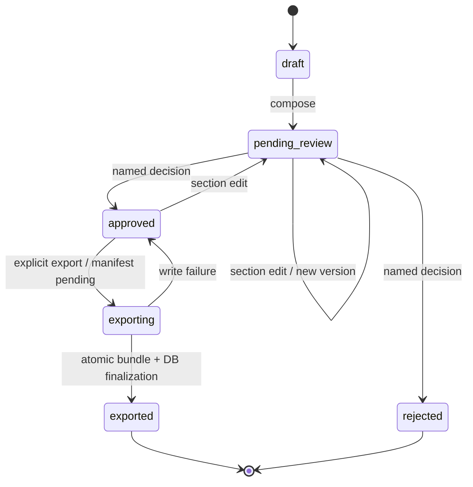

# Data dictionary and metric semantics

## Canonical principles

1. Raw input is immutable; corrections produce a new dataset, never an in-place rewrite.
2. Original and normalized values are separate.
3. Company, period, metric, source, and run identity are explicit foreign-key dimensions.
4. Missingness is semantic state, not a null-cleaning inconvenience.
5. Currency is part of a value's meaning and is never assumed or converted implicitly.
6. External evidence is untrusted content until independently verified.
7. A report claim is a proposition with evidence and verification, not just generated text.

## Core entities

| Entity | Purpose | Required identity / important fields | Key invariants |
|---|---|---|---|
| `Company` | Canonical portfolio-company identity | `id`, `canonical_name`, non-unique `normalized_name`, transitional `external_id`, resolution/classification | Normalized name is a search key only; no fuzzy/name-only auto-merge |
| `CompanyIdentifier` | Source-scoped exact identity | company, closed scheme, original/canonical value, source, validity, review flag | `(scheme, normalized_value)` globally unique; classifications cannot be crossed by a merge |
| `IdentityCandidate` / `IdentityDecision` | Human identity hold and append-only decision | submission/imported/suggested company, submitted identity, reason, actor/rationale | Name-only or conflicting identity cannot reach collection until a named decision |
| `CompanyProgrammeMembership` | Imported programme-entry boundary for one company/submission | submission, company, start date, submitted period label, source cell | One membership per submission/company; invalid or post-cutoff dates are held rather than guessed |
| `CatalogueVersion` | Frozen metric/workbook contract | semantic version, SHA-256, definition count | A version/hash pair cannot be silently reused with changed semantics |
| `ReportingPeriod` | Time boundary for inputs and claims | `id`, unique `label`, optional `start_date`, `end_date` | Start ≤ end; same label cannot acquire conflicting dates |
| `MetricDefinition` | Canonical semantic contract for a metric | `key`, label, category, `data_type`, unit, `sourceability`, period semantics, aliases, description | Key unique; aliases cannot map to multiple keys; every catalogue metric has explicit period semantics; changes should be versioned before empirical freeze |
| `RawSubmission` | Immutable import snapshot | dataset/period/cutoff, profile and catalogue version/hash, SHA-256, safe local path, classification | Same hash+period is idempotent; formula cells are held; import summary is provenance, not source truth |
| `Observation` | A submitted value for company×metric×period | original value, normalized value, missing state, unit/currency, source cell, normalization issue | Unique within raw submission×company×metric; original retained; normalized value cannot erase state |
| `ObservationNarrative` | Paired workbook explanation | parent metric key, body, exact source cell/label | Stored separately from numeric fact; cannot overwrite its parent observation |
| `EvidenceItem` | Source material used to test a claim | company/metric links, source type, connector, locator, publisher, times, content, checksum, connector version, classification, trust fields | Immutable source checksum; content is data, never instruction; provenance required for support; eligibility is read from `RunEvidence`, not the legacy global temporal column |
| `RunEvidence` | One evidence item's temporal decision for one run | run, evidence, frozen cutoff, status, rationale, evaluation time | Same evidence can be future for one cutoff and eligible for another; extraction and verification use only this association |
| `SourceDefinition` / `SourceSnapshot` | Versioned source policy and immutable response | licence/terms state; dated admission; live-admitted flag; manifest hash; exact fact-key→metric/method/schema/unit/currency contracts; request fingerprint; exact reviewed ID; cutoff and programme start; status; locator/path/content hash; canonical derivation hash and contract version; times/classification | Unconfigured/unadmitted source fails closed; response facts/events/media and semantic bindings are manifest-validated; held public content is not persisted; same request/window cannot drift in either bytes or derived facts/events |
| `RunSourceSnapshot` | Explicit source-collection provenance for one run | run, snapshot, frozen cutoff, link time | A report/event query may use only snapshots bound to its run and matching cutoff |
| `EvidenceFact` / `CompanyEvent` | Typed fact and append-only lifecycle history derived from a snapshot/submission | value/unit/currency/period; source locator; structured locator; extraction method/schema; event type/date/amount/source | Submission and public facts remain separate; fact provenance is derivation-hashed; events never imply causal impact; repeated events are canonical and linked to each source snapshot through `SourceSnapshotEvent` |
| `QualityContract` / `QualityViolation` | Executable rule version and source-linked disposition | rule/version/hash, severity, pass/warn/hold/exclude details | Expected missingness and no-record are explicit warnings; temporary unavailability is a coverage warning; terminal collection failure is a hold; no single opaque score |
| `Extraction` | Strictly parsed fact from an evidence item | run/evidence/company/metric, extracted and normalized values, exact locator/span or abstention, period, provider/model, schema version | Unique per run×evidence; expected identity/metric and span-parsed value must match; untrusted evidence has no extraction |
| `ExtractionAttempt` | Per-provider attempt telemetry | model/provider/prompt, input/output hashes, tokens, duration, terminal status/escalation | Public/synthetic only externally; maximum one 5.4 validation escalation |
| `WorkflowRun` | Dataset-level state machine instance | `id`, dataset, period, stage, status, configuration, times/error | Fixed ordered stages; one dataset/period; failure stops downstream stages |
| `AgentRun` | One functional role execution | run, stage, role, status, input/output hashes, model/attempts/tokens/cost, duration/error, bounded metadata | Trace metadata contains counts/IDs/hashes, not raw restricted values |
| `Claim` | Reportable proposition | run, company, metric, period, text, normalized value, verification status, evidence links | Must be independently verified before report approval; status is not implied by fluency |
| `Verification` | Independent decision on a claim | claim, status, rationale, verifier role, time | Separate role; exact evidence/period/sourceability rules; no averaging conflicts |
| `ContextStatistic` | Descriptive within-import portfolio distribution | metric, period semantics/exposure window, distribution definition, N, cutoff, source versions, five-number value/status | Not an external UK benchmark; suppressed below minimum N; no ranking/recommendation; currency/unit or incompatible exposure windows do not mix |
| `Report` | Versioned reporting artifact | run/dataset/period, content and optimistic lock versions, status/hash/times | One report per run; stale mutations fail; export requires current approval |
| `ReportSection` | Reviewable report unit | report/company, stable key, heading, order, body, version, current flag | Edits create a new version and invalidate approval |
| `ReviewDecision` | Human audit event | report/section, actor, decision, rationale, report version, time | Actor and rationale required; append-only audit intent |
| `ReportExport` | Filesystem/database finalization record | report version, pending/finalized/failed status, artifact root, manifest/hash/error | Only a finalized manifest makes download eligible; re-export is idempotent |

## Missing-state contract

| State | Meaning | Normalized value | Claim eligibility | Example input |
|---|---|---|---|---|
| `observed` | A valid non-zero value was supplied or explicitly found | Typed value | Yes, subject to verification | `17`, `GBP 250000`, `40%` |
| `zero` | A valid numeric value of exactly zero | `0` or numeric string `"0"` | Yes; zero is evidence-bearing | `0`, `0%` |
| `blank` | Cell/key exists but contains no value | `null` | No | empty cell or empty string |
| `none_stated` | Source explicitly states none | `null` | Normally no numeric claim; may support a qualitative absence statement only under a separate metric contract | `none`, `nil` |
| `not_applicable` | Metric explicitly does not apply | `null` | No | `N/A`, `not applicable` |
| `not_reported` | Source explicitly says the value was not reported/provided | `null` | No | `not reported` |
| `not_found_publicly` | A bounded public search explicitly returned no eligible evidence | `null` | No positive claim | `not found publicly` |
| `filing_not_due` | The filing obligation is not yet due at the cutoff | `null` | No defect and no positive filed-value claim | connector-derived state |
| `dormant` | The authoritative record marks the company/accounts dormant | `null` | Context-specific; never coerced to zero | connector-derived state |
| `not_required` | The source contract says the field is not required | `null` | No | connector-derived state |
| `source_unavailable` | An admitted source could not be retrieved within the bounded attempt policy | `null` | No; quality warning and explicit coverage gap | timeout/retry exhaustion |
| `invalid` | Present value violates type/range/finite-number contract | `null` | No; requires correction/review | fractional headcount, non-ISO date, `NaN`, `Infinity` |

SQL null alone is never used to infer which semantic state applies; `missing_state` is
mandatory on observations.

## Canonical value representation

| Data type | Stored normalized representation | Rules |
|---|---|---|
| Integer/count | JSON integer | Must be whole; no rounding |
| Decimal | Canonical decimal string | Avoids binary floating-point drift |
| Percentage | Canonical decimal string in percentage points | Valid range 0–100; a bare `0.4` remains 0.4 percentage points, not inferred as 40% |
| Currency | Canonical decimal string + explicit three-letter currency | Recognises explicit GBP/USD/EUR code or symbol in P0; absent currency raises issue |
| Boolean | JSON boolean | Only explicit boolean/yes/no tokens |
| Text | Trimmed string | No numeric coercion |
| Date | ISO `YYYY-MM-DD` string | No locale-dependent inference |
| Duration | Canonical decimal string + `hours` | No conversion from days/minutes unless an explicit input contract is added |

All numeric representations must be finite. IEEE/JSON non-finite tokens such as `NaN` and
positive or negative infinity are retained only as invalid source observations; they cannot enter
claims, event amounts, contextual statistics, or model-grounded extractions.

The P0 catalogue does not aggregate currency metrics. Any future aggregation must specify
currency, rate source, rate timestamp, rounding, and treatment of missing rates.

## Period-semantics contract

| Semantic type | Required interpretation | Representative metrics / treatment |
|---|---|---|
| `reporting_period` | Value occurred within the named reporting period | jobs created, R&D spend, products, revenue, partnerships |
| `last_quarter` | Value refers to the immediately preceding quarter encoded by the input contract | CBIT quarter-specific input rows only; never relabelled as the current quarter |
| `as_at_reporting_cutoff` | Point-in-time state on the frozen cutoff date | employees, TRL, valuation, AI adoption/coverage |
| `since_programme_start` | Cumulative interval from persisted programme start through cutoff, inclusive | grant funding; exact interval required for public metric support |
| `before_programme` | Historical value strictly before programme entry | comparison-only CBIT rows; label includes the programme boundary |
| `lifetime_or_unspecified` | Source describes lifetime scope and no narrower compatible interval exists | visible as such; never silently treated as a reporting-period value |
| `explanatory_only` | Narrative context, not a metric value | paired explanation rows |

A missing or invalid programme start prevents a cumulative public claim. It does not cause a
quarter label to be substituted. Source requests, snapshots, facts, and derivation hashes all retain
the exact cumulative interval.

For longitudinal change, reporting-period metrics require complete, non-overlapping bounds with
equal duration; point-in-time metrics require ordered cutoffs; and cumulative metrics require the
same programme origin with ordered cutoffs. Other or incomplete intervals are `not_comparable`.
Within-portfolio context uses the same exposure dimensions, so different programme starts form
separate cohorts and usually remain suppressed below the minimum sample size.

## Sourceability classes

| Class | Meaning | Verification rule |
|---|---|---|
| `publicly_sourceable` | Expected to have an eligible public record | Current eligible public evidence is mandatory for support; a submission alone is insufficient and no result stays missing |
| `internal_only` | Meaning depends on company reporting or internal measurement | Immutable submission evidence is required; public text cannot replace it |
| `mixed` | May be supported by internal and/or suitable public evidence | Eligible exact evidence may support; current conflict produces `contradicted` |
| `derived` | Computed from canonical observations | Formula/version and all inputs must be provenance-linked; P0 defines class but computes no derived claims |

## P0 metric catalogue

This is an initial research catalogue derived from source themes, not an approved
institutional taxonomy. Domain review and version freeze are required before real scoring.

| Key | Label | Type / unit | Sourceability | Notes |
|---|---|---|---|---|
| `employees_total` | Total employees | integer / people | internal-only | Period-end headcount contract needs domain confirmation |
| `jobs_created` | Jobs created | integer / people | internal-only | Zero is a valid reported outcome |
| `women_employees_percentage` | Women employees | percentage points | internal-only | Denominator definition must be fixed before real study |
| `research_development_spend` | R&D spend | currency | internal-only | Currency mandatory |
| `technology_readiness_level` | Technology readiness level | integer / TRL | mixed | Valid conceptual range 1–9 should be domain-approved before enforcement |
| `products_launched` | Products launched | integer / products | mixed | Product/release counting rule needs gold guidance |
| `process_efficiency_improvement` | Process efficiency improvement | percentage points | internal-only | Baseline and measurement method must accompany real values |
| `external_investment` | External investment raised | currency | mixed | Instrument type is not inferred |
| `grant_funding` | Grant funding awarded | currency | publicly sourceable | Named award, recipient, period, and publisher required |
| `awards_received` | Awards received | integer / awards | publicly sourceable | Eligibility/materiality rule required |
| `new_markets_entered` | New markets entered | integer / markets | mixed | “Market” definition must be frozen |
| `new_partnerships` | New partnerships | integer / partnerships | mixed | Materiality and duplicate announcements need adjudication |
| `revenue` | Revenue | currency | internal-only | Accounting period/basis required |
| `gross_margin` | Gross margin | percentage points | internal-only | Formula basis must be consistent |
| `valuation` | Valuation | currency | internal-only | Valuation date and method required |
| `policies_influenced` | Policies influenced | integer / policies | mixed | Causal attribution requires cautious evidence |
| `ai_hours_saved` | AI-enabled hours saved | decimal / hours | internal-only | Estimation method must be retained separately in future schema |
| `ai_error_reduction` | AI-enabled error reduction | percentage points | internal-only | Baseline window and error definition required |
| `ai_core_process_coverage` | Core processes using AI | percentage points | internal-only | Process denominator required |
| `ai_tools_adopted` | AI tools adopted | integer / tools | internal-only | Tool and adoption criteria required |
| `material_news_items` | Material news items | integer / items | publicly sourceable | Requires bounded source/search protocol; zero only after completed search |

## Claim and verification semantics

| Verification state | Necessary interpretation | Report treatment |
|---|---|---|
| `supported` | At least one eligible, current, provenance-complete item exactly supports the normalized claim and no current public item conflicts | May appear in supported narrative |
| `contradicted` | A current provenance-complete item contains a conflicting normalized value/currency | Excluded from supported narrative; shown as exception |
| `insufficient_evidence` | No eligible exact support exists | Excluded; never rewritten as positive |
| `stale` | Evidence exists but does not match requested period | Excluded; period mismatch displayed |
| `rejected_untrusted` | Evidence contains instruction-like content or lacks required provenance | Excluded; no model processing |

The current verifier gives a current public conflict precedence over an exact internal
match for mixed/publicly sourceable metrics. This is a conservative flag for human review,
not a declaration that the public source is necessarily correct.

For a `publicly_sourceable` metric, an internal submission alone is insufficient and stale
public evidence yields `stale`. This makes the sourceability classification an enforceable
claim contract rather than descriptive metadata.

## Report lifecycle

Exports record the status at the instant of export plus report, dataset, run, content,
claim, provenance, verification, and review identifiers.
