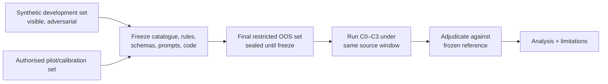

# Evaluation protocol

## Protocol status

Version: **draft-for-domain/ethics review**.

The automated synthetic portion is executable now. Manual, restricted-data, and human-user
conditions are defined but must remain unexecuted until ethics/data authority, gold-standard
construction, and protocol freeze are complete. This document contains no invented sample
size, acceptance threshold, timing, participant, cost, or outcome.

## Research question and evaluand

> To what extent can a multi-agent AI pipeline automate the end-to-end data ingestion,
> validation, and report-generation workflow for early-stage portfolio reporting, and how
> does quality/reliability compare to manually produced reports?

The evaluand is the **workflow configuration**, not an abstract model leaderboard. A condition
includes its input contract, catalogue, source access, agent decomposition, verification rule,
human involvement, prompt/schema versions, compute environment, and stop criteria.

## Units of analysis

| Level | Unit | Used for |
|---|---|---|
| Field | company × metric × reporting period | extraction, normalization, missingness accuracy |
| Claim | one reportable proposition | support, provenance, hallucination, contradiction |
| Report | company/portfolio report × period | section completeness, factual-error count, review edits |
| Workflow | condition × dataset/run | elapsed/active time, attempts, tokens, cost, repeat consistency |
| Reviewer | authorised participant × report | usability and inter-rater measures, if approved |

Repeated fields from the same company/report are not independent observations; analysis must
respect this clustering or use report/company-level aggregation.

## Experimental conditions

| ID | Condition | Operational definition | Current executable state |
|---|---|---|---|
| C0 | Manual | Authorised practitioner completes the existing reporting workflow using the same frozen input/source-access window; timing and corrections captured unobtrusively. | Protocol-only |
| C1 | Deterministic/single-agent baseline | One extraction/composition path applies the same catalogue/normalizer but has no independent verifier. It emits eligible normalized candidates and retains available provenance. | Implemented on synthetic labelled cases |
| C2 | Multi-agent verification | Bounded planner/resolver/collector/extractor/normalizer/verifier/composer roles; independent verifier controls support eligibility; no human edits before scoring. | Implemented on synthetic labelled cases |
| C3 | Multi-agent + HITL | C2 output followed by the versioned review interface; reviewer edits/approves/rejects; final approved report scored separately from pre-review output. | Workflow implemented; human results protocol-only |

The same canonical metric definitions, period, source-access window, and gold reference apply to
all comparable conditions. C0 may use established tools, but any tool/model assistance must be
recorded so “manual” is not mislabelled.

## Research propositions

The study should estimate, not presuppose:

- whether C2 changes claim precision/recall and unsupported-claim rate relative to C1;
- whether C3 changes final report correctness/completeness relative to pre-review C2;
- whether automated conditions change active and elapsed cycle time relative to C0;
- what error types remain and where human intervention adds or removes value; and
- the token/cost/reliability trade-off introduced by decomposition and verification.

Directional hypotheses or material-effect thresholds may be registered after a domain pilot
provides variance and practitioners define what difference matters. They are not invented here.

## Dataset partitions and leakage control



### D0 — synthetic development/evaluation fixtures

Fictional labelled cases cover complete, sparse, blank-vs-zero, mixed types, conflicts, stale
evidence, unsupported claims, ambiguous identity, duplicate evidence, inaccessible sources,
narrative evidence, mixed currency, and prompt injection. D0 is for engineering regression and
mechanism validation, not claims about real portfolio performance.

### D1 — authorised pilot/calibration set

Use the smallest authorised historical subset sufficient to:

- clarify ambiguous metric definitions and gold-label instructions;
- estimate annotation workload/disagreement and timing variance;
- test capture forms and code without touching final OOS cases; and
- perform sample-size/power or precision planning for the primary metric.

D1 results must be labelled pilot and excluded from final confirmatory estimates unless the
analysis plan explicitly treats the whole study as exploratory.

### D2 — final out-of-sample set

Select and seal company-period units before final system runs. Record a manifest/hash without
exposing restricted content. Do not inspect, tune catalogue aliases, modify prompts/rules, select
models, or repair connectors based on D2. Any post-access change creates a new exploratory run
and invalidates confirmatory labelling unless the protocol is amended transparently.

## Gold/reference standard

Subject to ethics and availability:

1. Create a codebook from `DATA_DICTIONARY.md` with metric/claim/source/period examples.
2. Give two authorised domain reviewers the same source bundle independently.
3. Label canonical value/missing state, eligible evidence, sourceability, period, claim support,
   and report-section requirement.
4. Measure agreement before adjudication (categorical agreement and an appropriate chance-
   corrected statistic where sample size supports it).
5. Adjudicate disagreements with a recorded reason and codebook revision/version.
6. Freeze the adjudicated reference and its manifest before condition scoring.

The system output or prior manually produced report must not be silently adopted as truth. A
manual report may contain errors and is therefore a comparison condition, not the reference.

## Source-access parity

For each company-period, freeze an eligible-source manifest and availability cutoff. Conditions
must have equivalent information access insofar as their design permits. Record inaccessible,
deleted, paywalled, login-only, or later-published sources. Retrieval time is distinct from
publication/availability time. Evidence published after the reporting cutoff cannot support a
historical current claim.

## Primary and secondary measures

No acceptance threshold is pre-populated. Denominators and zero-denominator handling must be
reported.

### Claim quality

- **Precision** = supported emitted claims / all emitted claims eligible for scoring.
- **Recall** = correctly emitted gold claims / all gold claims required by scope.
- **F1** = harmonic mean of precision and recall when both are defined.
- **Hallucination/unsupported-claim rate** = emitted claims without gold/evidence support /
  emitted claims.
- **Claim-support rate** = emitted claims satisfying the frozen support rule / emitted claims.
- **Contradiction detection recall** = correctly flagged gold conflicts / all gold conflicts.

### Extraction and normalization

- strict schema-validity rate;
- exact/field-level extraction accuracy;
- normalization accuracy by data type;
- missing-state classification accuracy, including separate blank/zero error matrix;
- company identity resolution accuracy/coverage; and
- currency/unit correctness without conversion inference.

### Provenance and report quality

- provenance completeness: eligible emitted claims with source ID, locator, publisher where
  applicable, retrieval time, checksum, and period / eligible emitted claims;
- locator validity at the frozen retrieval snapshot;
- report-section completeness against the reference template;
- factual-error count and severity using a pre-defined taxonomy; and
- transparency rate for missing/conflicted/stale items.

### Efficiency and resource use

- active human minutes and elapsed wall-clock minutes, separately;
- machine stage durations and retries;
- input/output tokens by model and run;
- monetary LLM/API cost using the official price effective on the execution date, with formula
  and currency recorded; null when unavailable rather than estimated;
- reviewer edit events, edited sections, and optional character/semantic edit distance; and
- failure/re-run count.

### Reliability

- exact outcome-vector consistency across repeated deterministic runs;
- per-field/claim agreement across repeated stochastic runs with fixed configuration;
- run completion and schema validity across repeats; and
- failure-category distribution.

### Usability (C3 only)

Use an ethics-approved instrument and task protocol. Candidate measures include task success,
time on task, decision reversals, confidence calibration, and a validated usability scale if
licensed/appropriate. Do not invent or retrospectively select a favourable scale. Capture
qualitative feedback with consent and a pre-defined coding approach.

## Automated synthetic harness

Run:

```bash
.venv/bin/portfolio-agent evaluate \
  --cases fixtures/evaluation_cases.json \
  --output var/evaluation/latest.json \
  --repeats 3
```

The output includes fixture SHA-256, case count, repeats, condition summaries, and case-level
confusion components. C0 and C3 deliberately contain null metrics and explanatory notes until
real authorised observations exist. The output file is ignored runtime evidence; archive an
immutable copy/hash in the dissertation evidence package after the protocol/version is frozen.

## Manual baseline capture

Before each C0 unit:

- record operator pseudonymous ID/experience band and tools allowed;
- record period/source bundle and start time;
- distinguish waiting/elapsed time from active work;
- capture intermediate/final report version under an approved location;
- record help/tool/model use and interruptions;
- stop timing at the same definition of “review-ready” used for C2; and
- score blind to condition where practically possible.

Avoid retrospectively reconstructing manual time from memory if direct capture is possible.

## HITL capture

Score C2 pre-review first, then expose C3 reviewers to the report. Capture append-only events:
view start/end, section edit with before/after version hashes, approval/rejection, rationale,
claim/evidence views if instrumented, and final report. The reviewer must not see gold labels.
Counterbalance report/condition order if the design compares interfaces to reduce learning and
order effects.

## Analysis plan

1. Publish a CONSORT-like flow of eligible, excluded, failed, and scored units with reasons.
2. Report descriptive distributions and per-condition denominators before hypothesis tests.
3. Use paired comparisons at the same company-period/claim when conditions share units.
4. Use cluster-aware confidence intervals or aggregate at report/company level; do not treat
   every field as independent.
5. For binary paired outcomes, consider exact paired methods; for non-normal time/edit data,
   use paired permutation/Wilcoxon-style analysis as assumptions permit.
6. Report effect sizes and uncertainty, not only p-values.
7. If multiple hypotheses are declared, predefine multiplicity handling or label analyses
   exploratory.
8. Stratify errors by metric type, sourceability, missingness, conflict/staleness, and company
   identity difficulty where sample size supports it.
9. Repeat conclusions with failures included and with clearly justified exclusions as a
   sensitivity analysis.
10. Preserve negative/null results and unexpected regressions.

The exact statistical method and sample size must be finalised after D1 variance/annotation
evidence and supervisor/statistical review; they are not safely inferable from three source files.

## Error taxonomy

| Code family | Examples |
|---|---|
| ID | wrong company, duplicate merge, unresolved alias |
| EXT | omitted field, fabricated field, wrong source span |
| NORM | wrong type/unit/currency, blank↔zero, ratio scaling |
| TIME | stale/future evidence, wrong period |
| PROV | missing/broken locator, publisher/checksum absent |
| VER | unsupported claim accepted, supported claim rejected, conflict missed |
| REP | missing section, duplicated claim, misleading aggregation/narrative |
| SEC | restricted-data disclosure, injection followed, unauthorised external call |
| HITL | harmful edit, missed exception, ungrounded approval |

Severity definitions must be agreed before scoring (for example, whether a wrong currency is
always critical). Do not assign severity after seeing which condition made the error.

## Reproducibility record

For each final run retain, under approved storage:

- Git revision/diff manifest (without committing restricted data);
- Python/platform and exact dependency versions;
- database migration revision;
- dataset/source manifest hashes and availability cutoff;
- catalogue, codebook, fixture, prompt, schema, connector, and model IDs/versions;
- configuration with secrets removed;
- run/agent IDs, timings, attempts, tokens, and failures;
- raw machine output and human decision logs;
- scoring/adjudication code and immutable result tables; and
- analysis scripts plus generated table/figure hashes.

## Ethics and stop conditions

Stop and do not collect data if ethics/data authority is unclear, consent is absent, a credential
remains exposed, unexpected personal data appears, a connector violates source terms, restricted
content would cross an unapproved processor, or the OOS seal is broken. Record the event and seek
supervisor/ethics direction rather than adapting silently.

## Validity threats to discuss

- one portfolio organisation or reporting period may not generalise;
- gold labels involve judgement and may inherit domain conventions;
- synthetic adversarial fixtures are deliberately constructed and easier to reproduce than the
  open web;
- interface familiarity and reviewer expertise affect HITL performance;
- “manual” workflows may already use AI/tools;
- public-source availability changes over time;
- verifier rules may trade recall for precision;
- condition implementation quality can confound architecture comparison; and
- the student-as-builder/evaluator role creates confirmation bias.

Mitigate through pairing, frozen protocols, independent/adjudicated labels, blinded scoring where
possible, full error accounting, versioned evidence, and appropriately narrow conclusions.

