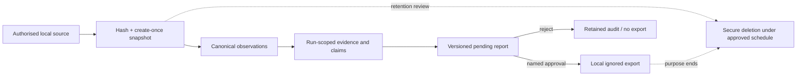

# Security and data governance

## Security posture

This is a local dissertation research prototype processing potentially restricted portfolio
reporting data. It is **not production-ready** and must not be exposed beyond loopback. Its
security goal is minimisation and containment: store only what the study needs, keep sensitive
material local/ignored, prevent untrusted evidence from gaining authority, and require a human
decision before export.

## Data classification and permitted flow

| Classification | Examples | Local persistence | External model | Git fixture | Export |
|---|---|---|---|---|---|
| `restricted` | Supplied portfolio workbook, identifiable transcript, company financial/operational values | Yes, ignored and purpose-limited | **Forbidden** | **Forbidden** | Only current approved report under authorised purpose |
| `internal` | Non-public operational metadata without highest restriction | Yes, ignored | **Forbidden** | **Forbidden** | Only approved, need-to-know |
| `public` | Eligible public award/news record | Yes, provenance retained | Opt-in only after trust/minimisation checks | Prefer synthetic replay, not copied live content | Approved claims with provenance |
| `synthetic` | Fictional companies, labelled test/adversarial cases | Yes | Opt-in permitted but unnecessary for core tests | Permitted if clearly labelled/non-identifiable | Permitted after test approval |

Classification is attached to submissions/evidence and enforced again at the external-provider
boundary. A configuration flag alone never upgrades restricted data to public.

## Data lifecycle

No retention period is invented here. Before real-data evaluation, the ethics approval/data
management plan must define controller, lawful basis, purpose, locations, access list,
retention duration, deletion method, and incident contact. Until then, real input is held to
the minimum local research purpose and excluded from Git/backups not approved for it.

## Exposed credential incident

One supplied PDF contains a dashboard credential. The credential value and associated account
identifier are intentionally absent from this repository and documentation. It was not used,
tested, copied, logged, or sent to any model; the dashboard was not accessed.

Required action by the credential owner:

1. revoke/rotate the credential immediately;
2. inspect authentication/audit logs for unexpected access from the exposure window;
3. invalidate active sessions if the service supports it;
4. remove the secret from source/dissertation materials and any shared copies;
5. distribute replacements through an approved secret manager; and
6. record confirmation before any separately authorised dashboard activity.

Credential rotation remains **unverified external work**. This project cannot claim it occurred.

## Threat model

| Threat | Attack/failure path | Current P0 control | Residual risk / next control |
|---|---|---|---|
| Source or credential committed | User copies restricted file or `.env` into Git | Ignore rules; fixtures synthetic; final secret scan | Git hooks/central secret scanning for team use |
| Prompt injection | Public page tells model/agent to ignore rules or exfiltrate | Content untrusted; detector; no extraction/model call; no agent tools | Broader classifier and connector sandbox before live sources |
| Cross-company contamination | Fuzzy/ambiguous identity merge | Exact ID/name only; ambiguity hold | Authoritative company registry and reviewed alias table |
| Hallucinated fact | Generator fills blank from priors | Deterministic-first; no claim without candidate; verifier; HITL | Empirical false-positive measurement on frozen gold data |
| Temporal leakage | Future evidence supports past report | Explicit period match; stale state | Publication/availability timestamps and final OOS governance |
| Formula/malicious workbook | Spreadsheet executes formula or payload | `data_only=False`; no formula execution/macros; `.xlsx` only | File-type scanning and isolated parser for production |
| Stored XSS/HTML injection | Source/reviewer text rendered as markup | Jinja auto-escape; custom HTML export escapes input; CSP | Security test/fuzzing and CSP nonce if scripts later added |
| Local unauthorised access | Other user/process reads runtime files | Snapshot/export mode `0600`; loopback bind | Encrypted disk/database and OS account controls |
| CSRF/local malicious site | Browser posts to loopback UI | Same-origin forms/CSP but no CSRF token | Add CSRF and authentication before any wider/user deployment |
| Unapproved export | Pipeline or user bypasses review | Service state invariant; audited approval required | Role-based auth and signed approval in production |
| Excessive logs | Exception captures raw evidence | Trace stores hashes/counts; no prompt/evidence logging | Structured redaction tests and secure log sink |
| Dependency compromise | Pinned package malicious/vulnerable | Exact versions, minimal stack, offline core | Lock hashes, SBOM, vulnerability scanning/update policy |

## External model policy

External inference is disabled by default. The optional adapter may be enabled only for a
specifically authorised public/synthetic experiment. Controls are cumulative:

- `PORTFOLIO_ALLOW_EXTERNAL_LLM=true` is explicit, never inferred;
- classification must be public/synthetic;
- instruction-like/untrusted evidence is rejected;
- only the minimum evidence item plus expected identity/metric/period is sent;
- Responses API `store=False` is set;
- output is a strict schema and then independently normalized/verified;
- attempts are bounded to default and one escalation model; and
- no model result can approve/export.

OpenAI's [official data controls documentation](https://platform.openai.com/docs/models/default-usage-policies-by-endpoint)
describes endpoint-specific retention, including default application-state behaviour for the
Responses API. `store=False` reduces stored response state but is not a substitute for lawful
authority, minimisation, organisational agreements, or the project's hard prohibition on
restricted/internal external processing. Current model IDs/capabilities are referenced in
ADR-0004 and should be re-verified at execution time because service behaviour may change.

## Secrets and configuration

- API keys must be process-environment secrets, not `.env.example`, code, CLI arguments,
  fixtures, trace metadata, screenshots, or dissertation appendices.
- `.env` is ignored; `.env.example` contains only non-secret switches.
- Filenames are reduced to safe basenames before local storage.
- No dashboard URL/account/credential from the supplied PDF appears in code or fixtures.
- Error messages expose error types and contract failures, not full raw input/prompts.

## Local storage controls

- `var/` and `data/` content are ignored except explanatory placeholders.
- Snapshots use a dataset-specific directory, exclusive-create write, `fsync`, and `0600`.
- Exports use temporary files, `fsync`, `0600`, then atomic replace.
- SQLite foreign keys are enabled on every connection.
- Hashes detect content drift; they are integrity evidence, not encryption or anonymisation.
- Backups/caches/cloud-sync locations must be checked before real restricted-data use.

## Human/participant and ethics hold

The transcript suggests restricted data access and possible interviews, but this repository
does not verify the current ethics approval, consent form, participant information, or data
management plan. Before manual baseline observation or usability testing:

1. confirm approved data types, purposes, participant groups, recruitment, recording, and tools;
2. confirm whether supervisors/staff may provide gold labels as participants or domain experts;
3. use consent and withdrawal procedures;
4. pseudonymise participant IDs and store the linkage separately;
5. avoid collecting company/person data not required by the metrics; and
6. predefine whether direct quotations can appear in the dissertation.

Until those checks pass, manual and HITL conditions remain protocol-only with null results.

## Security validation gate

Before sharing the repository or any artifact:

- run lint, type checks, tests, and migration-from-empty proof;
- search tracked/untracked source text for common secret patterns and the known exposed value
  without printing it;
- verify `git status` contains no source workbook/PDF/transcript/database/export;
- inspect report JSON for raw evidence content and unwanted identifiers;
- confirm the server still refuses non-loopback hosts; and
- document any unrun dynamic security/accessibility checks.

## Production prohibition

Do not deploy or expose this P0 application. It lacks authentication, authorisation, CSRF
tokens, tenant isolation, encrypted managed storage, secure operational logging, connector
governance, rate limits, incident monitoring, backup/restore, and production threat review.
