# Dissertation completion wayfinder

## How to use this document

This is the single execution ledger. A gate closes only when its exit evidence exists; time spent
or plausible prose does not close it. Preserve the exact states `done`, `in progress`, `pending`,
and `held`. Do not access the final OOS data to make progress appear faster.

```mermaid
flowchart LR
    G1[1. Authority<br/>and source audit] --> G2[2. RQ and<br/>protocol freeze]
    G2 --> G3[3. Catalogue and<br/>reference standard]
    G3 --> G4[4. P0 artifact<br/>quality gate]
    G4 --> G5[5. Synthetic and<br/>adversarial freeze]
    G5 --> G6[6. Authorised<br/>pilot]
    G6 --> G7[7. Final paired<br/>experiment]
    G7 --> G8[8. Analysis and<br/>robustness]
    G8 --> G9[9. Dissertation<br/>synthesis]
    G9 --> G10[10. Reproducible<br/>submission pack]
```



## Current gate ledger

| Gate | Objective | Exit evidence | Current state | Immediate blocker/action |
|---|---|---|---|---|
| 1 | Establish lawful authority, source provenance, and security boundary | Source hashes/matrix; ethics/data-management scope checked; credential rotation confirmed | **in progress** | Source audit done. Obtain current ethics/DMP evidence and credential-owner rotation confirmation; do not access dashboard. |
| 2 | Freeze RQ, conditions, primary outcome, exclusions, and analysis intent | Supervisor-approved protocol version; dated change log; D2 seal rule | **in progress** | Draft protocol exists. Review with supervisor/domain/statistical/ethics stakeholders; select primary metric without seeing D2. |
| 3 | Freeze metric catalogue, identity rules, gold codebook, and D1/D2 manifests | Catalogue version; two-reviewer instructions; adjudication record; partition hashes | **in progress** | Catalogue/CBIT contract and D0/D1/D2 technical manifest exist; domain gold labels, D1 authority, and the final D2 external seal record remain pending. |
| 4 | Demonstrate reproducible dissertation engineering artifact | Migration proof, lint/type/tests/coverage/secret scan, synthetic pending-review run, approval/export and figure-manifest proof | **in progress** | Review remediation now also binds source facts to exact semantics, rejects incomplete UKRI totals, stabilises event locators, proves legacy-v1 replay and fail-fast legacy downgrade, segments incompatible exposure windows, and distinguishes terminal source states. Exact-state gates and both independent re-reviews remain. |
| 5 | Freeze synthetic/adversarial mechanism evaluation | Labelled fixture manifest/hash; repeated C1/C2 outputs; case-level review; no real-world claim | **in progress** | Hashed D0 manifest, namespacing, repeat harness, and sealed-D2 guard exist. Independent label review and archival of the final exact-state output remain. |
| 6 | Execute authorised pilot/calibration only | Consent/access records; D1 reference/adjudication; timing variance; protocol amendments | **held** | Requires Gate 1 authority and Gate 2/3 freeze. Do not substitute synthetic “participants.” |
| 7 | Execute final paired C0–C3 experiment | Sealed D2 opened once; immutable run/event/raw result manifests; deviations log | **pending** | Requires Gates 1–6. No tuning after access. |
| 8 | Analyse quality, reliability, efficiency, cost, usability, and errors | Reproducible analysis dataset/scripts; CIs/effect sizes; failure flow; sensitivity checks | **pending** | Requires final experiment and adjudicated reference. |
| 9 | Write/revise dissertation as an evidence-bounded argument | Chapters map every claim to evidence; figures/tables generated; supervisor feedback resolved | **pending** | Introduction/design/method can start now; results/discussion conclusions wait for Gates 7–8. |
| 10 | Assemble and independently verify submission package | Official template, declarations/ethics/word count, artifact hashes, clean build, independent review | **pending** | Requires manuscript and institutional evidence; never infer missing submission fields. |

## Gate 1 — authority and source audit

Done in repository:

- all three sources reviewed completely and hashed;
- evidence/instruction distinction documented;
- source files excluded from Git and runtime dependency;
- exposed credential neither used nor reproduced; and
- security/data-classification policy drafted.

Required to close:

- obtain/inspect the actual current ethics approval and data management plan;
- enumerate approved data categories, processors/tools, participants, retention, and outputs;
- confirm credential rotation/log review with the owner;
- record who may authorise restricted data, external models, interviews, and publication; and
- create a de-identified source-access manifest for the research record.

Stop if any item conflicts with the proposed study; amend protocol before data use.

## Gate 2 — research/protocol freeze

1. Review the RQ and decide whether the primary evaluand is claim precision, unsupported-claim
   rate, or another domain-material outcome.
2. Agree C0–C3 operational definitions and source-access parity.
3. Define the report-ready start/stop boundary for timing.
4. Decide exploratory vs confirmatory framing.
5. Use D1 variance/annotation evidence for sample/precision planning—do not invent `n`.
6. Freeze analysis, exclusion, failure, multiplicity, and deviation rules.
7. Record approval/version/date before D2 access.

Exit artifact: versioned `EVALUATION_PROTOCOL.md` plus a signed/datable supervisor/ethics decision
record stored outside Git if it contains personal data.

## Gate 3 — semantic/reference freeze

1. Domain-review every P0 metric, unit, denominator, sourceability class, and period convention.
2. Resolve workbook “Explanation for row X” misalignment rather than guessing aliases.
3. Define company identity registry/aliases and ambiguity adjudication.
4. Write gold-label examples for blank, zero, none, N/A, not reported, not found, stale, conflict,
   mixed currency, narrative, and prompt injection.
5. Independently label D1; measure disagreement; revise the codebook.
6. Select and seal D2 without tuning access.

Exit artifacts: catalogue/codebook version/hash, D1 adjudication record, D2 manifest/hash.

## Gate 4 — P0 artifact final gate

Run on the final code/docs state:

```bash
.venv/bin/alembic upgrade head
.venv/bin/ruff format --check src tests alembic/versions
.venv/bin/ruff check src tests alembic/versions
.venv/bin/mypy src
.venv/bin/pytest --cov=portfolio_agent --cov-report=term-missing
.venv/bin/portfolio-agent demo
.venv/bin/portfolio-agent visualize
```

Then explicitly prove:

- migration-created tables equal SQLAlchemy metadata;
- demo report status is `pending_review`;
- report export fails before approval;
- a documented synthetic test reviewer can approve and export all formats;
- fixture/output hashes are captured;
- no credential/source file/database/export is unignored or staged; and
- residual warnings/unrun browser/accessibility/security checks are recorded.

Do not use a synthetic test approval as evidence about real human review quality.

The `0001` rollback proof is conditional: if two valid canonical companies share a normalized
name, the legacy schema cannot represent that state losslessly. The Alembic command must reject
before any revision runs and leave the current version/data intact; it must never partially
downgrade or invent a merge.

## Gate 5 — synthetic/adversarial freeze

1. Have a second reader review labels/expected states admitted by
   `fixtures/evaluation_manifest.json` (the cases file is never loaded directly).
2. Add any discovered source-shape edge case without using identifiable values.
3. Freeze fixture and code hashes.
4. Run ≥2 repeats (the default is 3) and retain case-level outputs.
5. Explain why C1 and C2 differ; ensure the baseline is not a straw man.
6. Report D0 only as mechanism/engineering evidence.

## Gate 6 — authorised pilot

Held until Gate 1 closes. When authorised:

- train reviewers on the codebook without D2;
- collect D1 manual timing and gold labels;
- exercise the real source-access and evidence-snapshot process;
- inspect error/annotation variance and participant burden;
- amend/freeze the protocol; and
- document deviations and whether any metric is infeasible.

If the pilot cannot support a defensible sample or source parity, narrow the RQ rather than
fabricate a full comparative study.

## Gate 7 — final experiment

- Instantiate one immutable execution manifest per company-period and condition.
- Randomise/counterbalance reviewer order where applicable.
- Run C0–C3 on equivalent source snapshots and environment.
- Capture failures and exclusions, not only successful runs.
- Keep C2 pre-review output immutable before C3 begins.
- Do not change code/prompts/catalogue/rules after D2 access; log any unavoidable deviation.
- Back up only to approved encrypted locations.

## Gate 8 — analysis

- Reproduce gold scoring from code, then manually audit a sample of scoring joins.
- Produce denominators and failure flow first.
- Compute paired/cluster-aware estimates and uncertainty.
- Analyse error taxonomy and human edit effects, including harmful edits.
- Calculate tokens/cost using execution-date official prices and recorded calls only.
- Run sensitivity analyses for exclusions/failures and codebook uncertainty.
- Freeze an analysis dataset and generate tables/figures from it.

## Gate 9 — dissertation synthesis

Recommended dependency order:

1. Introduction/problem/RQ/contribution from charter and source matrix.
2. Methodology from the frozen protocol and governance—not from observed outcomes.
3. Design/implementation from requirements, architecture, ADRs, code, and validation.
4. Literature review as a critical synthesis tied to design/evaluation decisions.
5. Results generated from frozen analysis without interpretation drift.
6. Discussion explaining mechanisms, trade-offs, negative findings, validity, ethics, and
   generalisability.
7. Conclusion answering the RQ only to the extent supported by results.

Use `DISSERTATION_EVIDENCE_MAP.md` as the claim-level review checklist.

## Gate 10 — submission and reproducibility package

- Use the official institutional template and required declaration wording.
- Obtain, do not infer, student identifiers, ethics reference, signatures/declarations, word
  count, confidentiality status, and submission rules.
- Build the manuscript from a clean environment and inspect rendered pages.
- Check references/DOIs/URLs, figure/table callouts, acronyms, appendices, and accessibility.
- Include a redacted README, code revision/hash, dependency lock, migration, synthetic fixtures,
  protocols, and result/analysis manifests as permitted.
- Exclude restricted data, transcript, credentials, raw participant data, and local exports that
  are not approved for submission.
- Obtain an independent dissertation review and resolve every material finding.

## Immediate next actions

In critical-path order:

1. Close the external credential/ethics evidence holds in Gate 1.
2. Review and freeze the RQ/primary metric/condition definitions with the supervisor.
3. Domain-review the metric catalogue and gold codebook; plan D1/D2 without opening D2.
4. Capture the final repository engineering gate and freeze D0 fixtures/results.
5. Only then run an authorised pilot and decide whether the full empirical comparison is feasible.

## Scope discipline

Do not spend dissertation-critical time on scheduling, live dashboard integration, cloud
deployment, social scraping, slide decks, fine-tuning, or production multi-tenancy before Gates
1–5 close. Those features do not repair missing research evidence.
