# Dissertation visual pack

All figures are deterministic SVGs with embedded titles/descriptions, adjacent textual alternatives, source labels, sample sizes, and cutoffs. Synthetic results and illustrative data are not empirical claims about the supplied portfolio.

| Figure | Visual | Type | Evidence boundary |
|---:|---|---|---|
| 1 | [Evidence-first architecture and trust boundaries](figure-01-architecture-trust-boundaries.svg) | flow diagram | 8 bounded components; cutoff 2025-06-30 |
| 2 | [Bounded agent workflow](figure-02-agent-workflow-wayfinder.svg) | flow diagram | 8 persisted stages; cutoff 2025-06-30 |
| 3 | [Claim-to-source provenance chain](figure-03-evidence-provenance-chain.svg) | flow diagram | 5 provenance links; cutoff 2025-06-30 |
| 4 | [Precision-first identity resolution](figure-04-identity-resolution-funnel.svg) | horizontal bar chart | N=14 company columns; cutoff 2025-06-30 |
| 5 | [Claim-relative temporal eligibility](figure-05-temporal-eligibility.svg) | timeline | 5 temporal checkpoints; cutoff 2025-06-30 |
| 6 | [Synthetic source coverage](figure-06-source-coverage.svg) | horizontal bar chart | N=31 evidence items; cutoff 2025-06-30 |
| 7 | [Verification outcomes](figure-07-verification-outcomes.svg) | stacked bar chart | N=16 claims; cutoff 2025-06-30 |
| 8 | [Typed missingness profile](figure-08-missingness-quality-heatmap.svg) | heatmap | N=21 observations; cutoff 2025-06-30 |
| 9 | [Executable quality dispositions](figure-09-quality-dispositions.svg) | horizontal bar chart | N=2 explicit findings; cutoff 2025-06-30 |
| 10 | [UKRI/GtR grant lifecycle](figure-10-ukri-lifecycle.svg) | timeline | 5 expected lifecycle stages; cutoff 2025-06-30 |
| 11 | [Within-portfolio distribution context](figure-11-cohort-context-five-number.svg) | five-number box plot | N=8 synthetic values; cutoff 2025-06-30 |
| 12 | [Controlled D0 condition comparison](figure-12-evaluation-condition-comparison.svg) | grouped bar chart | N=14 synthetic cases; cutoff 2025-06-30 |
| 13 | [Extraction attempt outcomes](figure-13-extraction-attempt-outcomes.svg) | horizontal bar chart | N=9 attempts; cutoff 2025-06-30 |
| 14 | [Hierarchical extraction and abstention](figure-14-extraction-abstention-decision.svg) | flow diagram | 5 decision points; cutoff 2025-06-30 |
| 15 | [Approval-gated export states](figure-15-report-review-state-machine.svg) | timeline | 5 report states; cutoff 2025-06-30 |

## Visual gallery

### Figure 1: Evidence-first architecture and trust boundaries

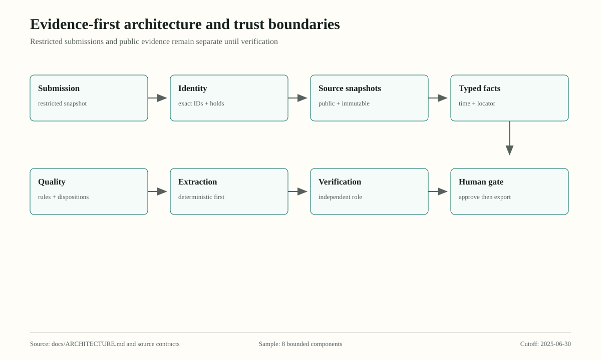

Source: docs/ARCHITECTURE.md and source contracts. 8 bounded components; cutoff 2025-06-30.

### Figure 2: Bounded agent workflow

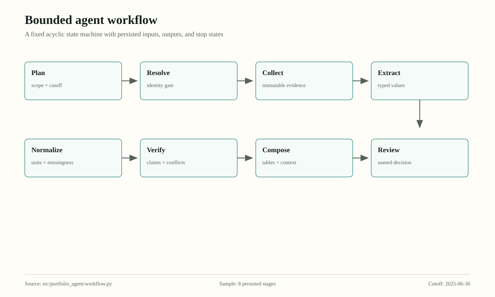

Source: src/portfolio_agent/workflow.py. 8 persisted stages; cutoff 2025-06-30.

### Figure 3: Claim-to-source provenance chain

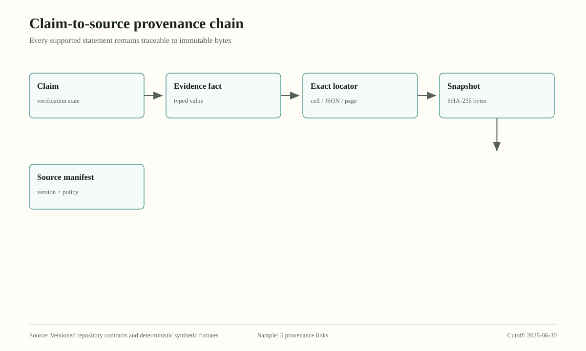

Source: Versioned repository contracts and deterministic synthetic fixtures. 5 provenance links; cutoff 2025-06-30.

### Figure 4: Precision-first identity resolution

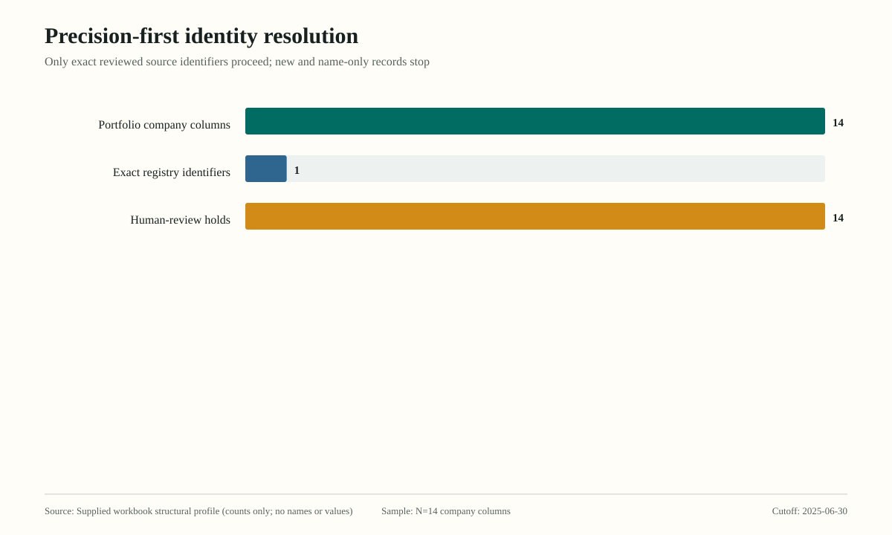

Source: Supplied workbook structural profile (counts only; no names or values). N=14 company columns; cutoff 2025-06-30.

### Figure 5: Claim-relative temporal eligibility

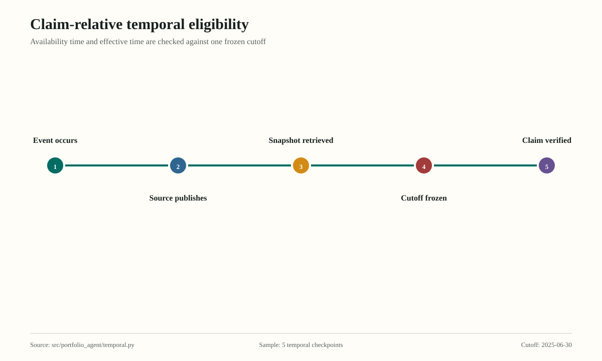

Source: src/portfolio_agent/temporal.py. 5 temporal checkpoints; cutoff 2025-06-30.

### Figure 6: Synthetic source coverage

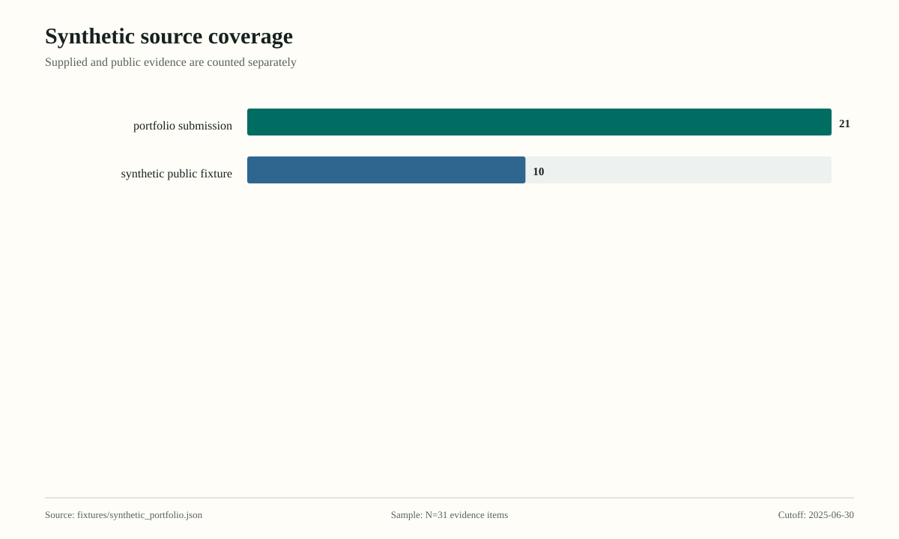

Source: fixtures/synthetic_portfolio.json. N=31 evidence items; cutoff 2025-06-30.

### Figure 7: Verification outcomes

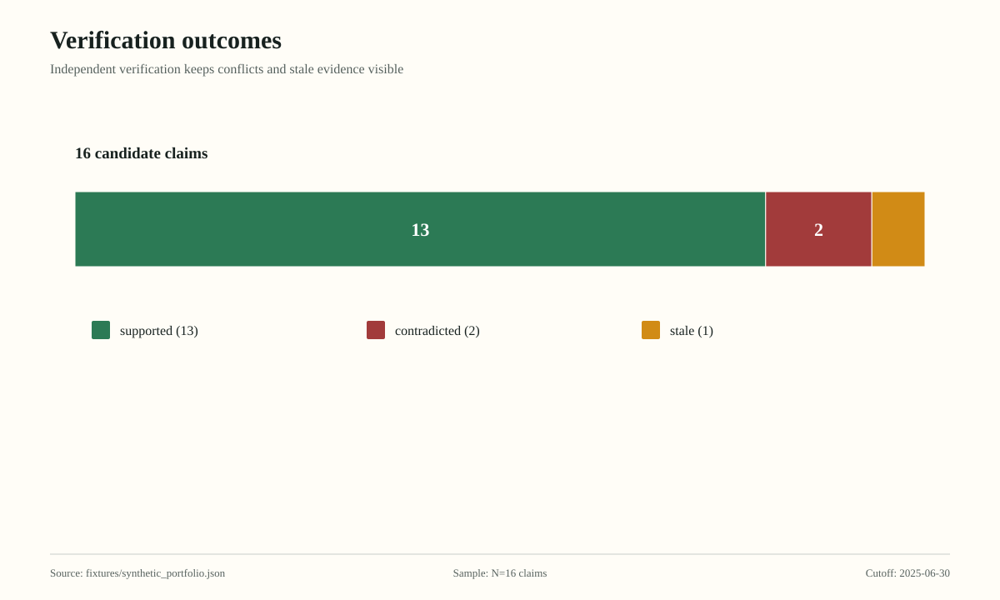

Source: fixtures/synthetic_portfolio.json. N=16 claims; cutoff 2025-06-30.

### Figure 8: Typed missingness profile

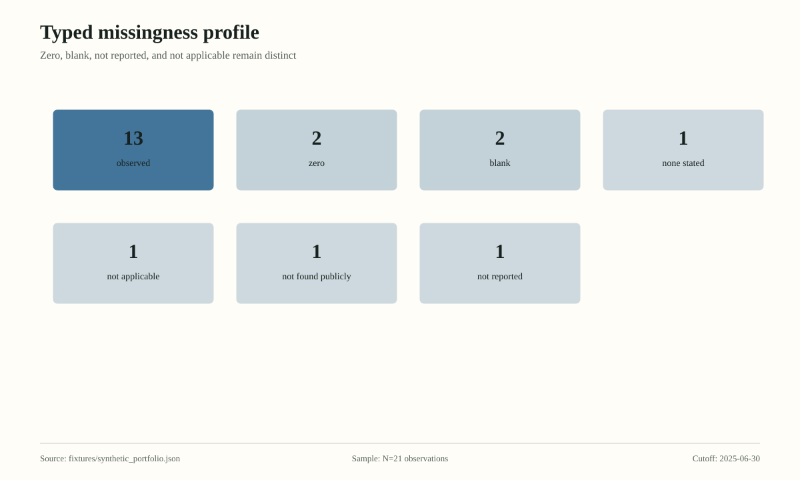

Source: fixtures/synthetic_portfolio.json. N=21 observations; cutoff 2025-06-30.

### Figure 9: Executable quality dispositions

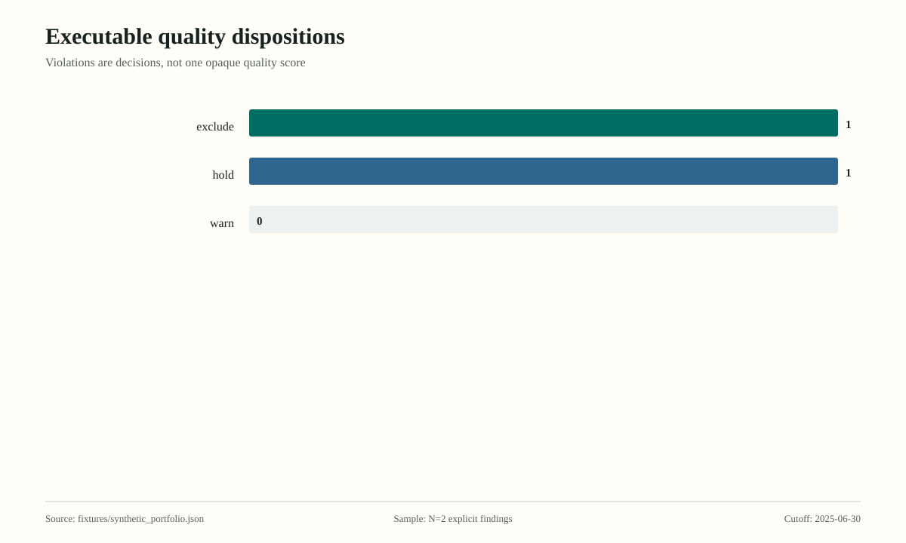

Source: fixtures/synthetic_portfolio.json. N=2 explicit findings; cutoff 2025-06-30.

### Figure 10: UKRI/GtR grant lifecycle

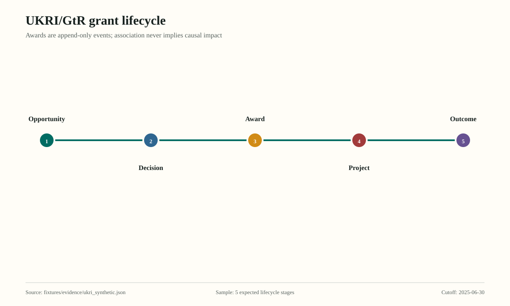

Source: fixtures/evidence/ukri_synthetic.json. 5 expected lifecycle stages; cutoff 2025-06-30.

### Figure 11: Within-portfolio distribution context

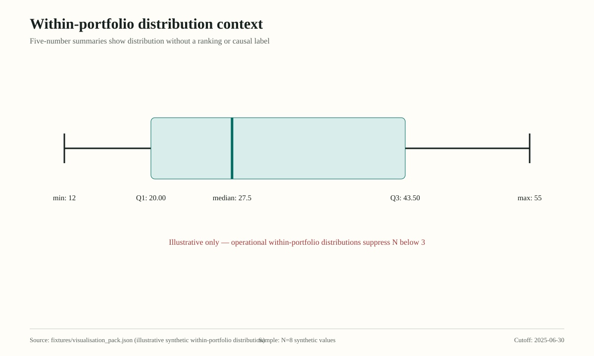

Source: fixtures/visualisation_pack.json (illustrative synthetic within-portfolio distribution). N=8 synthetic values; cutoff 2025-06-30.

### Figure 12: Controlled D0 condition comparison

Source: fixtures/evaluation_manifest.json. N=14 synthetic cases; cutoff 2025-06-30.

### Figure 13: Extraction attempt outcomes

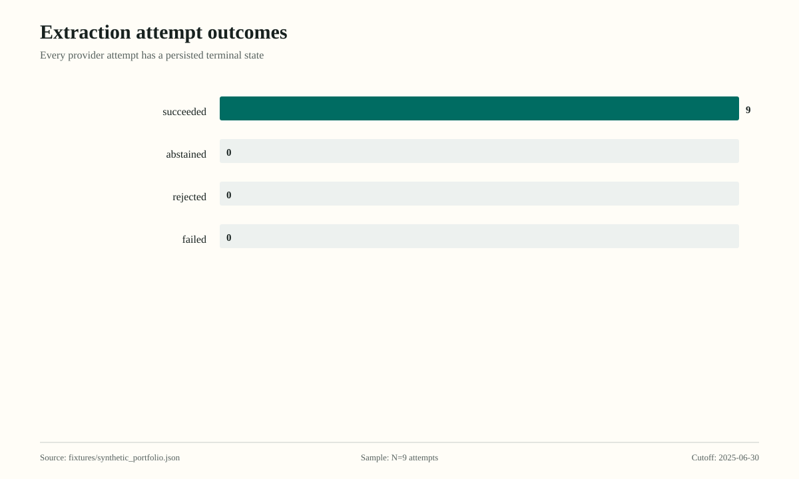

Source: fixtures/synthetic_portfolio.json. N=9 attempts; cutoff 2025-06-30.

### Figure 14: Hierarchical extraction and abstention

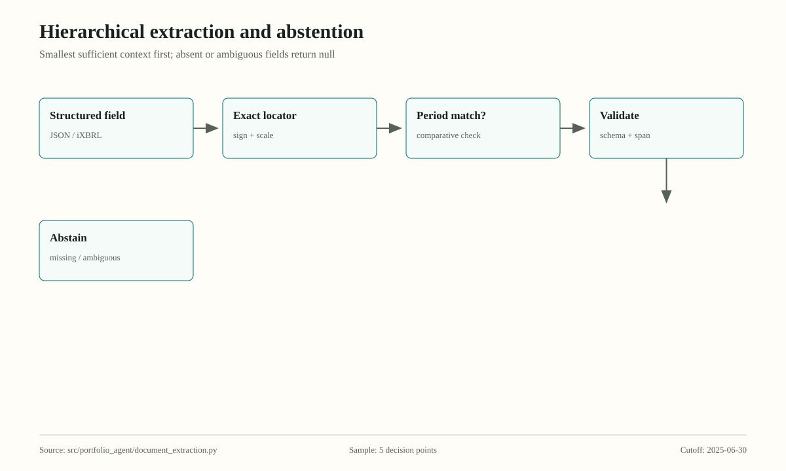

Source: src/portfolio_agent/document_extraction.py. 5 decision points; cutoff 2025-06-30.

### Figure 15: Approval-gated export states

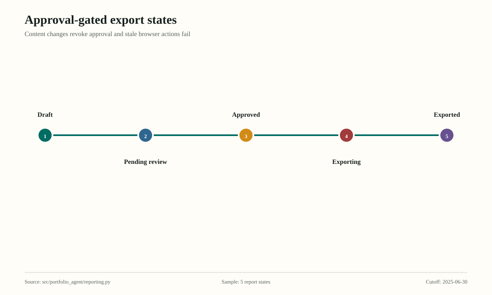

Source: src/portfolio_agent/reporting.py. 5 report states; cutoff 2025-06-30.

## Textual alternatives

### Figure 1: Evidence-first architecture and trust boundaries

Flow from restricted submission through reviewed identity, immutable public snapshots, typed facts, quality, extraction, independent verification, and named human approval.
### Figure 2: Bounded agent workflow

Eight stages: plan, resolve, collect, extract, normalize, verify, compose, review.
### Figure 3: Claim-to-source provenance chain

A claim links to a typed fact, exact locator, immutable snapshot, and source manifest.
### Figure 4: Precision-first identity resolution

Of 14 structural company columns, 1 has an exact registry identifier and 14 require human identity review.
### Figure 5: Claim-relative temporal eligibility

Timeline separates event, publication, retrieval, reporting cutoff, and claim verification. Evidence published after the cutoff is excluded.
### Figure 6: Synthetic source coverage

Evidence coverage contains 21 portfolio submission items, 10 synthetic public fixture items.
### Figure 7: Verification outcomes

Verification outcomes in the synthetic workflow: supported: 13, contradicted: 2, stale: 1
### Figure 8: Typed missingness profile

Missingness heatmap with explicit states: observed 13, zero 2, blank 2, none_stated 1, not_applicable 1, not_found_publicly 1, not_reported 1
### Figure 9: Executable quality dispositions

Synthetic workflow quality dispositions: exclude 1, hold 1, warn 0.
### Figure 10: UKRI/GtR grant lifecycle

Lifecycle stages are opportunity, decision, award, project, and outcome.
### Figure 11: Within-portfolio distribution context

Five-number plot for Illustrative synthetic within-portfolio employee distribution; N=8, minimum sample N=3, minimum value 12, Q1 20.00, median 27.5, Q3 43.50, maximum value 55 people. Illustrative synthetic data.
### Figure 12: Controlled D0 condition comparison

D0 synthetic evaluation with 14 cases. Single-agent ablation precision 0.45, recall 1.00, verification accuracy 0.57. Multi-agent verification precision 1.00, recall 1.00, verification accuracy 1.00. These are synthetic functional results, not general performance claims.
### Figure 13: Extraction attempt outcomes

Synthetic deterministic extraction attempts: succeeded 9, abstained 0, rejected 0, failed 0.
### Figure 14: Hierarchical extraction and abstention

The extractor searches structured fields, preserves exact locators and sign or scale, checks periods, validates, and abstains when evidence is absent or ambiguous.
### Figure 15: Approval-gated export states

Report states progress from draft to pending review, approved, exporting, and exported.

Regenerate with `portfolio-agent visualize`; compare `manifest.json` hashes before using a figure in the dissertation.
