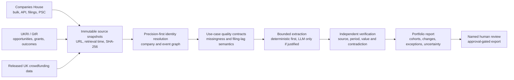
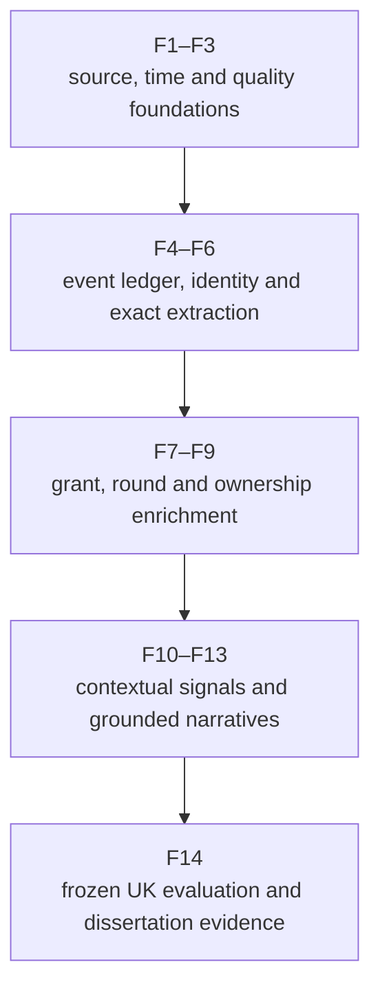

# Agentic portfolio reporting for UK early-stage investment

## Accessible-data literature review and implementation wayfinder

**Review date:** 26 August 2026  
**Corpus:** 10 downloaded academic papers; 6 direct-domain papers and 4 supporting-method papers  
**Geographic rule:** UK companies only, or an explicitly separable UK component  
**Evidence rule:** no included paper depends on proprietary, credentialed, or restricted research data  
**Status:** design evidence for the MSc prototype, not proof that the proposed additions are already implemented

## Executive conclusion

The literature supports a dissertation-grade system that is **agentic in workflow but conservative in authority**. The highest-value next step is not an autonomous investment-scoring agent. It is a UK evidence platform that collects immutable Companies House, UKRI and released crowdfunding evidence; resolves firms and events conservatively; runs executable data-quality and temporal checks; uses an LLM only for bounded extraction or explanation; independently verifies every reportable claim; and stops for human review.

The current prototype already has strong foundations: immutable SHA-256 snapshots, exact identity resolution, typed normalisation, source-linked verification, versioned reports, guarded `gpt-5.4-mini` to `gpt-5.4` routing, and approval-gated export. The literature most strongly justifies adding:

1. live, time-aware UK public-source connectors;
2. a company, funding-round, grant, filing, director and ownership event graph;
3. use-case-specific executable quality contracts;
4. filing-lag-aware missingness and dormancy semantics;
5. tested OCR/table extraction with cell-level provenance;
6. sector, geography, age and period cohort context rather than unqualified scores;
7. precision-first entity linking with explicit unresolved states;
8. strict LLM abstention and field-confusion tests; and
9. a frozen, UK-only evaluation corpus measuring extraction, grounding, temporal correctness and reviewer utility separately.

## Scope and selection protocol

This is a targeted, implementation-led evidence synthesis rather than a claim of an exhaustive PRISMA systematic review. Candidate papers were screened against four hard gates:

- **Downloadability:** a valid local PDF had to be downloadable and parseable.
- **Data access:** either the frozen study data/code had to be released (**Class A**) or every primary input had to be obtainable from UK public sources with a documented reconstruction route (**Class B**).
- **UK scope:** the study had to analyse UK companies, or expose a UK component that can be isolated without importing non-UK observations into the proposed evaluation.
- **Implementation relevance:** the paper had to contribute directly to early-stage portfolio evidence or to a necessary technical layer such as extraction, entity linking, data quality or ownership provenance.

Class B is deliberately narrower than “available on request”: it requires public source access now. It does **not** imply that an exact historical derived table can always be regenerated byte-for-byte. Where a paper withholds an anonymised identifier map, random seed or manually reconciled table, this review uses it only for architecture or feature design and does not treat its effect estimate as exactly reproducible.

All ten PDFs are in [`papers/`](papers/). File hashes, source URLs, page counts, UK scope and data-access caveats are recorded in [`MANIFEST.csv`](MANIFEST.csv). Excluded studies and their failed gates are recorded in [`REJECTED_CANDIDATES.md`](REJECTED_CANDIDATES.md).

## Corpus map

| ID | Paper | Primary contribution to this project | UK/data verdict |
|---:|---|---|---|
| 1 | Estrin et al. (2024) | UK crowdfunding facts, investor participation and cohort controls | Class A; 1,295-row UK subset of released data |
| 2 | Wasti et al. (2024) | Successive-round lineage, dilution and investor-response features | Class A; released Crowdcube workbook |
| 3 | Galanakis and Savagar (2026) | Real-time Companies House event history and temporal signals | Class B; public register snapshots/API and construction appendix |
| 4 | Hardman and Ramírez Santos (2023) | Early-stage filing-lag and small-company missingness semantics | Class B; full UK register, public code/reconstruction route |
| 5 | Nikiforova et al. (2020) | User-defined, executable source-quality contracts | Class B; UK Companies House component only |
| 6 | Bradley et al. (2024) | Financial-table OCR/extraction benchmark and provenance | Class A; released synthetic dataset/model/code |
| 7 | Mondal and Mellor (2025) | Grant/project events and SIC-matched longitudinal context | Class B; public UKRI/Companies House inputs; derived IDs not released |
| 8 | Surak and Inkley (2026) | PSC/ownership graph construction and uncertain entity matching | Class B; public UK register components; supporting method only |
| 9 | Thorne et al. (2026) | UK funding-lifecycle schema, precision-first linkage and LLM abstention | Class A; released database and code |
| 10 | Krasikov et al. (2020) | Source-capability and use-case/content fitness assessment | Class B; UK register component only |

## Cross-paper synthesis

### 1. Early-stage reporting is primarily a temporal missing-data problem

Hardman and Ramírez Santos show that 56.85% of their near-five-million-company register snapshot had no usable account-type picture, while newer companies disproportionately populate the no-detail category (pp. 21–25). Galanakis and Savagar show why incorporation is nonetheless useful: it is observable close to event time, precedes tax-based business birth, and can carry leading information even when later financials do not yet exist (pp. 2–6, 13–17). The implementation should therefore represent “not filed yet”, “not required”, “dormant”, “not economically active”, “stale”, and “source unavailable” as different states. A missing value must never silently become zero or a negative assessment.

### 2. Funding activity is an event history, not a scalar “funding” field

Estrin et al. show that the number of participating investors and context such as platform, year, sector and geography matter to an observed raise, but with diminishing marginal effects (pp. 6–13). Wasti et al. show that successive rounds relate differently to investor count, target, equity offered and overfunding (pp. 6–12). Thorne et al. demonstrate that grants also have a lifecycle—opportunity, application, panel decision, award and outcome—not simply a final award value (pp. 1–6). The data model should store immutable events and terms, then derive current summaries. It should not overwrite history with a single latest value.

### 3. Open source does not mean analysis-ready

Nikiforova et al. find defects even in core Companies House fields, including missing addresses and inconsistent country values (pp. 15–17). Krasikov et al. show why generic portal metadata is insufficient: usability must be assessed against the exact business use case and required content (pp. 5–9). Surak and Inkley required suffix removal, country-alias mapping, fuzzy and manual reconciliation even across three official UK datasets (pp. 5–7). Each source connector therefore needs a versioned capability manifest, field-level quality results, known limitations and explicit resolution confidence.

### 4. Extraction should be evaluated end to end, with exact financial semantics

Bradley et al. show that an extraction model can be almost perfect with ground-truth words and boxes yet lose substantial accuracy through OCR. They also demonstrate a financially material error: dropping parentheses changes a negative value into a positive one (pp. 6–8). Thorne et al. show a complementary LLM failure mode: plausible but unsupported values and confusion between maximum award and total funding (pp. 4–6). The implementation needs cell coordinates, exact source locators, unit/currency/period checks, null-by-default responses and error suites that test sign, scale and adjacent-field confusion.

### 5. Useful signals require context and must not be promoted to causal truth

Galanakis and Savagar find that aggregate incorporation growth improves some employment forecasts but produces much weaker output forecasts (pp. 14–17). Mondal and Mellor find average post-project differences that are driven by substantial sector heterogeneity and a few strong performers, while explicitly rejecting a causal interpretation (pp. 5–7). Estrin et al. and Wasti et al. analyse associations within successful campaigns and a single platform respectively. Reports should therefore show the observed fact, the comparator cohort, the evidence window and the uncertainty. They should label derived features as contextual indicators, not “company quality”, investment advice or causal effects.

## Prioritised implementation wayfinder

These are proposed additions. They do not change the status of the current implementation in [`../../docs/REQUIREMENTS.md`](../../docs/REQUIREMENTS.md).

| Priority | Feature | Evidence base | Minimum dissertation-grade acceptance criterion |
|---|---|---|---|
| P0 | **F1. Companies House temporal connector** | 3, 4, 5 | Import a dated bulk/API snapshot into immutable storage; retain company number, incorporation/dissolution, SIC, postcode, status and source availability time; repeat import is idempotent; a later snapshot creates change events rather than overwriting facts. |
| P0 | **F2. Source capability and quality contracts** | 5, 10 | Version a human-readable contract per use case and compile it into executable checks for existence, type, enumerations, format, range, period and cross-field consistency; persist a field-level quality protocol. |
| P0 | **F3. Filing-lag-aware missingness** | 3, 4 | Distinguish at least `not_yet_due`, `not_filed`, `dormant`, `not_applicable`, `source_missing`, `stale` and `observed`; reports expose the state and its evidence rather than imputing zero. |
| P0 | **F4. Funding and corporate event ledger** | 1, 2, 3, 9 | Store rounds, grants, filings, incorporations, dissolutions and changes as append-only events with observed date, effective date, availability date, source and hash; derive latest state reproducibly. |
| P0 | **F5. Precision-first entity resolution** | 3, 8, 9 | Prefer Companies House number and exact grant/application identifiers; fuzzy candidates remain unresolved unless a threshold, corroborating attributes and an auditable human decision are satisfied; report precision and coverage separately. |
| P0 | **F6. Exact financial extraction contract** | 6, 9 | Preserve source page/table/cell, raw text, parsed number, sign, currency, scale, period and confidence; fail closed on sign/scale/period ambiguity; test parentheses-as-negative and neighbouring-field confusion. |
| P1 | **F7. UKRI/GtR grant-lifecycle connector** | 7, 9 | Ingest opportunities, organisations, awards and outcomes from released/public sources; link a company only through a documented identifier path; surface unlinked and conflicting records. |
| P1 | **F8. Round and dilution intelligence** | 1, 2 | Record platform, round order, target, raised, investor count, largest investment, equity offered and overfunding; compare terms across rounds without labelling the association as causal quality. |
| P1 | **F9. Director, PSC and ownership graph** | 2, 8 | Represent people/entities and typed, time-bounded edges; retain protected/missing owners as explicit states; graph-derived observations link back to each contributing source record. |
| P1 | **F10. Cohort context engine** | 1, 3, 7 | Compute descriptive comparators by compatible SIC, company age, period, region and source coverage; use robust summaries and minimum sample rules; no score is emitted when a cohort is underpowered. |
| P1 | **F11. Hierarchical evidence retrieval with abstention** | 9 | Preserve document section structure; retrieve bounded source passages; require the extractor to return `null` when the field is not explicit; evaluate hallucination and field-confusion rates against a frozen labelled set. |
| P1 | **F12. OCR/table benchmark** | 6 | Evaluate deterministic/OCR and optional `gpt-5.4-mini` extraction separately on SynFinTabs and a held, legally usable UK filing set; publish exact-match, sign, scale, cell-location and end-to-end accuracy with confidence intervals. |
| P1 | **F13. Change and exception narrative** | 1–10 | The composer explains material changes, missing evidence, contradictions and benchmark context; every sentence carries claim-evidence links; an agent cannot approve or export. |
| P1 | **F14. UK-only research evaluation pack** | all | Freeze dataset IDs, source hashes, task definitions and labels before testing; separate extraction, verification, report quality and human-review outcomes; do not tune on the final holdout. |

### Recommended build order

The order matters. Later agent behaviour is only defensible after source identity, availability time, missingness and extraction semantics are stable.

## Paper-by-paper analysis

### 1. Estrin, Khavul, Kritikos and Löher (2024)

**Reference:** Estrin, S., Khavul, S., Kritikos, A. S., & Löher, J. (2024). Access to digital finance: Equity crowdfunding across countries and platforms. *PLOS ONE, 19*(1), e0293292. <https://doi.org/10.1371/journal.pone.0293292>  
**Local PDF:** [`01_estrin_et_al_2024_access_to_digital_finance.pdf`](papers/01_estrin_et_al_2024_access_to_digital_finance.pdf)  
**Data verdict:** **Class A.** The study dataset is released at <https://doi.org/10.5281/zenodo.10183274>. The local Stata file contains 1,872 complete records; the explicitly separable UK subset contains 1,295 records, split between Crowdcube (674) and Seedrs (621).

**What is impressive**

- The authors move beyond a single platform by assembling successful pitch-level raises across countries and platforms, then control for sector, geography and time rather than treating all campaigns as comparable (pp. 5–8).
- They distinguish hard information from the softer information communicated through a crowd and estimate diminishing, rather than linear, marginal effects from additional investors (pp. 11–13).
- They release the analytical data, making the UK slice usable as a real, dissertation-appropriate benchmark rather than relying on a proprietary venture database (p. 1).

**Results that can be cited safely**

- The final complete-case dataset contains 1,872 successful pitches, 1,295 of which are UK pitches (pp. 6–7).
- In the preferred fixed-effect specification, the association between investor count and amount raised is positive but less than proportional—approximately 0.75 elasticity—consistent with diminishing marginal contribution (pp. 7–10).
- Platform, country, sector, region and period context materially affect the observed raise; the authors do not establish that investor count is a causal measure of venture quality (pp. 9–13).

**Implementation additions**

- Add a `funding_round_event` with platform, event date, amount raised, investor count, sector, geography, currency and source locator.
- Keep hard facts and model-generated interpretation in separate fields. An agent may say “the released campaign record reports 214 investors”; it must not silently translate that into “high-quality company”.
- Provide peer context by compatible year, SIC/sector, region and platform. Show distribution position and sample size, not a universal score.
- Use the released UK subset as an ingestion and descriptive-analysis test fixture only. It contains successful campaigns and cannot estimate success probability or later portfolio performance.

**Dissertation use:** supports the argument that early-stage portfolio reporting benefits from structured alternative-finance events and contextualised crowd participation, while also motivating a hard boundary between observed financing facts and inferred investment quality.

### 2. Wasti, Ahmed and Khan (2024)

**Reference:** Wasti, S. M. H. A., Ahmed, J., & Khan, M. H. (2024). Role of successive round as a quality signal in equity crowdfunding: Novel evidence from the perspective of investors' preferences. *PLOS ONE, 19*(3), e0297820. <https://doi.org/10.1371/journal.pone.0297820>  
**Local PDF:** [`02_wasti_et_al_2024_successive_round_signal.pdf`](papers/02_wasti_et_al_2024_successive_round_signal.pdf)  
**Data verdict:** **Class A.** The supporting workbook is released at <https://doi.org/10.1371/journal.pone.0297820.s001>. Local inspection found 1,081 campaign rows for 829 distinct firm identifiers. The workbook does not contain a jurisdiction column, so its UK scope rests on the study's Crowdcube/Companies House construction.

**What is impressive**

- The unit of analysis is a campaign round, not merely a company. The paper reconstructs repeated fundraising for 829 start-ups across 1,081 campaigns from July 2011 to December 2022 (pp. 6–7).
- It combines campaign terms with Companies House director information and models investor count, equity offered, target and overfunding separately (pp. 6–8).
- The released workbook exposes a strongly imbalanced round distribution—854 first rounds, 170 second rounds and progressively fewer later rounds—which is exactly the sort of imbalance a robust evaluation should surface rather than hide.

**Results that can be cited safely**

- Successive round order is positively associated with investor count in the reported model, while the authors also find associations with target, equity offered and overfunding (pp. 8–11).
- The model for investor count reports an adjusted R-squared of approximately 0.44, but this is association within observed Crowdcube campaigns, not a causal estimate of company quality (p. 9).
- The authors explicitly identify the single-platform design as a limitation and call for tests across other platforms and countries (p. 12).

**Implementation additions**

- Model `round_number` and `prior_round_id` as event lineage. Derive them only when chronology and company identity are defensible.
- Add target, raised amount, overfunding percentage, equity offered, implied dilution, investor count, largest investment, forecast availability, director count and relevant prior experience where explicitly sourced.
- Produce a round-over-round terms table and warnings for inconsistent chronology, changing company identity or unexplained dilution.
- Present “successive round” as a transparent observed feature. Do not use it as a self-validating quality label or train a recommendation model from successful campaigns alone.

**Dissertation use:** supports an event-sourced view of portfolio finance and provides an accessible UK benchmark for successive-round extraction, while its limitations justify conservative labels and external validation.

### 3. Galanakis and Savagar (2026)

**Reference:** Galanakis, Y., & Savagar, A. (2026). Tracking the economy through firm creation: Evidence from real-time administrative data. *arXiv*. <https://arxiv.org/abs/2606.01307>  
**Local PDF:** [`03_savagar_galanakis_2026_tracking_firm_creation.pdf`](papers/03_savagar_galanakis_2026_tracking_firm_creation.pdf)  
**Data verdict:** **Class B.** The construction uses public Companies House Free Company Data snapshots, archived historical files and the Companies House API. A public indicator dashboard is provided at <https://asavagar.shinyapps.io/BusinessDynamicsDashboard/>. The exact frozen analytical panel is not bundled locally, but the appendix gives a reconstructable public-source route.

**What is impressive**

- The Companies House Real-Time dataset separates legal incorporation from later economic activity and records company number, incorporation/dissolution dates, five-digit SIC and postcode across repeated snapshots (pp. 5–6, 25–26).
- The reconstruction spans more than 10 million companies and 300 million company-snapshot observations from 2012 to 2024, providing a strong pattern for temporal company data rather than latest-state lookup (p. 25).
- The authors validate the reconstructed register series against official statistics and evaluate both lead-lag relationships and out-of-sample forecasting rather than relying on an appealing dashboard alone (pp. 13–20, 25–26).

**Results that can be cited safely**

- Companies House incorporation data become available earlier than tax-based ONS business births and record a legally meaningful creation event, but include dormant firms and exclude unincorporated businesses (pp. 2–6).
- A one-standard-deviation rise in annual incorporation growth is associated with roughly 0.4–0.5 percentage points higher employment growth after about one year (pp. 14–15).
- Adding annual incorporation growth reduced employment forecast RMSE by 21.5% at the 12-month horizon in the reported exercise; output gains were weak or negative and monthly relationships were much less useful (pp. 15–17).
- The paper explicitly allows a common-expectations interpretation: the newly incorporated firms need not themselves cause the later employment growth (p. 17).

**Implementation additions**

- Store `effective_at`, `observed_at` and `available_at` separately for every incorporation, dissolution, filing and status change.
- Build a historical snapshot adapter that can compute first seen, last seen, SIC changes and postcode changes without rewriting earlier evidence.
- Add company-age, sector and regional context plus aggregate incorporation momentum as contextual report evidence—not as a firm-specific success forecast.
- Represent `legally_active`, `economically_active_unknown`, `dormant` and `unincorporated_out_of_scope` distinctly.

**Dissertation use:** provides the clearest accessible basis for arguing that timely UK administrative events can improve portfolio monitoring, while demonstrating why event-time correctness and careful interpretation are essential.

### 4. Hardman and Ramírez Santos (2023)

**Reference:** Hardman, J., & Ramírez Santos, G. (2023). Empirical evidence for the continuing need to “think small first” in UK company law. *European Business Organization Law Review, 24*, 117–165. <https://doi.org/10.1007/s40804-022-00258-y>  
**Local PDF:** [`04_hardman_ramirez_santos_2023_think_small_first.pdf`](papers/04_hardman_ramirez_santos_2023_think_small_first.pdf)  
**Data verdict:** **Class B.** The paper uses the complete Companies House live-register snapshot at 1 June 2021, nearly five million rows, and publishes methods/base results at <https://github.com/guillemram97/companiesdata>. Exact byte-for-byte recreation depends on archived historical files.

**What is impressive**

- It analyses the entire live UK register rather than a convenience sample and publishes the data-science approach (pp. 3, 5–6).
- It connects legal filing regimes to observed data availability, showing that missing detail is structurally concentrated in precisely the small and new companies an early-stage system is intended to report (pp. 12–16, 21–25).
- It treats company type, account type, age and charges/mortgages as different lenses and shows that an aggregate pattern can reverse at the per-company level (pp. 20–29).

**Results that can be cited safely**

- Of 4,956,374 live entities, 4,608,200 (92.98%) were private limited companies; after exclusions, 99.87% of the limited-company comparison set was private (pp. 20–21).
- The accounting picture was unavailable for 56.85% of the comparison set; 40.66% fell in the smallest grouping and only 2.20% in the full grouping (pp. 21–22).
- Newer firms dominate the register and are disproportionately represented in the no-detail category because of statutory filing lags (pp. 23–25).
- Charges illustrate an aggregation trap: private/smaller firms account for most charges in total because they are numerous, while larger firms have more charges per company (pp. 25–29).

**Implementation additions**

- Make account type, next accounts due date, most recent period end and filing age first-class provenance. Determine whether a filing could reasonably exist before labelling it missing.
- Add an early-stage completeness panel that explains which metrics are legally unavailable, historically delayed or voluntarily abridged.
- Treat Companies House charge/mortgage events as a potential governance/liability evidence stream, but benchmark them by company age and size proxy.
- Never compare a new micro-entity's public information density with a mature full-accounts company without an explicit compatibility rule.

**Dissertation use:** supplies strong UK-specific justification for designing the system around small-company information scarcity rather than treating it as a data-cleaning inconvenience.

### 5. Nikiforova, Bicevskis, Bicevska and Oditis (2020)

**Reference:** Nikiforova, A., Bicevskis, J., Bicevska, Z., & Oditis, I. (2020). User-oriented approach to data quality evaluation. *Journal of Universal Computer Science, 26*(1), 107–126. <https://www.jucs.org/jucs_26_1/user_oriented_approach_to.html>  
**Local PDF:** [`05_nikiforova_et_al_2020_user_oriented_data_quality.pdf`](papers/05_nikiforova_et_al_2020_user_oriented_data_quality.pdf)  
**Data verdict:** **Class B.** The review uses only the Companies House UK worked example and UK results. The public Free Company Data source and validation logic are specified; the exact historical extract is not frozen.

**What is impressive**

- The paper turns stakeholder intent into two linked artefacts: a platform-independent, human-readable quality specification and a platform-specific executable validator (pp. 4–13).
- It makes quality relative to a defined data object and use case rather than applying a generic score. Identification and contacting, for example, have different required fields (pp. 9–12, 15–17).
- Failed rules generate a persistent quality protocol, which is a much stronger audit artefact than silently “cleaning” the source (p. 12).

**Results that can be cited safely**

- In the UK component, the study found 7,518 missing/invalid address observations (about 1%) and 12,155 postal-code issues (about 1.6%) for the contacting use case (p. 15).
- Extended Companies House analysis found quality problems in 17 parameters, with empty mandatory values the most common defect across 11 parameters (p. 16).
- Country values contained synonymous and historically inconsistent labels, illustrating that syntactically valid strings can still be semantically inconsistent (p. 16).
- The authors acknowledge that single-object checks are insufficient for all contextual anomalies and identify multi-object analysis as future work (pp. 16–17).

**Implementation additions**

- Introduce a versioned `QualityContract` containing the use case, source/schema version, required fields, enumerations, regex/format rules, temporal rules and severity.
- Compile contracts into deterministic validators; store every violation with source record, rule version and disposition.
- Separate `source_defect`, `expected_missingness`, `normalisation_alias` and `cross-source_conflict` so the report does not flatten them into one quality score.
- Let a domain reviewer author or approve the readable contract while keeping executable translation and tests under version control.

**Dissertation use:** provides an academically grounded bridge between stakeholder-defined reporting requirements and executable, auditable data-quality checks in an agentic pipeline.

### 6. Bradley, Roman, Rafferty and Devereux (2024)

**Reference:** Bradley, E., Roman, M., Rafferty, K., & Devereux, B. (2024). SynFinTabs: A dataset of synthetic financial tables for information and table extraction. *arXiv*. <https://arxiv.org/abs/2412.04262>  
**Local PDF:** [`06_bradley_et_al_2024_synfintabs.pdf`](papers/06_bradley_et_al_2024_synfintabs.pdf)  
**Data verdict:** **Class A.** Dataset: <https://huggingface.co/datasets/ethanbradley/synfintabs>; model: <https://huggingface.co/ethanbradley/fintabqa>; generator: <https://github.com/ethanbradley/synfintabgen>. The values are synthetic and must not be used as company evidence.

**What is impressive**

- SynFinTabs supplies 100,000 labelled financial tables, with table, row, cell, word, empty-cell and semantic-role annotations. Forty percent use a Companies House-inspired layout derived from a sample of March 2023 filings (pp. 3–5).
- Because the generator controls the content and layout, the ground truth includes exact word and cell locations instead of inheriting OCR errors into the labels (pp. 4–6).
- The authors test the synthetic-trained model on a manually annotated real-world set of 50 Companies House tables and 100 questions, then decompose OCR and model failures rather than reporting only one end-to-end number (pp. 6–8).

**Results that can be cited safely**

- FinTabQA reached 95.87% exact-match accuracy on the synthetic test split when tested through tuned OCR, but only 75.27% with default OCR settings; with ground-truth words and boxes, accuracy was 99.98% (pp. 6–8).
- On the small real Companies House test, FinTabQA achieved 89% and the A4 variant 79%. GPT-4V improved from 76% to 94% after an instruction explicitly required parentheses and negation signs (pp. 7–8).
- Twenty-two of the original 24 GPT-4V errors dropped parentheses around negative values, showing that apparently minor formatting loss can reverse financial meaning (p. 7).
- Limitations include random, semantically meaningless table values, one question grammar and only 100 real-world questions (p. 8).

**Implementation additions**

- Add an extraction object with page, table, row, column, bounding box, raw token sequence, parsed value, sign, currency, scale and accounting period.
- Make sign/parentheses, dash-as-zero versus dash-as-missing, thousands/millions scale and comparative-year column selection mandatory tests.
- Use SynFinTabs to train or benchmark layout handling, then evaluate generalisation on a separately licensed, frozen set of real UK filings. Report synthetic and real results separately.
- Keep deterministic/OCR extraction as the baseline. If the approved public-data LLM route is tested, use the configured `gpt-5.4-mini` and `gpt-5.4` boundary, strict structured output and exact source-cell verification; do not assume results from GPT-4V transfer to those models.

**Dissertation use:** supplies a public benchmark and a compelling end-to-end error analysis for the proposed financial-document extraction component, especially the need to preserve sign and location provenance.

### 7. Mondal and Mellor (2025)

**Reference:** Mondal, C., & Mellor, R. B. (2025). Investigating the effect of state support on innovation pathways by tracking the legacy performance of firms involved in academic co-operations. *Journal of Innovation & Knowledge, 10*, 100679. <https://doi.org/10.1016/j.jik.2025.100679>  
**Local PDF:** [`07_mondal_mellor_2025_state_support_innovation_pathways.pdf`](papers/07_mondal_mellor_2025_state_support_innovation_pathways.pdf)  
**Data verdict:** **Class B with a reproducibility limitation.** The inputs are public UKRI/GtR and Companies House data. The paper anonymises the 368 firms and does not release the random control selection/seed, so the exact numerical effects are not a suitable replication target. The paper remains admissible for feature and study-design evidence because it introduces no inaccessible proprietary source.

**What is impressive**

- The study links 266 UK projects—63 AHRC and 203 Innovate UK—to 368 firms in 169 SIC codes and follows financial performance from 2012 to 2022 (pp. 1–2).
- It attempts matched context by comparing each observed firm with a pooled group of six similar-sized, same-SIC non-participants, and it examines sector and geography rather than only a single aggregate (p. 2).
- The discussion directly confronts aggregation and selection problems: averages can be driven by a few exceptional firms, and project participation may select firms that would have outperformed anyway (pp. 5–7).

**Results that can be cited safely**

- On the reported aggregates, AHRC-associated firms were about 29% above control and Innovate UK-associated firms about 18% above control (pp. 1, 6–7).
- Thirty-one percent of Innovate UK-associated firms underperformed control, and detailed SIC results were often comparable with or below control despite positive aggregate results (pp. 7).
- The authors explicitly state that causality has not been proven and that high-performing “gazelles” may have been selected into projects (p. 7).

**Implementation additions**

- Add grant/project events with UKRI identifier, funder, opportunity, award, dates, project role, organisation link and source evidence.
- Provide matched descriptive context only when company size, SIC, age, period and source coverage are compatible; retain the cohort definition and sample count in the report.
- Use median, trimmed mean, quantiles and individual-company distributions alongside averages so a few outliers cannot silently define “portfolio impact”.
- Label grant association as an observed event. Any post-grant difference must be presented as descriptive unless a pre-registered causal design and accessible analysis data support stronger language.

**Dissertation use:** motivates grant history and sector-aware longitudinal context, while its reproducibility and causal limitations are useful examples of claims the reporting agent must refuse to overstate.

### 8. Surak and Inkley (2026)

**Reference:** Surak, K., & Inkley, J. (2026). Gateways, funnels, and stackers: How people hide property ownership through offshore structures. *The British Journal of Sociology, 77*(2), 318–331. <https://doi.org/10.1111/1468-4446.70075>  
**Local PDF:** [`08_surak_inkley_2026_gateways_funnels_stackers.pdf`](papers/08_surak_inkley_2026_gateways_funnels_stackers.pdf)  
**Data verdict:** **Class B; supporting method only.** The Free Company Data Product, PSC register and HM Land Registry OCOD source are public. This is not an early-stage investment-performance paper; it is included solely because its entity-resolution and ownership-graph method transfers to portfolio governance/KYC evidence.

**What is impressive**

- The authors integrate three public datasets into a graph of properties, entities and beneficial owners, recording two distinct ownership layers rather than flattening ownership to one field (pp. 5–7).
- They document difficult real-register reconciliation: suffix removal, country aliases, fuzzy matching and manual adjudication. They found 95 representations of the United States and 22 for Hong Kong in one field (p. 6).
- They create interpretable graph measures—homeness, entropy-based dispersion and address alignment—and distinguish transparent, missing/protected and multi-layer ownership states (pp. 6–7).

**Results that can be cited safely**

- The merge matched 83% of OCOD titles and produced a wider network of about 31,000 overseas entities and 77,000 titles; the focused analytical set contained 6,120 expensive residential property titles (p. 6).
- In the focused structures, 52% exposed an individual owner, 19% were missing/mixed/protected and 28% showed at least two reportable entity layers (p. 7).
- The authors can observe only the entry and action layers, not necessarily the ultimate owner or every intermediate layer (p. 7).

**Implementation additions**

- Represent directors, PSCs, corporate owners and companies as typed nodes with time-bounded, source-linked edges. Preserve “protected”, “legal person”, “multiple owners” and “unknown” rather than forcing a person match.
- Keep exact identifier matches separate from normalised-name and fuzzy candidates. Record transformations, score, corroborating attributes and reviewer decision.
- Derive transparent governance indicators such as ownership depth, repeated registered address and address alignment only as evidence prompts for review—not as accusations, fraud labels or automated exclusion rules.
- Evaluate entity-resolution precision and coverage separately. A lower, auditable coverage is preferable to contaminating one portfolio company with another entity's evidence.

**Dissertation use:** supports a provenance-preserving ownership graph and demonstrates why identity resolution itself must be a bounded agent with explicit uncertainty and human adjudication.

### 9. Thorne, Shepherd and Maynard (2026)

**Reference:** Thorne, W., Shepherd, R., & Maynard, D. (2026). Demystifying funding: Reconstructing a unified dataset of the UK funding lifecycle. *arXiv*. <https://arxiv.org/abs/2603.26426>  
**Local PDF:** [`09_thorne_et_al_2026_uk_funding_lifecycle.pdf`](papers/09_thorne_et_al_2026_uk_funding_lifecycle.pdf)  
**Data verdict:** **Class A.** Database and code: <https://github.com/wrmthorne/GtR-Extended>. The paper states that all inputs are public under CC BY-NC-SA 4.0. A companion opportunity dataset is published at <https://huggingface.co/datasets/wrmthorne/ukri-funding-opportunities>.

**What is impressive**

- The authors reconstruct the whole UKRI funding lifecycle by integrating opportunities, applications, panel decisions, projects, organisations, people and outcomes instead of analysing only successful awards (pp. 1–3).
- They preserve source structure by serialising opportunity sections into hierarchical Markdown, then compare full-document, sliding-window and hierarchy-aware retrieval for field extraction (pp. 2–4).
- Linking thresholds intentionally favour precision over recall, and the paper reports both coverage and cross-validated precision rather than concealing unmatched records (pp. 5–6).

**Results that can be cited safely**

- The released reconstruction contains 2,053 opportunities, 38,862 applications, 173,220 projects, 89,884 organisations and about 2.62 million outcomes (p. 5).
- Hierarchical retrieval reached 87.7% field accuracy versus 85.3% for the full-document baseline; maximum award remained difficult at 66.7% (p. 4).
- Of 60 errors in the best configuration, 47 were false positives; 30 were hallucinated plausible-looking values absent from the source, while other errors confused fields such as total funding and maximum award (pp. 4–5).
- Exact application/project identifiers linked 27.1% of applications with estimated 98.0% precision; fuzzy application/opportunity linking covered 29.6%. The incomplete coverage is disclosed as a limitation (pp. 5–6).

**Implementation additions**

- Model grant evidence as `Opportunity -> Application/Decision -> Project/Award -> Outcome`, with link-table provenance and deterministic identifiers when no source ID exists.
- Preserve section hierarchy and retrieve the smallest sufficient source context; store the passages used for every extracted field.
- Require explicit `null` for absent values and validate maximum award, total programme funding, contribution percentage and duration as distinct semantic fields.
- Add an extraction error suite for fabricated numbers, wrong-field answers, rounding, duration unit and non-adjacent evidence. Report precision, recall/coverage and abstention separately.

**Dissertation use:** offers the most direct released architecture analogue for a UK funding-evidence agent and an unusually useful empirical demonstration that plausible LLM outputs must be checked against explicit source text.

### 10. Krasikov, Obrecht, Legner and Eurich (2020)

**Reference:** Krasikov, P., Obrecht, T., Legner, C., & Eurich, M. (2020). Is open data ready for use by enterprises? Learnings from corporate registers. In *Proceedings of the 9th International Conference on Data Science, Technology and Applications* (pp. 109–120). <https://doi.org/10.5220/0009875801090120>  
**Local PDF:** [`10_krasikov_et_al_2020_open_data_ready_enterprises.pdf`](papers/10_krasikov_et_al_2020_open_data_ready_enterprises.pdf)  
**Data verdict:** **Class B; UK component only.** Companies House is one of 20 registers. This review imports the four-step method and the UK source assessment only; it does not present the cross-country aggregate as a UK empirical result.

**What is impressive**

- The study starts with practitioner use cases—intelligence/analytics, business processes and data management—then derives required business concepts instead of assuming that an “open” source is useful (pp. 5–7).
- It evaluates both source metadata and actual content across 21 attributes, explicitly including access, licence, update cycle, identity, address, organisational, financial and contact fields (pp. 6–8, 11).
- It proposes a reusable four-step fitness assessment: define use context, identify authoritative sources, assess metadata, then assess dataset content (p. 9).

**Results that can be cited safely**

- Across the 20-register comparison, access mechanisms, licences, formats, refresh rates and content varied substantially; this aggregate is contextual rather than UK-specific (pp. 7–9).
- The paper finds that legal identity/address fields are much more common than management, financial, employee or contact data, meaning source openness cannot be treated as portfolio-metric coverage (pp. 8–9).
- The authors acknowledge that 20 registers and one focus group do not establish complete domain coverage and recommend adding timeliness, accuracy and completeness metrics (p. 9).

**Implementation additions**

- Add a `SourceCapability` record with authoritative scope, licence, access mode, refresh cadence, schema version, geographic coverage, expected fields and known omissions.
- Define source fitness per report question. Companies House may be authoritative for legal status and filings while being insufficient for product usage, pipeline or management reporting.
- Show coverage before collection starts: which requested portfolio fields are directly sourceable, derivable, stale, unavailable or dependent on a company submission.
- Use a common semantic layer for company identifiers, addresses, legal form, SIC, status and dates, but preserve original source values and transformation history.

**Dissertation use:** justifies a formal source-capability and metric-sourceability layer, preventing the agent from confusing an accessible API with adequate evidence for the user's reporting question.

## Research implications and defensible dissertation claims

### Claims this corpus can support

- UK public administrative and released crowdfunding data can provide timely, structured evidence for early-stage portfolio reporting, but availability and meaning vary by company age, filing regime, source and period.
- A bounded agentic workflow can add value through multi-source collection, temporal/entity linkage, structured extraction, independent verification, exception detection and grounded narrative composition.
- Data quality should be specified against the reporting use case and compiled into executable tests, with violations retained as evidence.
- Financial-document extraction requires end-to-end evaluation because OCR, cell selection, sign, scale and field confusion can dominate model error.
- Contextual indicators such as round history, crowd participation, incorporation activity and grant association must be presented with compatible cohorts and limitations rather than as causal quality scores.

### Claims this corpus does not support

- It does not establish that an LLM or multi-agent system improves investment returns.
- It does not establish that more investors, a later crowdfunding round, a grant or faster incorporation activity causes a company to succeed.
- It does not justify autonomous investment recommendations, automated fraud conclusions or the inference of protected characteristics.
- It does not validate production reliability, real-user usability or HITL benefit for the current prototype; those require a frozen evaluation and approved study.
- Class B papers do not all provide byte-identical historical derived datasets. Their results must not be presented as independently replicated here.

## Proposed dissertation evaluation derived from the corpus

| Evaluation layer | Dataset | Primary metrics | Main leakage/control rule |
|---|---|---|---|
| Source ingestion | Dated Companies House and UKRI public snapshots | completeness by expected field, parse failure, provenance completeness, repeat-run identity | Freeze source URLs, retrieval times and hashes before evaluation. |
| Entity/event linking | Adjudicated UK company, round, grant and PSC pairs | precision, coverage, unresolved rate, cross-company contamination | Thresholds and aliases fixed before final holdout; false merge is a critical error. |
| Table extraction | SynFinTabs plus separately frozen real UK filing tables | exact cell, value, sign, scale, period, end-to-end accuracy | Synthetic and real results separate; no training on real final holdout. |
| LLM extraction | Public/synthetic source passages with explicit null cases | grounded exact match, hallucination, wrong-field, abstention calibration, cost/latency | `gpt-5.4-mini` first; one `gpt-5.4` escalation only under the existing contract; prompts frozen. |
| Claim verification | Supported, contradicted, stale, ambiguous and missing cases | macro/micro precision, recall, calibration, provenance validity | Verifier receives source evidence, not a desired narrative label. |
| Report utility | Baseline template versus agentic verified report | claim correctness, source coverage, exception recall, reviewer time, edits, usability | Equivalent source snapshots; blind/adjudicated scoring; HITL claims only after approval. |

## Reproducibility record

- All ten local PDFs passed `file` and `pdfinfo` parsing; logical page counts are in the manifest.
- SHA-256 hashes were computed for every PDF and both locally downloaded study-data files.
- The Estrin Stata release was inspected as 1,872 rows with a 1,295-row UK subset.
- The Wasti workbook was inspected as two worksheets and 1,081 populated campaign rows representing 829 firm IDs.
- Full extracted paper text was used transiently for analysis and is not copied into the repository; the review contains paraphrases and page locators rather than reproducing papers.
- No implementation source, schema or test was changed by this literature task.

## Reference list

Bradley, E., Roman, M., Rafferty, K., & Devereux, B. (2024). SynFinTabs: A dataset of synthetic financial tables for information and table extraction. *arXiv*. <https://arxiv.org/abs/2412.04262>

Estrin, S., Khavul, S., Kritikos, A. S., & Löher, J. (2024). Access to digital finance: Equity crowdfunding across countries and platforms. *PLOS ONE, 19*(1), e0293292. <https://doi.org/10.1371/journal.pone.0293292>

Galanakis, Y., & Savagar, A. (2026). Tracking the economy through firm creation: Evidence from real-time administrative data. *arXiv*. <https://arxiv.org/abs/2606.01307>

Hardman, J., & Ramírez Santos, G. (2023). Empirical evidence for the continuing need to “think small first” in UK company law. *European Business Organization Law Review, 24*, 117–165. <https://doi.org/10.1007/s40804-022-00258-y>

Krasikov, P., Obrecht, T., Legner, C., & Eurich, M. (2020). Is open data ready for use by enterprises? Learnings from corporate registers. In *Proceedings of the 9th International Conference on Data Science, Technology and Applications* (pp. 109–120). <https://doi.org/10.5220/0009875801090120>

Mondal, C., & Mellor, R. B. (2025). Investigating the effect of state support on innovation pathways by tracking the legacy performance of firms involved in academic co-operations. *Journal of Innovation & Knowledge, 10*, 100679. <https://doi.org/10.1016/j.jik.2025.100679>

Nikiforova, A., Bicevskis, J., Bicevska, Z., & Oditis, I. (2020). User-oriented approach to data quality evaluation. *Journal of Universal Computer Science, 26*(1), 107–126. <https://www.jucs.org/jucs_26_1/user_oriented_approach_to.html>

Surak, K., & Inkley, J. (2026). Gateways, funnels, and stackers: How people hide property ownership through offshore structures. *The British Journal of Sociology, 77*(2), 318–331. <https://doi.org/10.1111/1468-4446.70075>

Thorne, W., Shepherd, R., & Maynard, D. (2026). Demystifying funding: Reconstructing a unified dataset of the UK funding lifecycle. *arXiv*. <https://arxiv.org/abs/2603.26426>

Wasti, S. M. H. A., Ahmed, J., & Khan, M. H. (2024). Role of successive round as a quality signal in equity crowdfunding: Novel evidence from the perspective of investors' preferences. *PLOS ONE, 19*(3), e0297820. <https://doi.org/10.1371/journal.pone.0297820>
